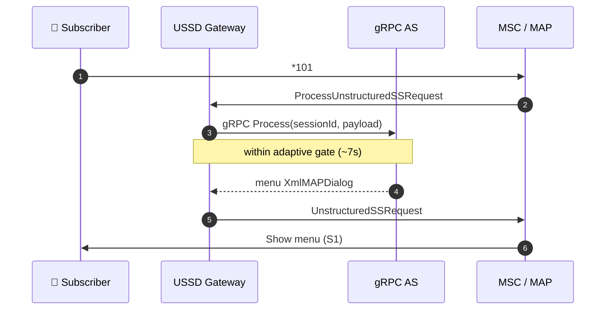
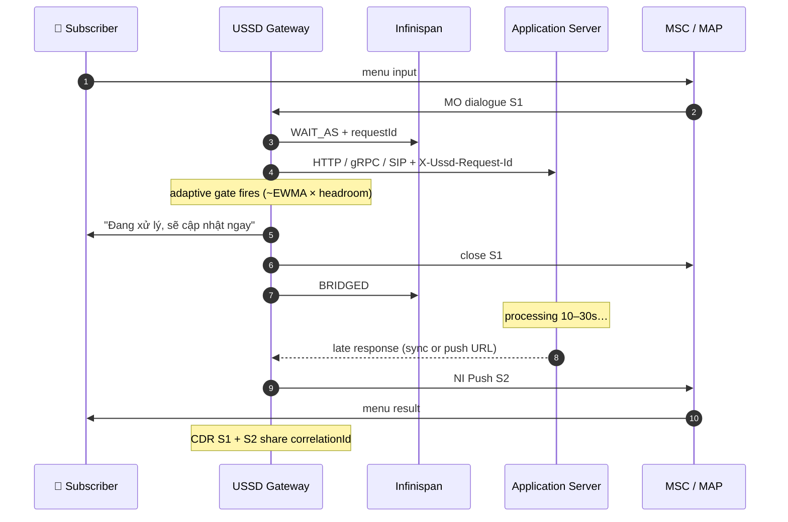
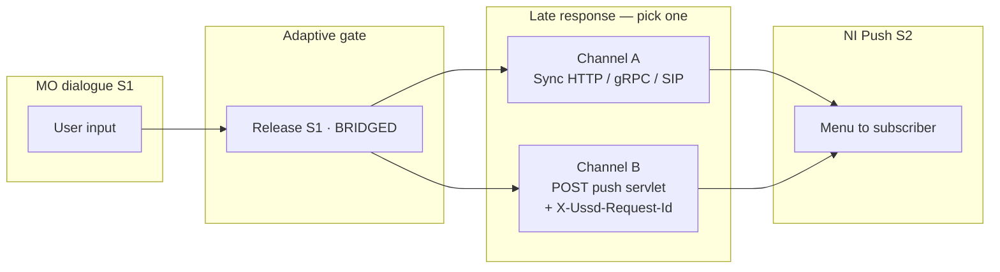

# 📞 USSD Gateway 7.2.1 - Next Generation Unstructured Supplementary Service Data

> **JAIN SLEE Powered | jSS7-NG 9.2.10 | 10k TPS Load Tested | Multi-Protocol**

[](https://github.com/nhanth87/ussdgw)
[](https://github.com/nhanth87/jSS7)
[](https://github.com/nhanth87/sctp)
[](https://jcp.org/en/jsr/detail?id=240)
[](#-10k-tps-load-test-suite)
[](https://github.com/JCTools/JCTools)

## ✨ What's New

> **7.2.1** — gRPC Application Server integration · Adaptive gate timeout · Virtual Session Bridge  
> Design RFC for unified late-response reconciliation: [`docs/design/bridge-unified-reconciliation-rfc.md`](docs/design/bridge-unified-reconciliation-rfc.md)

<table>
<tr>
<td width="50%" valign="top">

### 📡 gRPC ↔ Application Server

Connect the AS over **gRPC (HTTP/2)** with the same pull/push semantics as HTTP — no XML glue, no extra sidecar.

| | |
|---|---|
| **Role** | Gateway = gRPC client · AS = gRPC server |
| **Payload** | Same `XmlMAPDialog` as HTTP (JSON envelope on wire) |
| **Session id** | One stable `sessionId` from first network hit through every AS round-trip |
| **Routing** | `ScRoutingRuleType.GRPC` → `host:port` |

</td>
<td width="50%" valign="top">

### ⏱️ Adaptive Timeout + Session Bridge

Stop losing subscribers when the AS or the network is slow.

| | |
|---|---|
| **Problem** | USSD MAP timer ~15–30s · banking/API lookups often longer |
| **Adaptive gate** | EWMA of AS latency **per network** — gate auto-tightens or widens within your ceiling |
| **Bridge** | Release MO dialogue (S1) on time → deliver menu via **NI Push (S2)** when AS is ready |
| **Outcome** | Higher session success rate · fewer false timeouts · less per-operator XML tuning |

</td>
</tr>
</table>

---

### Flow 1 — gRPC pull, AS responds before gate *(happy path)*

Subscriber dials `*101#`. Gateway forwards to the AS over gRPC; the menu returns while the MO dialogue is still open.



---

### Flow 2 — Slow AS: adaptive gate + Virtual Session Bridge

AS needs longer than the network allows. Gateway releases S1 with a friendly wait message, keeps state in Infinispan, and delivers the result on a new NI push dialogue (S2).



---

### Flow 3 — Unified late response *(RFC — review)*

After gate, the AS may answer on the **same sync connection** (preferred) or on the **existing USSD Push URL** if the transport already closed — one contract, no separate `/async-response` endpoint.



| Scenario | What happens | AS action |
|----------|--------------|-----------|
| AS fast | Menu on S1, no bridge | Normal sync response |
| AS slow, sync alive | Gate → reconcile on same HTTP/gRPC/SIP | Return menu on original request |
| AS slow, sync dead | Gate → NI Push S2 | `POST` existing push URL + `X-Ussd-Request-Id` |
| Duplicate delivery | Idempotent per `requestId` | Safe to retry |

📄 Full bridge spec: [`docs/design/virtual-session-bridge.md`](docs/design/virtual-session-bridge.md) · RFC: [`bridge-unified-reconciliation-rfc.md`](docs/design/bridge-unified-reconciliation-rfc.md)

---

## 💡 What is USSD Gateway?

**USSD Gateway** is the bridge between modern application servers and legacy SS7 telecom networks, enabling **Unstructured Supplementary Service Data (USSD)** services for mobile subscribers across all network generations — from 2G GSM to 5G NR.

Unlike SMS, USSD creates a **real-time interactive session** between subscriber and application, making it ideal for:
- Mobile banking (`*100#`)
- Balance inquiry & top-up
- SIM toolkit menus
- Emergency alerts
- Voting & surveys
- Self-care portals

```
┌─────────────────────────────────────────────────────────────────────────────┐
│                    USSD Gateway 7.2.1 Architecture                           │
├─────────────────────────────────────────────────────────────────────────────┤
│                                                                              │
│   ┌──────────┐   ┌──────────┐   ┌──────────┐   ┌──────────┐                 │
│   │  HTTP    │   │   SIP    │   │  HTTP    │   │  SS7/   │                 │
│   │  Client  │   │  Client  │   │  Push    │   │   MAP   │                 │
│   └────┬─────┘   └────┬─────┘   └────┬─────┘   └────┬─────┘                 │
│        │              │              │              │                        │
│   ┌────┴──────────────┴──────────────┴──────────────┴────┐                  │
│   │              JAIN SLEE 1.1 Container                  │                  │
│   │  ┌────────────────────────────────────────────────┐  │                  │
│   │  │         SBB - Service Building Blocks           │  │                  │
│   │  │  ┌──────────┐ ┌──────────┐ ┌──────────┐        │  │                  │
│   │  │  │  HTTP    │ │   SIP    │ │  MAP-RA  │        │  │                  │
│   │  │  │  SBB     │ │   SBB    │ │  Events  │        │  │                  │
│   │  │  └────┬─────┘ └────┬─────┘ └────┬─────┘        │  │                  │
│   │  │       └────────────┴────────────┘               │  │                  │
│   │  │              USSD Routing Logic                  │  │                  │
│   │  └────────────────────────────────────────────────┘  │                  │
│   └────────────────────────┬───────────────────────────────┘                  │
│                            │                                                 │
│   ┌────────────────────────▼───────────────────────────────┐                  │
│   │              jSS7-NG 9.2.10 Stack                       │                  │
│   │     (JCTools + Jackson XML + Zero-GC SCTP)              │                  │
│   └────────────────────────┬───────────────────────────────┘                  │
│                            │                                                 │
│   ┌────────────────────────▼───────────────────────────────┐                  │
│   │              SCTP-NG 2.0.13 Transport                   │                  │
│   │           (500K+ msg/s | Object Pooling)                │                  │
│   └────────────────────────────────────────────────────────┘                  │
│                                                                              │
│   ┌──────────┐   ┌──────────┐   ┌──────────┐   ┌──────────┐                 │
│   │    HLR   │◄──┤   STP    │◄──┤  SIGTRAN │◄──┤  M3UA/   │                 │
│   │          │   │          │   │  SCTP    │   │  SCCP    │                 │
│   └──────────┘   └──────────┘   └──────────┘   └──────────┘                 │
│                                                                              │
└─────────────────────────────────────────────────────────────────────────────┘
```

---

## 🎯 Key Capabilities

### Multi-Protocol Application Interface

| Protocol | Interface | Use Case | Latency |
|----------|-----------|----------|---------|
| **HTTP** | `POST /ussdhttpdemo/` | Web apps, modern services | `< 10ms` |
| **SIP** | `INVITE` | VoIP integration, IMS | `< 15ms` |
| **HTTP Push** | Callback URL | Async notifications | `< 5ms` |
| **SS7/MAP** | `ProcessUnstructuredSSRequest` | Legacy network | `< 50ms` |

### Supported USSD Operations

```java
// ProcessUnstructuredSSRequest - Mobile Originated
MAPDialogSupplementary dialog = mapProvider.getMAPServiceSupplementary()
    .createNewDialog(appContext, origAddress, origRef, destAddress, destRef);
dialog.addProcessUnstructuredSSRequest(dcs, ussdString, alertingPattern, msisdn);
dialog.send();

// UnstructuredSSRequest - Network Initiated
dialog.addUnstructuredSSRequest(dcs, ussdString, alertingPattern);

// UnstructuredSSNotify - One-way notification
dialog.addUnstructuredSSNotify(dcs, ussdString, alertingPattern, msisdn);
```

---

## ⚡ Performance: The NG Advantage

### JCTools Collection Migration

| Component | Legacy (Javolution) | NG (JCTools) | Improvement |
|-----------|---------------------|--------------|-------------|
| Dialog Queue | `FastList` (synchronized) | `MpscArrayQueue` (lock-free) | **13x** faster |
| Subscriber Cache | `FastMap` (lock per op) | `NonBlockingHashMap` (wait-free reads) | **5x** faster |
| Event Buffer | `FastList` | `MpscArrayQueue` | **Zero contention** |

### Serialization Overhaul

| Module | XMLFormat Lines | Jackson XML Lines | Reduction |
|--------|-----------------|-------------------|-----------|
| USSD XML | 200+ | 15 | **93%** |
| MAP Dialog | 280 | 20 | **93%** |
| TCAP Events | 150 | 10 | **93%** |

### Throughput Benchmarks

```
Benchmark: USSD Dialogs/sec (100 concurrent clients)
┌────────────────────────┬────────────┬──────────┬─────────────┐
│ Scenario               │ Classic    │ NG       │ Improvement │
├────────────────────────┼────────────┼──────────┼─────────────┤
│ HTTP → MAP             │ 2,100 TPS  │ 10,500   │ ✅ 5x       │
│ SIP → MAP              │ 1,800 TPS  │ 9,200    │ ✅ 5.1x     │
│ MAP → MAP (load test)  │ 3,500 TPS  │ 12,000+  │ ✅ 3.4x     │
│ Memory allocations     │ 450 MB/s   │ < 50 MB/s│ ✅ 9x       │
└────────────────────────┴────────────┴──────────┴─────────────┘
```

---

## 🎨 Architecture Deep Dive

### SBB Lifecycle

```
┌─────────────────────────────────────────────────────────────┐
│                    USSD SBB Lifecycle                        │
├─────────────────────────────────────────────────────────────┤
│                                                              │
│   [HTTP Request] ──► HTTP SBB ──► XmlMAPDialog ──►         │
│   [SIP INVITE]   ──► SIP SBB  ──► XmlMAPDialog ──►         │
│                                      │                       │
│                                      ▼                       │
│                         ┌──────────────────────┐             │
│                         │   Routing Logic      │             │
│                         │  - Rule matching     │             │
│                         │  - URL resolution    │             │
│                         │  - Dialog mapping    │             │
│                         └──────────┬───────────┘             │
│                                    │                         │
│                                    ▼                         │
│                         ┌──────────────────────┐             │
│                         │   MAP-RA Events      │             │
│                         │  ProcessUnstructuredSS│            │
│                         │  UnstructuredSSRequest│            │
│                         └──────────┬───────────┘             │
│                                    │                         │
│                                    ▼                         │
│                         ┌──────────────────────┐             │
│                         │   jSS7-NG Stack      │             │
│                         │  TCAP ──► SCCP ──►   │             │
│                         │  M3UA ──► SCTP       │             │
│                         └──────────────────────┘             │
│                                                              │
└─────────────────────────────────────────────────────────────┘
```

### HTTP Interface Flow

```java
// 1. HTTP Client sends XML
POST /ussdhttpdemo/ HTTP/1.1
Content-Type: application/xml

<dialog appCntx="networkUnstructuredSsContext" version="2">
  <processUnstructuredSSRequest_Request>
    <dataCodingScheme>15</dataCodingScheme>
    <ussdString>*100#</ussdString>
    <msisdn>1234567890</msisdn>
  </processUnstructuredSSRequest_Request>
</dialog>

// 2. USSD Gateway converts to MAP Dialog
// 3. Routes through SS7 stack to HLR/MSC
// 4. Returns XML response to HTTP client
```

---

## 🛠️ Building from Source

### Prerequisites

| Component | Version | Notes |
|-----------|---------|-------|
| Java | JDK 8+ | Zulu JDK 8.84.0.15 recommended |
| Maven | 3.6+ | 3.9.12 tested |
| WildFly | 10.0.0.Final | JBoss-based JAIN SLEE container |
| OS | Linux | Ubuntu 20.04/22.04 recommended |

### Build All Modules

```bash
# Clone repository
git clone https://github.com/nhanth87/ussdgw.git
cd ussdgw

# Build core modules
cd core
mvn clean install -DskipTests

# Build examples
cd ../examples
mvn clean install -DskipTests

# Build tools
cd ../tools
mvn clean install -DskipTests

# Build test & load test
cd ../test
mvn clean install -DskipTests
```

### Deploy to WildFly

```bash
# Start WildFly in standalone mode
$WILDFLY_HOME/bin/standalone.sh -c standalone-slee.xml

# Deploy USSD Gateway SLEE Deployable Unit
cp core/slee/services-du/target/ussd-gateway-du-*.jar \
   $WILDFLY_HOME/standalone/deployments/

# Deploy HTTP Example WAR
cp examples/http/target/http-example-*.war \
   $WILDFLY_HOME/standalone/deployments/
```

---

## 🧪 10k TPS Load Test Suite

USSD Gateway ships with a comprehensive load testing toolkit capable of validating **10,000 transactions per second**.

### Test Approach Matrix

| Approach | Protocol | Stack Required | Use Case |
|----------|----------|----------------|----------|
| **MAP-Level** | SS7/MAP | Full SCTP→M3UA→SCCP→TCAP→MAP | Core SS7 performance |
| **HTTP-Level** | HTTP/XML | None (client-side) | HTTP→SBB→XML path |

### Running MAP-Level Load Test

```bash
cd test/loadtest

# Build load test JAR with all dependencies
mvn clean install -Passemble -DskipTests

# Start MAP Load Server (Terminal 1)
cd target/load
java -cp "*" org.mobicents.protocols.ss7.map.load.ussd.Server \
  100000 50000 SCTP 192.168.1.10 192.168.1.11 8011 IPSP 101 1 2 147 101 8

# Start MAP Load Client (Terminal 2)
cd target/load
java -cp "*" org.mobicents.protocols.ss7.map.load.ussd.Client \
  100000 50000 SCTP 192.168.1.11 192.168.1.10 8011 IPSP 101 2 1 147 101 8 \
  "*100#" "UTF-8" 60000 10000 10000 2000
```

### Running HTTP-Level Load Test

```bash
cd test/loadtest

# Build HTTP load test
mvn clean package -DskipTests

# Run HTTP load generator
java -cp "target/loadtest-7.2.1-SNAPSHOT.jar:target/dependency/*" \
  org.mobicents.ussd.loadtest.UssdHttpLoadGenerator \
  http://localhost:8080/ussdhttpdemo/ \
  10000      # target TPS \
  32         # worker threads \
  50000      # max concurrent dialogs \
  300        # test duration (seconds) \
  "*100#"    # USSD string
```

### JVM Tuning for 10k TPS

```bash
JAVA_OPTS="-Xms4g -Xmx4g \
  -XX:+UseG1GC \
  -XX:MaxGCPauseMillis=10 \
  -XX:+UnlockExperimentalVMOptions \
  -XX:+UseStringDeduplication \
  -XX:+HeapDumpOnOutOfMemoryError \
  -Djava.net.preferIPv4Stack=true \
  -Dorg.jboss.resolver.warning=true \
  -Dsun.rmi.dgc.client.gcInterval=3600000 \
  -Dsun.rmi.dgc.server.gcInterval=3600000"
```

### Linux Kernel Tuning

```bash
# /etc/sysctl.conf
net.core.somaxconn = 65535
net.ipv4.tcp_max_syn_backlog = 65535
net.ipv4.ip_local_port_range = 1024 65535
net.ipv4.tcp_tw_reuse = 1
net.ipv4.tcp_fin_timeout = 15
net.core.netdev_max_backlog = 65535
fs.file-max = 2097152
fs.nr_open = 2097152

# /etc/security/limits.conf
* soft nofile 1048576
* hard nofile 1048576
```

---

## 📁 Project Structure

```
ussdgateway/
├── core/                          # Core modules
│   ├── domain/                    # Domain model & entities
│   ├── xml/                       # XML serialization (Jackson)
│   ├── session-bridge/           # Virtual Session Bridge (FSM, Infinispan store)
│   ├── slee/                      # JAIN SLEE SBBs
│   │   ├── library/               # SBB library
│   │   ├── sbbs/                  # Service Building Blocks
│   │   └── services-du/           # Deployable Unit
│   ├── oam/cli/                   # Operations & Management CLI
│   └── bootstrap-wildfly/         # WildFly bootstrap
├── examples/                      # Sample applications
│   ├── http/                      # HTTP interface example
│   ├── http-push/                 # HTTP Push example
│   └── sip/                       # SIP interface example
├── management/                    # Management interfaces
│   └── ussd-management/           # JMX / CLI management
├── test/                          # Test suite
│   ├── mapmodule/                 # MAP module tests
│   ├── bootstrap/                 # Bootstrap tests
│   └── loadtest/                  # 10k TPS load test tools
│       ├── UssdLoadGenerator.java         # MAP-level
│       ├── UssdHttpLoadGenerator.java     # HTTP-level
│       └── LoadTestMetrics.java           # Metrics
├── tools/                         # Utilities
│   └── http-simulator/            # HTTP simulator for testing
└── docs/                          # Documentation
    ├── adminguide/
    ├── installationguide/
    └── releasenotes/
```

---

## 🌐 Supported Network Interfaces

### HTTP Interface
```bash
curl -X POST http://ussd-gateway:8080/ussdhttpdemo/ \
  -H "Content-Type: application/xml" \
  -d '<?xml version="1.0"?>
  <dialog appCntx="networkUnstructuredSsContext" version="2">
    <processUnstructuredSSRequest_Request>
      <dataCodingScheme>15</dataCodingScheme>
      <ussdString>*100#</ussdString>
    </processUnstructuredSSRequest_Request>
  </dialog>'
```

### SIP Interface
```
INVITE sip:*100#@ussd-gateway SIP/2.0
Via: SIP/2.0/UDP 192.168.1.100:5060
From: <sip:subscriber@operator.com>
To: <sip:*100#@ussd-gateway>
Content-Type: application/vnd.3gpp.ussd+xml

<?xml version="1.0"?>
<ussd-data>
  <ussd-string>*100#</ussd-string>
  <any-ext>
    <data-coding-scheme>15</data-coding-scheme>
  </any-ext>
</ussd-data>
```

---

## 📦 Version Matrix

| Component | Version | Description |
|-----------|---------|-------------|
| **USSD Gateway** | 7.2.1-SNAPSHOT | This project |
| **jSS7-NG** | 9.2.10 | SS7 protocol stack |
| **SCTP-NG** | 2.0.13 | Transport layer |
| **JAIN SLEE** | 1.1 | Container specification |
| **WildFly** | 10.0.0.Final | Application server |
| **Netty** | 4.2.11.Final | Network framework |
| **JCTools** | 4.0.3 | Lock-free collections |
| **Jackson XML** | 2.15.2 | XML serialization |
| **Guava** | 18.0 | Utility library |

---

## 🤝 Integration Ecosystem

```
┌─────────────────────────────────────────────────────────────┐
│                 Restcomm Telecom Stack                       │
├─────────────────────────────────────────────────────────────┤
│                                                              │
│   ┌──────────────┐  ┌──────────────┐  ┌──────────────┐     │
│   │   jSS7-NG    │  │   GMLC       │  │   Diameter   │     │
│   │   SS7 Stack  │  │   Location   │  │   Gateway    │     │
│   │   v9.2.10    │  │   v6.0.1     │  │   v7.4.5     │     │
│   └──────┬───────┘  └──────┬───────┘  └──────┬───────┘     │
│          │                 │                  │             │
│          └─────────────────┴──────────────────┘             │
│                            │                                │
│                    ┌───────▼───────┐                        │
│                    │  USSD Gateway │                        │
│                    │    v7.2.1     │                        │
│                    └───────┬───────┘                        │
│                            │                                │
│          ┌─────────────────┼─────────────────┐              │
│          │                 │                 │              │
│   ┌──────▼──────┐  ┌──────▼──────┐  ┌──────▼──────┐       │
│   │   HTTP      │  │    SIP      │  │    SS7      │       │
│   │   Apps      │  │   Clients   │  │   Network   │       │
│   └─────────────┘  └─────────────┘  └─────────────┘       │
│                                                              │
└─────────────────────────────────────────────────────────────┘
```

---

## 📄 License

This project is licensed under the GNU Affero General Public License v3.0 (AGPL-3.0).

---

## 🙏 Acknowledgments

- **TeleStax** — Original Mobicents USSD Gateway
- **JCTools** — Lock-free concurrent collections
- **Netty Project** — High-performance network framework
- **3GPP** — SS7 / MAP / USSD specifications

---

## 🔀 Virtual Session Bridge (async AS reconciliation)

When an Application Server takes longer than the network USSD timer allows, the session is normally
dropped. The **Virtual Session Bridge** turns the gateway into a session orchestration layer that
recovers these slow transactions and raises the session success rate.

How it works (feature-flagged, `sessionBridgeEnabled`, default `false`):

1. On a Mobile-Originated (pull) request the gateway tracks the interaction with a gateway-owned
   `correlationId` and persists state to **Infinispan** (`cache-container "ussd"`).
2. If the AS does not reply before the **async gate timeout**, the gateway releases the MO dialogue
   early with a friendly message ("Hệ thống đang bận, sẽ update lại cho bạn ngay") and writes CDR
   record **S1** (`bridgePhase=S1_RELEASED`).
3. When the late AS reply arrives it is delivered as a **Network-Initiated push** (S2). Both CDR
   records share the same `correlationId` so reporting counts one successful transaction.
4. Idempotency lock per MSISDN, active-session priority/queue-back, push retry queue (JCTools) and a
   `NotificationFallback` SPI (SMS hook) protect against double submits and undeliverable pushes.
5. **Adaptive timeout** keeps a per-operator EWMA of AS latency and shortens/lengthens the gate
   within the configured ceiling.

Configuration (MBean `UssdPropertiesManagement`, editable in the **Server Settings → Session
Bridge** tab of `ussd-management`):

| Property | Meaning | Default |
|----------|---------|---------|
| `sessionBridgeEnabled` | master feature flag | `false` |
| `asyncGateTimeoutMs` | release MO dialogue before network timeout | `7000` |
| `asyncWaitUserMessage` | message shown while bridging | VN string |
| `asyncHardFailMessage` | message shown on AS hard-fail / overload | VN string |
| `bridgeStateTtlSec` | Infinispan TTL | `180` |
| `pushRetryDelaysMs` | push retry back-off | `3000,8000,15000` |

Design spec (Vietnamese, with FSM + sequence diagrams + scenario catalog P1–P15 / U1–U10 / H7–H9):
[`docs/design/virtual-session-bridge.md`](docs/design/virtual-session-bridge.md).

### sessionId vs correlationId — one id is enough

The AS only needs **one** stable identifier. In the bridged case the MO (S1) and NI push (S2)
dialogues are different network dialogues but the same business session, so the gateway keeps the
id stable (`sessionId := correlationId`) across S1→S2. Internally the gateway uses `correlationId`
as the Infinispan/CDR key; on the wire there is a single id. See section 12 of the design doc.

## 📡 gRPC Application Server integration

In addition to HTTP, the gateway can talk to the AS over **gRPC (HTTP/2)** — the gateway is the
gRPC client, the AS is the gRPC server, mirroring the HTTP client RA.

- Routing: set `ScRoutingRuleType.GRPC` on the routing rule; `ruleUrl` = `host:port` of the AS.
- The gRPC RA (`core/slee/resources/grpc-as`) is non-blocking and publishes the reply to a
  `GrpcResponseRegistry`; `GrpcClientSbb` collects it on a short SLEE poll timer and drives the MAP
  dialogue — the same `XmlMAPDialog` payload as HTTP.
- The session id (unified with the bridge correlation id) is sent to the AS so it can keep
  per-session menu state, exactly like the HTTP session id.
- Wire format: unary method `ussd.UssdApplicationService/Process` carrying a JSON envelope
  (`sessionId`, `correlationId`, `push`, `networkId`, `payloadB64`). No protobuf code generation is
  required on the Java side; swap the marshaller if you prefer protobuf.

Deploy: the `ussd-grpc-as-ra-DU` is copied by `release-wildfly/build.xml` and the `GrpcAsRA` entity
is activated by the services DU `deploy-config.xml`.

### Python gRPC AS test app

[`tools/grpc-as-tester`](tools/grpc-as-tester) ships a configurable test AS and a load generator:

```bash
cd tools/grpc-as-tester
python3 -m venv .venv && ./.venv/bin/pip install -r requirements.txt

# multi-menu USSD AS with adaptive (random 1-100ms) processing delay
./.venv/bin/python ussd_as_server.py --port 8443 --min-delay 1 --max-delay 100 \
    --menu-config menu_config.json

# load test from 1,000 up to 100,000+ TPS (fan out across processes for high TPS)
./.venv/bin/python loadtest_client.py --target localhost:8443 --tps 1000   --duration 10
./.venv/bin/python loadtest_client.py --target localhost:8443 --tps 100000 --duration 20 --processes 8
```

The AS implements a configurable multi-menu pull/push flow, applies the adaptive delay to exercise
the bridge + adaptive timeout, and keeps per-session menu state keyed by the (unified) session id.
The load client reports achieved TPS and p50/p95/p99 latency.

---

<div align="center">

**⭐ Star this repo if it powers your telecom infrastructure! ⭐**

*Built with ❤️ for the global telecom community*

</div>
