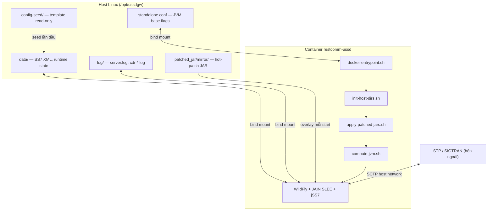
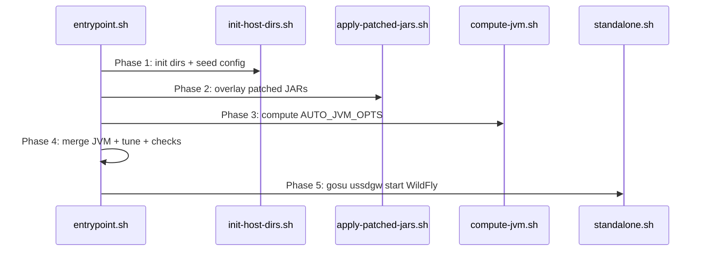
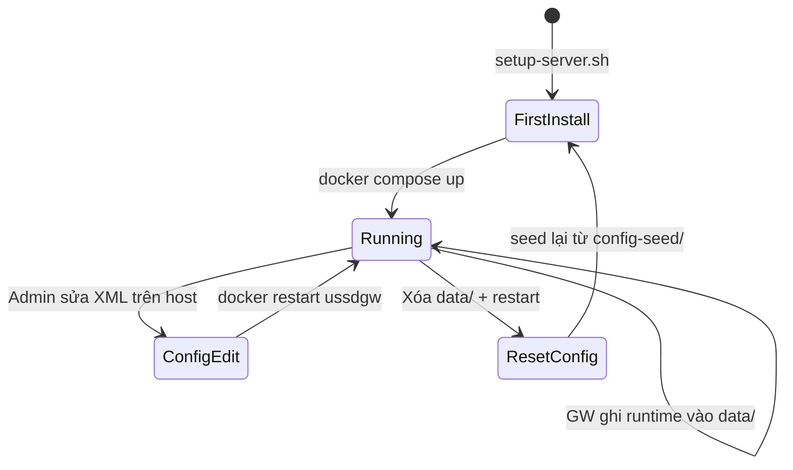

# USSD Gateway — Thiết kế Docker Deployment

> **Phiên bản tài liệu:** 1.0  
> **USSD Gateway:** 7.2.1-SNAPSHOT  
> **WildFly:** 10.0.0.Final · **Java:** OpenJDK/Temurin 8  
> **Trạng thái:** Spec triển khai — mô tả chi tiết những gì sẽ được implement

---

## Mục lục

1. [Tổng quan](#1-tổng-quan)
2. [Kiến trúc](#2-kiến-trúc)
3. [Yêu cầu hệ thống](#3-yêu-cầu-hệ-thống)
4. [Cấu trúc thư mục trên Host](#4-cấu-trúc-thư-mục-trên-host)
5. [Danh mục file sẽ tạo / sửa](#5-danh-mục-file-sẽ-tạo--sửa)
6. [Dockerfile — spec chi tiết](#6-dockerfile--spec-chi-tiết)
7. [Entrypoint — luồng khởi động 5 phase](#7-entrypoint--luồng-khởi-động-5-phase)
8. [Scripts hỗ trợ](#8-scripts-hỗ-trợ)
9. [Docker Compose — 2 profile](#9-docker-compose--2-profile)
10. [JVM tuning — 3 tầng merge](#10-jvm-tuning--3-tầng-merge)
11. [Hot-patch JAR (`patched_jar`)](#11-hot-patch-jar-patched_jar)
12. [Persistence & vòng đời config](#12-persistence--vòng-đời-config)
13. [SCTP / SS7 networking](#13-sctp--ss7-networking)
14. [Performance tuning khi start](#14-performance-tuning-khi-start)
15. [Save / Load image Dev → Production](#15-save--load-image-dev--production)
16. [Checklist triển khai theo Phase](#16-checklist-triển-khai-theo-phase)
17. [Troubleshooting & FAQ](#17-troubleshooting--faq)

---

## 1. Tổng quan

Tài liệu này mô tả **toàn bộ thiết kế Docker** cho USSD Gateway: build image, chạy container, mount dữ liệu persistent, tự động tinh chỉnh JVM theo tài nguyên host, overlay JAR hot-patch, và kết nối SCTP tới STP bên ngoài.

### Mục tiêu

| Mục tiêu | Mô tả |
|----------|-------|
| **Portable** | Build một lần trên dev, deploy sang production qua `docker save/load` hoặc registry |
| **Persistent** | Config SS7, log, CDR, JVM flags, patched JAR đều sống trên host `/opt/ussdgw/` |
| **An toàn config** | Template gốc read-only; runtime ghi vào `data/` không làm hỏng bản seed |
| **Tự động JVM** | Heap/GC threads tính theo RAM/CPU cgroup khi container start |
| **Override linh hoạt** | Biến `USER_CONFIG_JVM` cho phép ghi đè bất kỳ cờ JVM nào |
| **SS7-ready** | SCTP hoạt động ổn định qua `network_mode: host` + kernel module trên host |

### Phạm vi

- **Trong scope:** Dockerfile, entrypoint, compose, setup script, JVM auto-detect, JAR overlay, doc vận hành
- **Ngoài scope:** Kubernetes/Helm, CI/CD pipeline đầy đủ, HA clustering WildFly

---

## 2. Kiến trúc

### 2.1 Sơ đồ tổng thể



### 2.2 Luồng dữ liệu JVM (3 tầng)

```
JAVA_OPTS cuối cùng =
    AUTO_JVM_OPTS          ← entrypoint tính từ RAM/CPU cgroup
  + BASE_JVM (standalone.conf) ← jSS7, WildFly, Netty cố định
  + USER_CONFIG_JVM      ← user ghi đè (env trong compose)
```

**Quy tắc quan trọng:** Không set env `JAVA_OPTS` trực tiếp trong compose (sẽ ghi đè toàn bộ và mất jSS7 flags). Thay vào đó dùng `USER_CONFIG_JVM` để **append** ở cuối.

### 2.3 Đường dẫn chuẩn hóa

| Vị trí | Đường dẫn | Ghi chú |
|--------|-----------|---------|
| Binary trong container | `/opt/restcomm/restcomm-ussd-7.2.1-SNAPSHOT/` | Extract từ release zip |
| WildFly home | `.../wildfly-10.0.0.Final` | `JBOSS_HOME` |
| Host persistence root | `/opt/ussdgw/` | **Chuẩn mới** (thay `/opt/ussdgateway`) |
| Mount point trong container | `/opt/ussdgw/` | Map 1:1 với host |

---

## 3. Yêu cầu hệ thống

### 3.1 Host (Production / Lab)

| Thành phần | Yêu cầu tối thiểu | Khuyến nghị (10k TPS lab) |
|------------|-------------------|---------------------------|
| OS | Ubuntu 20.04/22.04, RHEL 8+ | Ubuntu 22.04 LTS |
| RAM | 4 GB | 8–16 GB |
| CPU | 2 core | 4–32 core |
| Docker | 24.x+ | Cùng version dev/prod |
| Kernel module | `sctp` loaded trên **host** | `modprobe sctp` + persistent |
| Quyền | user trong group `docker` | root cho `tune-system.sh` lần đầu |

### 3.2 Container

| Thành phần | Giá trị |
|------------|---------|
| Base image | `eclipse-temurin:8-jdk-jammy` |
| User runtime | `ussdgw` UID:GID **2000:2000** |
| Capabilities | `NET_ADMIN`, `NET_RAW` (production SCTP) |
| Privileged | `true` chỉ khi profile **production** (SCTP association) |

### 3.3 Lưu ý về `modprobe sctp`

> **Không chạy `modprobe` bên trong container.** Container dùng kernel của host; module SCTP phải được load trên host:

```bash
sudo modprobe sctp
echo sctp | sudo tee /etc/modules-load.d/sctp.conf
```

Entrypoint sẽ **kiểm tra** `/proc/net/sctp` và cảnh báo nếu module chưa load — không fail hard (HTTP-only dev vẫn chạy được).

---

## 4. Cấu trúc thư mục trên Host

```
/opt/ussdgw/
├── data/                          # PERSISTENCE — WildFly standalone/data
│   ├── SCTPManagement_sctp.xml    #   SCTP endpoint (chỉnh IP/port STP)
│   ├── Mtp3UserPart_m3ua1.xml
│   ├── SccpStack_*.xml
│   ├── TcapStack_management.xml
│   ├── MapStack_management.xml
│   ├── UssdManagement_*.xml
│   └── ... (runtime files do GW tạo thêm)
│
├── log/                           # PERSISTENCE — server.log, cdr-yyyy-MM-dd.log
│
├── standalone.conf                # PERSISTENCE — JVM base (jSS7 flags, WildFly)
│
├── patched_jar/                   # PERSISTENCE — hot-patch overlay
│   └── mirror/                    #   Mirror cấu trúc binary (xem §11)
│       └── wildfly-10.0.0.Final/
│           └── standalone/
│               └── deployments/
│                   └── map-du-9.2.11.jar   # ví dụ
│
└── config-seed/                   # READ-ONLY template — seed vào data/ lần đầu
    ├── SCTPManagement_sctp.xml
    └── ...
```

**Ownership:** Toàn bộ `/opt/ussdgw/` phải thuộc `2000:2000` (user `ussdgw` trong container).

Script `setup-server.sh` sẽ tạo cấu trúc này và copy template từ `release-wildfly/config-seed/` (sẽ được tạo mới).

---

## 5. Danh mục file sẽ tạo / sửa

### 5.1 File mới

| File | Mục đích |
|------|----------|
| `release-wildfly/scripts/compute-jvm.sh` | Tính `AUTO_JVM_OPTS` từ cgroup RAM/CPU |
| `release-wildfly/scripts/apply-patched-jars.sh` | Overlay JAR từ `patched_jar/mirror/` |
| `release-wildfly/scripts/init-host-dirs.sh` | Seed config, symlink data/log → WildFly |
| `release-wildfly/scripts/print-banner.sh` | Log thông tin startup (RAM, heap, flags) |
| `release-wildfly/docker-compose.dev.yml` | Profile dev: bridge network, HTTP test |
| `release-wildfly/config-seed/*.xml` | Template SS7/USSD mặc định |

### 5.2 File viết lại

| File | Thay đổi chính |
|------|----------------|
| `release-wildfly/Dockerfile` | Thêm packages, ARG version, copy scripts |
| `release-wildfly/docker-entrypoint.sh` | 5-phase startup (§7) |
| `release-wildfly/docker-compose.yml` | Profile production: host network, mounts `/opt/ussdgw` |
| `release-wildfly/setup-server.sh` | Path `/opt/ussdgw`, thêm `patched_jar/`, `config-seed/` |
| `release-wildfly/build-docker.sh` | Tag version, build-arg |
| `release-wildfly/standalone.conf` | Tách phần heap (bỏ hardcode 4g — entrypoint lo) |

### 5.3 File giữ nguyên / deprecated

| File | Trạng thái |
|------|------------|
| `release-wildfly/docker-compose.test.yml` | Deprecated → thay bằng `docker-compose.dev.yml` |
| `dockerDesignForUssd.md` | Tài liệu này (spec) |

---

## 6. Dockerfile — spec chi tiết

### 6.1 Base image & packages

```dockerfile
FROM eclipse-temurin:8-jdk-jammy

RUN apt-get update && apt-get install -y \
    unzip \
    gosu \
    lksctp-tools \
    curl \
    procps \
    iproute2 \
    inetutils-ping \
    && rm -rf /var/lib/apt/lists/*
```

| Package | Lý do |
|---------|-------|
| `lksctp-tools` | User-space SCTP tools, libsctp |
| `gosu` | Drop root → user `ussdgw` |
| `curl` | Healthcheck WildFly management |
| `procps` | `ps`, debug trong container |
| `iproute2` | `ip addr`, kiểm tra network |
| `inetutils-ping` | Ping STP từ container (dev) |

### 6.2 User & permissions

```dockerfile
RUN groupadd -r -g 2000 ussdgw \
 && useradd -r -u 2000 -g 2000 -d /opt/restcomm -s /sbin/nologin ussdgw
```

UID/GID **2000** cố định — phải khớp ownership trên host.

### 6.3 Copy binary

```dockerfile
ARG USSD_VERSION=7.2.1-SNAPSHOT
ENV USSD_VERSION=${USSD_VERSION}
ENV JBOSS_HOME=/opt/restcomm/restcomm-ussd-${USSD_VERSION}/wildfly-10.0.0.Final
ENV USSDGW_HOST_BASE=/opt/ussdgw

COPY restcomm-ussd-${USSD_VERSION}-linux.zip /tmp/
RUN unzip -q /tmp/restcomm-ussd-*.zip -d /opt/restcomm \
 && rm /tmp/restcomm-ussd-*.zip \
 && chmod +x ${JBOSS_HOME}/bin/*.sh \
 && chown -R ussdgw:ussdgw /opt/restcomm
```

### 6.4 Scripts & entrypoint

```dockerfile
COPY scripts/              /opt/restcomm/scripts/
COPY docker-entrypoint.sh  /opt/restcomm/docker-entrypoint.sh
RUN chmod +x /opt/restcomm/docker-entrypoint.sh /opt/restcomm/scripts/*.sh
```

### 6.5 Environment defaults

```dockerfile
ENV AUTO_JVM_ENABLED=true
ENV USSDGW_PROFILE=lab
ENV USER_CONFIG_JVM=""
ENV PATCH_FORCE=true
ENV PATCH_BACKUP=true
```

### 6.6 Ports & healthcheck

```dockerfile
EXPOSE 8080 8443 9990 9993 8009 2905 2906 8011 8012

HEALTHCHECK --interval=30s --timeout=10s --start-period=180s --retries=5 \
  CMD curl -fs http://localhost:9990/health || exit 1

ENTRYPOINT ["/opt/restcomm/docker-entrypoint.sh"]
CMD ["-b", "0.0.0.0", "-bmanagement", "0.0.0.0"]
```

| Port | Protocol | Dịch vụ |
|------|----------|---------|
| 8080 | TCP | HTTP (USSD HTTP interface) |
| 8443 | TCP | HTTPS |
| 9990 | TCP | WildFly management / health |
| 9993 | TCP | WildFly management HTTPS |
| 8009 | TCP | AJP |
| 2905 | SCTP | M3UA (default) |
| 2906 | SCTP | M3UA alt |
| 8011 | SCTP | MAP load test |
| 8012 | SCTP | MAP load test alt |

> `EXPOSE` mang tính tài liệu; với `network_mode: host` Docker không NAT — port bind trực tiếp trên host.

---

## 7. Entrypoint — luồng khởi động 5 phase

File: `release-wildfly/docker-entrypoint.sh`



### Phase 1 — `init-host-dirs.sh`

| Bước | Hành động |
|------|-----------|
| 1 | Tạo `/opt/ussdgw/{data,log,patched_jar/mirror}` nếu chưa có |
| 2 | Nếu `data/` **rỗng** → copy `config-seed/*` → `data/` |
| 3 | Copy `standalone.conf` từ mount host → `${JBOSS_HOME}/bin/standalone.conf` (nếu file mount tồn tại) |
| 4 | Symlink: `${JBOSS_HOME}/standalone/data` → `/opt/ussdgw/data` |
| 5 | Symlink: `${JBOSS_HOME}/standalone/log` → `/opt/ussdgw/log` |
| 6 | `chown -R ussdgw:ussdgw` trên các thư mục mount (khi chạy root) |

**Seed policy:**

- `data/` **rỗng** → copy từ `config-seed/` (first install)
- `data/` **đã có file** → **không** ghi đè (giữ runtime state)
- Muốn reset config → xóa `data/` trên host rồi restart (hoặc script `reset-config.sh` — optional)

### Phase 2 — `apply-patched-jars.sh`

| Bước | Hành động |
|------|-----------|
| 1 | Duyệt recursives `/opt/ussdgw/patched_jar/mirror/**` |
| 2 | Với mỗi file: map path tương đối → `${JBOSS_HOME}/...` hoặc `/opt/restcomm/restcomm-ussd-*/...` |
| 3 | Nếu `PATCH_BACKUP=true` → copy file gốc thành `.bak` trước khi đè |
| 4 | Copy đè JAR vào vị trí đích |
| 5 | Log: `[patch] map-du-9.2.11.jar → deployments/` |

Chi tiết mirror path: xem [§11](#11-hot-patch-jar-patched_jar).

### Phase 3 — `compute-jvm.sh`

Đọc cgroup memory limit & CPU quota → export `AUTO_JVM_OPTS`.

Bảng auto-detect (khi `AUTO_JVM_ENABLED=true`):

| Container RAM limit | `-Xms/-Xmx` | `-XX:MaxDirectMemorySize` | `-XX:MaxGCPauseMillis` | `-XX:ParallelGCThreads` |
|--------------------|-------------|----------------------------|------------------------|---------------------------|
| ≤ 4 GB | 2g | 512m | 200 | 2 |
| 4 – 8 GB | 4g | 1024m | 100 | 4 |
| 8 – 16 GB | 6g | 1536m | 50 | 4 |
| 16 – 32 GB | 8g | 2048m | 20 | 8 |
| > 32 GB | 12g | 3072m | 20 | 16 |

Luôn thêm:

```
-XX:+UseG1GC
-XX:+UseContainerSupport
-XX:+DisableExplicitGC
-XX:MetaspaceSize=128m
-XX:MaxMetaspaceSize=512m
-XX:+HeapDumpOnOutOfMemoryError
-XX:HeapDumpPath=/opt/ussdgw/log/heapdump.hprof
```

Khi `AUTO_JVM_ENABLED=false` → `AUTO_JVM_OPTS=""` (dùng hoàn toàn standalone.conf).

### Phase 4 — Merge JVM & runtime checks

```bash
# Đọc BASE từ standalone.conf (source file, trích phần sau if JAVA_OPTS)
source "${JBOSS_HOME}/bin/standalone.conf"

# Merge — USER_CONFIG_JVM append cuối (override priority cao nhất)
export JAVA_OPTS="${AUTO_JVM_OPTS} ${JAVA_OPTS} ${USER_CONFIG_JVM}"

# Profile extras
if [ "$USSDGW_PROFILE" = "production" ]; then
  export JAVA_OPTS="$JAVA_OPTS ${PRODUCTION_JVM_EXTRAS}"
fi
```

**`PRODUCTION_JVM_EXTRAS`** (profile production, 16+ core):

```
-Djainslee.eventrouter.useDisruptor=true
-Djainslee.eventrouter.threads=32
-Djainslee.eventrouter.ringsize=65536
-Djainslee.eventrouter.waitstrategy=blocking
-Djainslee.eventrouter.multi.producer=false
-Djainslee.eventrouter.collectStats=false
-Djainslee.sbb.pool.min=500
-Djainslee.sbb.pool.max=50000
-Djainslee.sbb.pool.maxIdle=10000
-Dio.netty.leakDetectionLevel=disabled
```

**Runtime checks:**

| Check | Hành động nếu fail |
|-------|-------------------|
| `/proc/net/sctp` tồn tại | WARN — SS7 không hoạt động |
| `data/SCTPManagement_sctp.xml` tồn tại | WARN — cần seed config |
| RAM limit < 4 GB | WARN — không đủ cho production |
| In banner | Log heap, CPU, profile, số JAR patched |

### Phase 5 — Start WildFly

```bash
if [ "$(id -u)" = "0" ]; then
  exec gosu ussdgw "${JBOSS_HOME}/bin/standalone.sh" "$@"
else
  exec "${JBOSS_HOME}/bin/standalone.sh" "$@"
fi
```

---

## 8. Scripts hỗ trợ

### 8.1 `setup-server.sh` (chạy trên host, một lần)

```bash
sudo ./setup-server.sh
```

| Bước | Mô tả |
|------|-------|
| 1 | `mkdir -p /opt/ussdgw/{data,log,patched_jar/mirror,config-seed}` |
| 2 | `chown -R 2000:2000 /opt/ussdgw` |
| 3 | Copy `standalone.conf` mẫu nếu chưa có |
| 4 | Copy `config-seed/*.xml` nếu `config-seed/` rỗng |
| 5 | Kiểm tra `modprobe sctp` |
| 6 | In hướng dẫn bước tiếp theo |

### 8.2 `build-docker.sh`

```bash
#!/bin/bash
set -euo pipefail
VERSION="${USSD_VERSION:-7.2.1-SNAPSHOT}"

echo "=== Step 1: Build Linux release ==="
ant -f build-linux.xml clean release

echo "=== Step 2: Build Docker image ==="
docker build \
  --build-arg USSD_VERSION="${VERSION}" \
  -t "restcomm-ussd:${VERSION}" \
  -t "restcomm-ussd:latest" \
  .

echo "=== Done: restcomm-ussd:${VERSION} ==="
```

---

## 9. Docker Compose — 2 profile

### 9.1 Production — `docker-compose.yml`

Dùng khi kết nối STP/SIGTRAN thật.

```yaml
services:
  ussdgw:
    image: restcomm-ussd:7.2.1-SNAPSHOT
    container_name: ussdgw
    hostname: ussdgw

    network_mode: host

    cap_add:
      - NET_ADMIN
      - NET_RAW
    privileged: true

    ulimits:
      nofile:
        soft: 1048576
        hard: 1048576

    deploy:
      resources:
        limits:
          memory: 8g
          cpus: "4"

    volumes:
      - /opt/ussdgw/data:/opt/ussdgw/data
      - /opt/ussdgw/log:/opt/ussdgw/log
      - /opt/ussdgw/standalone.conf:/opt/ussdgw/standalone.conf:ro
      - /opt/ussdgw/patched_jar:/opt/ussdgw/patched_jar:ro
      - /opt/ussdgw/config-seed:/opt/ussdgw/config-seed:ro

    environment:
      - AUTO_JVM_ENABLED=true
      - USSDGW_PROFILE=production
      - USER_CONFIG_JVM=
      - PATCH_FORCE=true
      - PATCH_BACKUP=true
      - TZ=Asia/Ho_Chi_Minh

    stop_grace_period: 120s
    restart: unless-stopped

    healthcheck:
      test: ["CMD", "curl", "-fs", "http://localhost:9990/health"]
      interval: 30s
      timeout: 10s
      start_period: 180s
      retries: 5
```

**Lệnh chạy:**

```bash
cd release-wildfly
docker compose up -d
docker logs -f ussdgw
```

### 9.2 Dev / Lab — `docker-compose.dev.yml`

Dùng khi test HTTP, không cần SCTP.

```yaml
services:
  ussdgw:
    image: restcomm-ussd:7.2.1-SNAPSHOT
    container_name: ussdgw-dev
    ports:
      - "8080:8080"
      - "9990:9990"
    cap_add:
      - NET_ADMIN
    deploy:
      resources:
        limits:
          memory: 5g
          cpus: "2"
    volumes:
      - /opt/ussdgw/data:/opt/ussdgw/data
      - /opt/ussdgw/log:/opt/ussdgw/log
      - /opt/ussdgw/standalone.conf:/opt/ussdgw/standalone.conf:ro
      - /opt/ussdgw/patched_jar:/opt/ussdgw/patched_jar:ro
      - /opt/ussdgw/config-seed:/opt/ussdgw/config-seed:ro
    environment:
      - AUTO_JVM_ENABLED=true
      - USSDGW_PROFILE=lab
      - USER_CONFIG_JVM=
    restart: unless-stopped
```

**Lệnh chạy:**

```bash
docker compose -f docker-compose.dev.yml up -d
```

### 9.3 So sánh profile

| Thuộc tính | Production | Dev |
|------------|------------|-----|
| Network | `host` | bridge + port map |
| Privileged | `true` | `false` |
| SCTP | ✅ Native | ❌ (HTTP only) |
| Disruptor/SBB pool | ✅ | ❌ |
| RAM limit mặc định | 8g | 5g |

---

## 10. JVM tuning — 3 tầng merge

### 10.1 Tầng 1 — AUTO (`compute-jvm.sh`)

Tự động theo cgroup: heap, direct memory, GC threads, pause target.

### 10.2 Tầng 2 — BASE (`standalone.conf`)

Flags **cố định**, không phụ thuộc RAM:

```bash
# WildFly
-Djboss.server.default.config=standalone.xml
-Djava.net.preferIPv4Stack=true
-Djava.awt.headless=true
-Duser.timezone=UTC

# jSS7 Phase 4 zero-copy (BẮT BUỘC cho throughput)
-Djss7.m3ua.byteBufEnabled=true
-Djss7.sccp.byteBufEnabled=true
-Djss7.asn.nettyEncodeEnabled=true
-Djss7.asn.flatIndexEnabled=true

# Netty (lab: simple, production: disabled qua profile)
-Dio.netty.leakDetectionLevel=simple

# SCTP buffers
-Dsctp.nodelay=true
-Dsctp.sndbuf=2097152
-Dsctp.rcvbuf=2097152

# RMI GC interval
-Dsun.rmi.dgc.client.gcInterval=3600000
-Dsun.rmi.dgc.server.gcInterval=3600000
-Djava.security.egd=file:/dev/./urandom
```

> **Thay đổi so với hiện tại:** Bỏ hardcode `-Xms4g -Xmx4g` khỏi `standalone.conf` — heap do tầng AUTO lo.

### 10.3 Tầng 3 — USER (`USER_CONFIG_JVM`)

Biến môi trường trong compose — **append cuối**, override mọi flag trùng:

```yaml
environment:
  - USER_CONFIG_JVM=-agentlib:jdwp=transport=dt_socket,address=*:8787,server=y,suspend=n
```

Ví dụ production override heap thủ công:

```yaml
  - USER_CONFIG_JVM=-Xms8g -Xmx8g -XX:MaxGCPauseMillis=10
```

### 10.4 Bảng tham chiếu đầy đủ các cờ JVM

| Nhóm | Flag | Tầng | Mục đích |
|------|------|------|----------|
| Heap | `-Xms/-Xmx` | AUTO / USER | Kích thước heap |
| Off-heap | `-XX:MaxDirectMemorySize` | AUTO | Netty direct buffers |
| Metaspace | `-XX:MetaspaceSize/MaxMetaspaceSize` | AUTO | Class metadata |
| GC | `-XX:+UseG1GC` | AUTO | Low-latency GC |
| GC | `-XX:MaxGCPauseMillis` | AUTO / USER | Target pause |
| GC | `-XX:ParallelGCThreads` | AUTO | Parallel GC workers |
| GC | `-XX:ConcGCThreads` | AUTO | Concurrent mark threads |
| GC | `-XX:+UseStringDeduplication` | USER (10k TPS) | Dedup USSD strings |
| GC | `-XX:+AlwaysPreTouch` | USER (10k TPS) | Pre-touch heap pages |
| Container | `-XX:+UseContainerSupport` | AUTO | Respect cgroup limits |
| Safety | `-XX:+DisableExplicitGC` | AUTO | Block System.gc() |
| Safety | `-XX:+HeapDumpOnOutOfMemoryError` | AUTO | OOM diagnostics |
| jSS7 | `-Djss7.*.byteBufEnabled=true` | BASE | Zero-copy M3UA/SCCP |
| jSS7 | `-Djss7.asn.nettyEncodeEnabled=true` | BASE | Netty ASN encode |
| jSS7 | `-Djss7.asn.flatIndexEnabled=true` | BASE | Flat ASN decode |
| Netty | `-Dio.netty.allocator.numDirectArenas=N` | USER | Match CPU count |
| Netty | `-Dio.netty.leakDetectionLevel` | BASE/PROFILE | simple/disabled |
| SCTP | `-Dsctp.nodelay/sndbuf/rcvbuf` | BASE | SS7 transport tuning |
| SLEE | `-Djainslee.eventrouter.*` | PROFILE prod | Disruptor event router |
| SLEE | `-Djainslee.sbb.pool.*` | PROFILE prod | SBB object pool |
| Debug | `-agentlib:jdwp=...` | USER | Remote debug |
| JMX | `-Dcom.sun.management.jmxremote.*` | USER | Monitoring |

Tài liệu chi tiết 10k TPS lab: [`docs/JVM_TUNING_10K_TPS.md`](docs/JVM_TUNING_10K_TPS.md).

---

## 11. Hot-patch JAR (`patched_jar`)

### 11.1 Nguyên tắc Mirror Path

User đặt JAR trên host theo **cùng cấu trúc thư mục** như trong binary container, root tại `patched_jar/mirror/`:

```
Host: /opt/ussdgw/patched_jar/mirror/
└── wildfly-10.0.0.Final/
    └── standalone/
        └── deployments/
            └── map-DU-9.2.11.jar        → patch deployment
        └── deployments/
            └── ussd-services-DU-7.2.1-SNAPSHOT.jar
```

Hoặc patch module JAIN SLEE:

```
patched_jar/mirror/
└── wildfly-10.0.0.Final/
    └── modules/
        └── org/mobicents/slee/container/main/
            └── restcomm-slee-container-8.jar
```

### 11.2 Thuật toán overlay (mỗi lần start)

```
FOR each file IN /opt/ussdgw/patched_jar/mirror/**:
    relative = path relative to mirror/
    target   = ${JBOSS_HOME}/${relative}
                  OR /opt/restcomm/restcomm-ussd-*/${relative}

    IF target exists AND PATCH_BACKUP=true:
        cp target target.bak.$(date +%Y%m%d%H%M%S)

    cp -f source target
    chown ussdgw:ussdgw target
    LOG "[patch] ${relative}"
```

### 11.3 Ví dụ workflow

```bash
# 1. Build JAR mới trên dev
cd core/slee/services-du && mvn package -DskipTests

# 2. Copy vào mirror path
sudo cp target/ussd-services-du-7.2.1-SNAPSHOT.jar \
  /opt/ussdgw/patched_jar/mirror/wildfly-10.0.0.Final/standalone/deployments/

# 3. Restart container — entrypoint tự overlay
docker restart ussdgw

# 4. Xác nhận trong log
docker logs ussdgw 2>&1 | grep '\[patch\]'
```

### 11.4 Lưu ý

- Mount `patched_jar/` **read-only** trong compose — user sửa trên host, container đọc khi start
- Không cần rebuild image khi patch JAR
- WildFly có thể cần **restart** (không hot-redeploy) với một số DU — doc sẽ ghi rõ từng loại JAR

---

## 12. Persistence & vòng đời config

### 12.1 Bind mount = persistence tự nhiên

| Host path | Container path | Ghi bởi | Persist |
|-----------|----------------|---------|---------|
| `/opt/ussdgw/data/` | `/opt/ussdgw/data/` | USSD GW, jSS7 | ✅ |
| `/opt/ussdgw/log/` | `/opt/ussdgw/log/` | WildFly, CDR RA | ✅ |
| `/opt/ussdgw/standalone.conf` | mount → bin/standalone.conf | Admin | ✅ |
| `/opt/ussdgw/patched_jar/` | mount read-only | Admin | ✅ |

Mọi thay đổi trong container trên các path trên **tự đồng bộ về host** (bind mount). Stop container → sửa file trên host → start lại → load config mới.

### 12.2 Vòng đời config SS7



### 12.3 Chính sách seed

| Tình huống | Hành vi entrypoint |
|------------|-------------------|
| `data/` rỗng (first install) | Copy `config-seed/*` → `data/` |
| `data/` đã có file | **Giữ nguyên** — không ghi đè |
| Admin sửa XML trong `data/` | Có hiệu lực sau `docker restart` |
| Admin sửa `config-seed/` | Chỉ ảnh hưởng lần seed tiếp theo (khi `data/` rỗng) |
| Muốn reset hoàn toàn | `sudo rm -rf /opt/ussdgw/data/*` rồi restart |

---

## 13. SCTP / SS7 networking

### 13.1 Tại sao dùng `network_mode: host`

SCTP qua Docker bridge/NAT **không ổn định** cho SIGTRAN production:
- Multi-homing SCTP không qua được NAT
- Association state phức tạp qua port mapping
- Performance kém hơn native socket

**Production:** luôn dùng `network_mode: host`.

### 13.2 Cấu hình IP trong XML

File `data/SCTPManagement_sctp.xml` phải dùng **IP thật của host** (không dùng `0.0.0.0` cho remote peer):

```xml
<!-- Ví dụ: host IP 192.168.1.100, SCTP port 8012 -->
<SctpAssociation localIp="192.168.1.100" localPort="8012"
                 remoteIp="10.0.0.50" remotePort="8012" ... />
```

### 13.3 Sơ đồ kết nối STP

```
┌──────────────┐         SCTP/M3UA          ┌──────────────┐
│  STP / SG    │ ◄──────────────────────────► │  Host Linux  │
│  10.0.0.50   │    192.168.1.100:8012      │              │
└──────────────┘                             │  ┌──────────┐ │
                                             │  │ Container│ │
                                             │  │ (host    │ │
                                             │  │  network)│ │
                                             │  │  ussdgw  │ │
                                             │  └──────────┘ │
                                             └──────────────┘
```

Với `network_mode: host`, container bind cùng IP/port stack với host — STP thấy IP host, không thấy Docker bridge.

### 13.4 Kiểm tra SCTP sau start

```bash
# Trên host
cat /proc/net/sctp/eps | grep 8012
ss -an | grep sctp

# Log container
docker logs ussdgw 2>&1 | grep -i sctp
```

---

## 14. Performance tuning khi start

### 14.1 Host — one-time (`tune-system.sh`)

Chạy **một lần** trên host với quyền root (script có sẵn trong `test/loadtest/`):

| Hạng mục | Tham số | Mục đích |
|----------|---------|----------|
| TCP backlog | `net.core.somaxconn=65535` | High connection rate |
| Port range | `net.ipv4.ip_local_port_range=1024 65535` | Ephemeral ports |
| Swappiness | `vm.swappiness=1` | Giảm swap |
| File descriptors | `fs.file-max=2097152` | Nhiều socket |
| Huge pages | `vm.nr_hugepages=2560` | G1GC large heap (optional) |
| SCTP module | `modprobe sctp` | Bắt buộc SS7 |

### 14.2 Container — mỗi lần start (compose)

| Hạng mục | Cấu hình |
|----------|----------|
| `ulimits.nofile` | 1048576 |
| `deploy.resources.limits` | RAM/CPU → input cho AUTO JVM |
| `stop_grace_period` | 120s — graceful WildFly shutdown |

### 14.3 JVM — mỗi lần start (entrypoint)

| Profile | Extras |
|---------|--------|
| `lab` | G1, leak detection `simple`, pause 100–200ms |
| `production` | Disruptor event router, SBB pool, leak detection `disabled` |

---

## 15. Save / Load image Dev → Production

### 15.1 Phương án A — `docker save/load` (offline)

**Trên máy Dev:**

```bash
cd ussdgateway/release-wildfly
./build-docker.sh

# Export image
docker save restcomm-ussd:7.2.1-SNAPSHOT | gzip > restcomm-ussd-7.2.1-SNAPSHOT.tar.gz

# Kiểm tra size
ls -lh restcomm-ussd-7.2.1-SNAPSHOT.tar.gz
```

**Transfer sang Production:**

```bash
scp restcomm-ussd-7.2.1-SNAPSHOT.tar.gz user@prod-server:/tmp/
```

**Trên máy Production:**

```bash
gunzip -c /tmp/restcomm-ussd-7.2.1-SNAPSHOT.tar.gz | docker load

# Xác nhận
docker images | grep restcomm-ussd

# Setup host dirs
cd /path/to/release-wildfly
sudo ./setup-server.sh

# Chỉnh SS7 config
sudo vi /opt/ussdgw/data/SCTPManagement_sctp.xml

# Start
docker compose up -d
```

### 15.2 Phương án B — Docker Registry (online)

```bash
# Dev
docker tag restcomm-ussd:7.2.1-SNAPSHOT registry.example.com/ussdgw:7.2.1-SNAPSHOT
docker push registry.example.com/ussdgw:7.2.1-SNAPSHOT

# Prod
docker pull registry.example.com/ussdgw:7.2.1-SNAPSHOT
docker tag registry.example.com/ussdgw:7.2.1-SNAPSHOT restcomm-ussd:7.2.1-SNAPSHOT
```

### 15.3 Checklist deploy production

- [ ] Image load/pull thành công
- [ ] `setup-server.sh` chạy xong, ownership 2000:2000
- [ ] `modprobe sctp` + persistent module
- [ ] `tune-system.sh` (optional, khuyến nghị)
- [ ] SS7 XML trong `/opt/ussdgw/data/` — IP/port đúng môi trường prod
- [ ] `standalone.conf` review JVM flags
- [ ] `docker compose up -d` + đợi healthcheck pass (~3 phút)
- [ ] Verify SCTP: `cat /proc/net/sctp/eps`
- [ ] Test USSD call

---

## 16. Checklist triển khai theo Phase

| Phase | Nội dung | File chính | Trạng thái |
|-------|----------|------------|------------|
| **P1** | Chuẩn hóa host layout | `setup-server.sh`, `config-seed/` | ✅ Hoàn thành |
| **P2** | Scripts JVM + patch + init | `scripts/*.sh` | ✅ Hoàn thành |
| **P3** | Entrypoint 5 phase | `docker-entrypoint.sh` | ✅ Hoàn thành |
| **P4** | Dockerfile refactor | `Dockerfile` | ✅ Hoàn thành |
| **P5** | Compose production + dev | `docker-compose*.yml` | ✅ Hoàn thành |
| **P6** | Tài liệu spec (file này + EN) | `dockerDesignForUssd.md`, `docs/docker-design-en.md` | ✅ Hoàn thành |
| **P7** | Test end-to-end | build → setup → up → SCTP | ⏳ Cần chạy trên host có Docker |

### Thứ tự implement sau khi review doc

```
P1 → P2 → P3 → P4 → P5 → P7
(P6 = doc này — làm trước theo yêu cầu)
```

---

## 17. Troubleshooting & FAQ

### Container start rồi exit ngay

```bash
docker logs ussdgw
# Thường gặp: permission denied trên /opt/ussdgw/
sudo chown -R 2000:2000 /opt/ussdgw
```

### WildFly boot quá 3 phút, healthcheck fail

- Tăng `start_period: 180s` (đã set)
- Kiểm tra RAM: container limit ≥ 4g cho lab
- Xem log: `tail -f /opt/ussdgw/log/server.log`

### SCTP không listen

1. Host: `lsmod | grep sctp` — nếu trống → `sudo modprobe sctp`
2. Config: IP trong `SCTPManagement_sctp.xml` phải là IP host thật
3. Network: production phải dùng `network_mode: host`
4. Capabilities: `NET_ADMIN` + `NET_RAW`, `privileged: true`

### jSS7 flags bị mất (throughput thấp)

- **Nguyên nhân:** set env `JAVA_OPTS` trực tiếp trong compose (ghi đè toàn bộ)
- **Fix:** Xóa env `JAVA_OPTS`, dùng `USER_CONFIG_JVM` thay thế

### Patch JAR không có hiệu lực

```bash
# Kiểm tra path mirror đúng chưa
find /opt/ussdgw/patched_jar/mirror -name "*.jar"

# Kiểm tra log patch
docker logs ussdgw 2>&1 | grep '\[patch\]'

# Restart (không chỉ reload)
docker restart ussdgw
```

### Muốn reset config về mặc định

```bash
docker stop ussdgw
sudo rm -rf /opt/ussdgw/data/*
docker start ussdgw
# Entrypoint seed lại từ config-seed/
```

### FAQ

**Q: Tại sao dùng `standalone.conf` chứ không phải `standalone.sh`?**  
A: WildFly đọc JVM flags từ `bin/standalone.conf`. File `standalone.sh` là launcher — không chỉnh JVM tại đó.

**Q: `data/` bị GW ghi đè config gốc?**  
A: Bind mount trực tiếp — GW ghi vào `data/` là persist có chủ đích. Template gốc an toàn trong `config-seed/` (read-only). Muốn reset → xóa `data/`.

**Q: Có cần rebuild image khi đổi SS7 config?**  
A: Không. Chỉ cần sửa XML trong `/opt/ussdgw/data/` và `docker restart`.

**Q: Có cần rebuild image khi patch JAR?**  
A: Không. Copy JAR vào `patched_jar/mirror/` và restart.

**Q: Dev không có STP, test được không?**  
A: Có — dùng `docker-compose.dev.yml` (HTTP only, bridge network).

---

## Phụ lục A — Mapping yêu cầu gốc → thiết kế

| # Yêu cầu gốc | Giải pháp trong spec |
|---------------|----------------------|
| 1. Kiểm tra file docker có sẵn | §5 — inventory file cũ/mới |
| 2. lksctp, ubuntu, jdk8, inet, expose ports | §6 Dockerfile |
| 3. Binary vào `/opt/restcomm` | §6.3 |
| 4. chown ussdgw 2000:2000 | §6.2, §8.1 |
| 5. modprobe sctp | §3.3 — trên **host**, entrypoint check |
| 6. Auto JVM + USER_CONFIG_JVM | §7 Phase 3, §10 |
| 7. Tạo thư mục host + seed config | §4, §7 Phase 1, §8.1 |
| 8. patched_jar overlay | §11 |
| 9. Persistence bind mount | §12 |
| 10. SCTP connect STP | §13 |
| 11. Performance tuning at start | §14 |
| 12. Save/load image | §15 |
| 13. Make perfect | §17, checklist §16 |

---

## Phụ lục B — Tham chiếu nhanh lệnh

```bash
# Build image
cd ussdgateway/release-wildfly && ./build-docker.sh

# Setup host lần đầu
sudo ./setup-server.sh

# Start production (SCTP)
docker compose up -d

# Start dev (HTTP)
docker compose -f docker-compose.dev.yml up -d

# Logs
docker logs -f ussdgw

# Restart sau sửa config/JAR
docker restart ussdgw

# Export image
docker save restcomm-ussd:7.2.1-SNAPSHOT | gzip > ussdgw.tar.gz
```

---

*Tài liệu spec — sẵn sàng cho review. Sau khi ông chủ confirm, implement theo thứ tự P1 → P5 → P7.*
