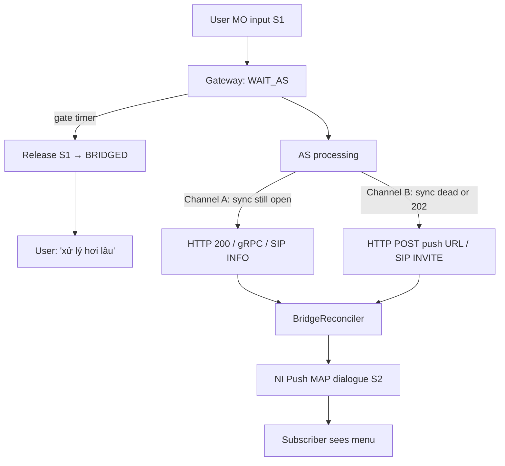
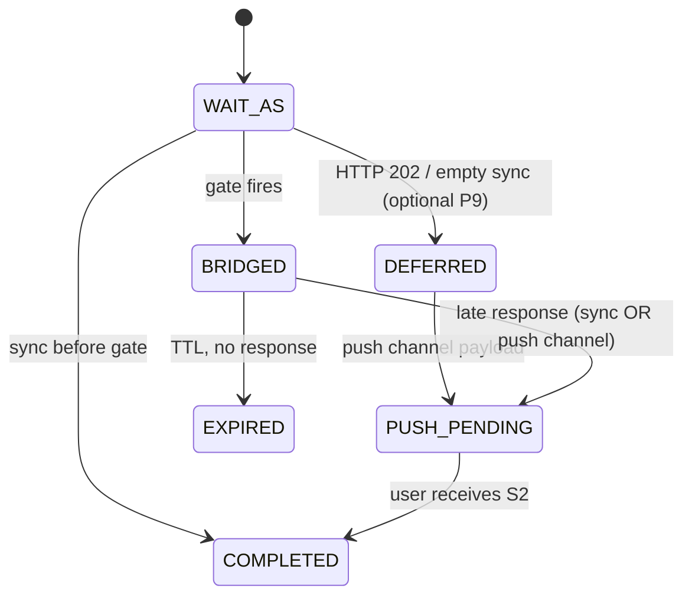
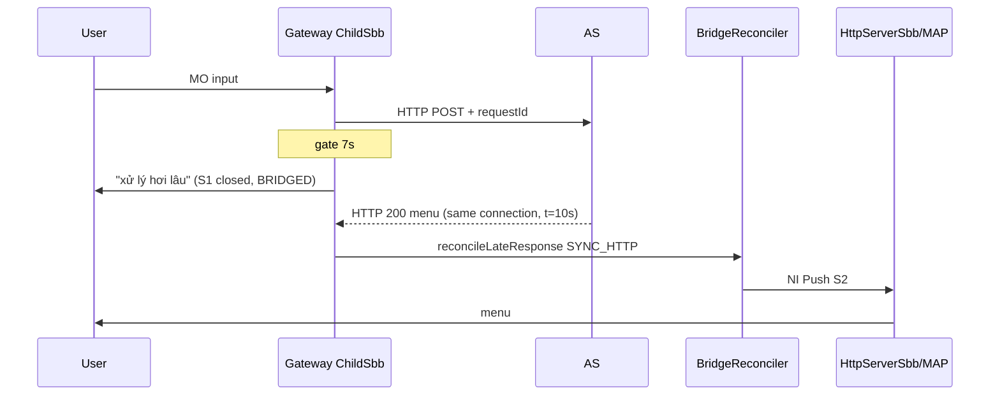
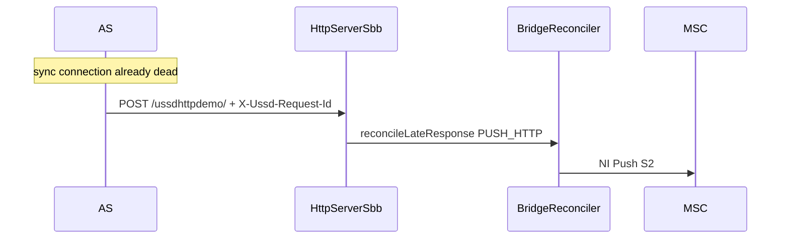
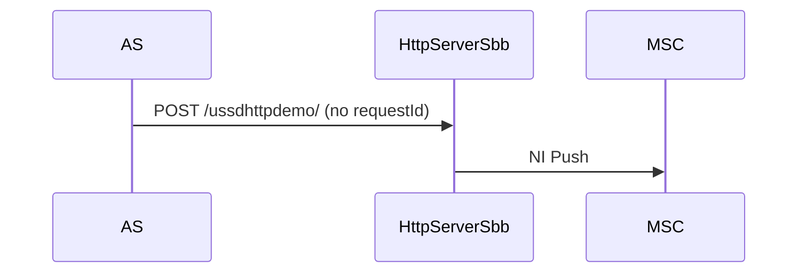

# RFC: Unified Bridge Reconciliation (single endpoint, no async-response)

Status: **Review** (not implemented)  
Author: Jenny / USSD GW team  
Supersedes: §9 “Asynchronous callback” in [`virtual-session-bridge.md`](virtual-session-bridge.md)  
Target release: 7.2.x bridge Phase 2

---

## 1. Problem statement

### 1.1 Current behaviour (gaps)

| Path | After gate (`BRIDGED`) | Actual behaviour |
|------|------------------------|------------------|
| HTTP MO sync (`HttpClientSbb`) | AS returns HTTP 200 on **same** connection | **Dropped** — MAP dialog null / EXPUNGED |
| gRPC MO sync (`GrpcClientSbb`) | AS returns unary response | **Dropped** — MAP dialog null |
| SIP MO sync (`SipClientSbb`) | AS returns INFO payload | **Dropped** — MAP dialog null; **no bridge headers wired** |
| HTTP NI push (`HttpServerSbb`) | AS POST with `X-Ussd-Request-Id` | **Works** — triggers NI Push S2 |
| SIP NI push (`SipServerSbb`) | AS INVITE with bridge id | **Not implemented** — no bridge hook |

Design doc §9 documents a separate URL `POST /ussd/async-response`. **That path was never implemented.** Code already uses the **existing USSD Push servlet** (`HttpServerSbb.onPost`) and distinguishes bridge recovery via header `X-Ussd-Request-Id`.

### 1.2 User-visible failure

AS receives HTTP 200 after gate, believes delivery succeeded, subscriber never sees menu unless AS **also** POSTs to the push servlet — behaviour AS cannot infer from the sync channel alone.

---

## 2. Design goals

1. **One semantic contract** for late AS responses — no “async callback” vs “sync response” split in AS integration docs.
2. **Prefer sync channel** when still open: same HTTP/gRPC/SIP response after gate → gateway reconciles and NI Push S2 automatically.
3. **Fallback push channel** only when sync transport is dead (timeout, reset, AS chose HTTP 202).
4. **Single inbound push endpoint per transport** (HTTP servlet URL, SIP INVITE to GW) for both cold NI push and bridge recovery.
5. **Remove** `POST /ussd/async-response` from all documentation.
6. **Parity** across HTTP, gRPC, SIP client (MO) and HTTP, SIP server (NI push).

Non-goals (this RFC):

- Cross-node Infinispan replication.
- SMS fallback implementation (SPI unchanged).

---

## 3. Unified model: “Late response reconciliation”

Replace the term **async callback** with **late response reconciliation**.

A **late response** is any AS reply tied to a `requestId` that arrives after the MO dialogue S1 was released (state `BRIDGED`) or after the AS signalled deferral (`HTTP 202` / empty sync body while still in `WAIT_AS`).

### 3.1 Two delivery channels (same payload, same idempotency)



| Channel | When AS uses it | Gateway entry point |
|---------|-----------------|---------------------|
| **A — Sync** | Response arrives on the **original** MO request connection | `HttpClientSbb`, `GrpcClientSbb`, `SipClientSbb` |
| **B — Push** | Sync timed out / connection reset / AS returned 202 or empty body | `HttpServerSbb.onPost`, `SipServerSbb.onInvite` |

**Rule for AS integrators:** always echo `X-Ussd-Request-Id` (and session id). Return menu payload on whichever channel is still alive. **Do not** call push channel if sync response already succeeded **unless** implementing deliberate retry (idempotent).

---

## 4. AS contract (single endpoint per direction)

### 4.1 Gateway → AS (MO / pull) — unchanged URL

Existing routing rule URL (`ScRoutingRule.ruleUrl`). When `sessionBridgeEnabled=true`, gateway adds:

```http
X-Ussd-Session-Id: <sessionId>     # stable across S1→S2; equals internal correlationId
X-Ussd-Request-Id: <requestId>     # one per user input / one AS round-trip
```

gRPC envelope (existing): `sessionId`, `correlationId` (same value), `requestId` **added in Phase 2** to JSON envelope.

SIP MO (new): custom SIP header on outbound INFO:

```text
X-Ussd-Session-Id: gw-m1abc-1f
X-Ussd-Request-Id: rgw-m1abc-1g
```

### 4.2 AS → Gateway (late response)

#### Channel A — Sync (preferred)

Return normal `XmlMAPDialog` body on the **same** MO transaction:

- HTTP: `200 OK` + XML/JSON body (even if S1 already closed — gateway reconciles)
- gRPC: unary `Process` response bytes
- SIP: INFO with `application/vnd.3gpp.ussd+xml` payload

Optional deferral (P9):

```http
HTTP/1.1 202 Accepted
X-Ussd-Request-Id: rgw-m1abc-1g
```

Gateway keeps `WAIT_AS`, does **not** wait for body on sync; AS must use Channel B before TTL.

#### Channel B — Push (fallback)

**Same URL / interface as campaign USSD Push** — no second path.

HTTP example (push servlet already deployed, e.g. `/ussdhttpdemo/`):

```http
POST /ussdhttpdemo/ HTTP/1.1
Content-Type: application/xml
X-Ussd-Request-Id: rgw-m1abc-1g
X-Ussd-Session-Id: gw-m1abc-1f

<dialog>... menu XmlMAPDialog ...</dialog>
```

SIP example (new bridge hook on `SipServerSbb`):

```text
INVITE sip:251911234567@ussd-gateway SIP/2.0
X-Ussd-Request-Id: rgw-m1abc-1g
X-Ussd-Session-Id: gw-m1abc-1f
Content-Type: application/vnd.3gpp.ussd+xml
...
```

**Cold NI push** (no prior MO bridge): omit `X-Ussd-Request-Id` → existing behaviour (SRI + push).

### 4.3 Idempotency

First successful reconcile wins per `requestId`:

- FSM: `BRIDGED` → `PUSH_PENDING` (atomic in store)
- Duplicate on either channel: acknowledge (HTTP 200 / SIP 200) without second NI Push or CDR S2

Race: sync and push arrive nearly together — store-level transition guards duplicate delivery (same as today’s `onAsyncCallback`).

---

## 5. New core component: `BridgeReconciler`

Location: `core/session-bridge` (new class), called via `SessionBridgeSupport`.

```java
public enum ReconcileChannel {
    SYNC_HTTP, SYNC_GRPC, SYNC_SIP,
    PUSH_HTTP, PUSH_SIP
}

public final class ReconcileResult {
    public enum Outcome { DELIVERED, QUEUED, DUPLICATE, UNKNOWN, EXPIRED, DISABLED }
    // ...
}

/**
 * Accept a late AS response and schedule NI Push S2.
 * @param requestId  from X-Ussd-Request-Id (required)
 * @param payload    serialized XmlMAPDialog bytes
 * @param channel    which entry point received it (metrics)
 */
ReconcileResult reconcileLateResponse(String requestId, byte[] payload, ReconcileChannel channel);
```

Responsibilities:

1. Load `VirtualSession` by `requestId`; require state `BRIDGED` (or `WAIT_AS` after HTTP 202 — see §6.2).
2. Idempotent transition → `PUSH_PENDING`.
3. Deserialize payload → validate MAP messages (menu / notify).
4. Run `shouldDeliverNow()` — queue via `PushRetryQueue` if active MO blocks.
5. Invoke **`NiPushDispatcher.deliver(VirtualSession, XmlMAPDialog)`** (new SLEE-facing interface).
6. Record metrics, attach CDR S2 (`bridgePhase=S2_PUSH`).

Rename for clarity:

| Old | New |
|-----|-----|
| `onAsyncCallback(requestId)` | `acceptLateResponse(requestId)` (internal step 2 only) |
| “async callback” (docs) | “late response reconciliation” |

---

## 6. FSM adjustments



### 6.1 Allowed transitions (changes)

| From | Event | To |
|------|-------|-----|
| `BRIDGED` | late response (any channel) | `PUSH_PENDING` |
| `WAIT_AS` | HTTP 202 / empty 200 with `requestId` | `DEFERRED` or stay `WAIT_AS` until gate — **config**: `bridgeDeferOn202` |

Gate timer behaviour unchanged: at gate, if still `WAIT_AS` → release S1 → `BRIDGED`.

### 6.2 HTTP 202 (optional, Phase 2b)

If AS returns `202` before gate:

- Gateway stops expecting sync body.
- Does **not** complete on S1.
- At gate → `BRIDGED` as today.
- AS delivers via push channel only.

If `202` arrives **after** gate while sync socket still open — treat as idempotent ack.

---

## 7. SBB changes (implementation map)

### 7.1 `HttpClientSbb.onResponseEvent`

**Before** dropping on null / EXPUNGED MAP dialog:

```java
if (bridge.isEnabled()) {
    String requestId = bridge.requestIdFor(cdrState.getCorrelationId());
    byte[] body = extractBody(response);
    ReconcileResult r = bridge.reconcileLateResponse(requestId, body, SYNC_HTTP);
    if (r.isHandled()) { endHttpClientActivity(); return; }
}
// legacy drop path
```

Also handle: `finalMessageSent == true` but `requestId` still in `BRIDGED` (same reconcile attempt).

Record AS latency for adaptive timeout **before** reconcile (unchanged).

### 7.2 `GrpcClientSbb.processGrpcResponse`

Same check when `getMAPDialog() == null`:

```java
bridge.reconcileLateResponse(response.getRequestId(), response.getPayload(), SYNC_GRPC);
```

Requires **`requestId` in `GrpcResponse`** (propagate from request envelope).

Extend poll window: continue polling registry until **HTTP client equivalent timeout** (dialog timeout), not only until gate — gate releases S1 but sync gRPC may still complete. **Or**: gRPC channel independent; reconcile on late registry entry even after gate (preferred).

### 7.3 `SipClientSbb` (new bridge wiring)

Phase 2 adds:

1. Outbound MO: propagate `X-Ussd-*` headers on INFO (mirror `HttpClientSbb`).
2. Inbound INFO response: if MAP null → `reconcileLateResponse(..., SYNC_SIP)`.
3. `ChildSbb.beginWaitAs` already runs for MAP MO — SIP MO uses same `ChildSbb` timer / gate.

### 7.4 `HttpServerSbb.onPost` — USSD Push case (inbound)

Refactor existing block (lines ~232–257):

- Remove comments referring to “async callback”.
- Flow:

```text
if requestId header present:
    result = reconcileLateResponse(requestId, body, PUSH_HTTP)
    if DUPLICATE/UNKNOWN → ackHttp 200, return
    if QUEUED → ackHttp 200, return
    if DELIVERED → continue existing SRI + pushToDevice with bridgeCorrelationId on CDR
else:
    existing cold NI push flow (unchanged)
```

**Single endpoint** = configured push servlet only. Remove any doc reference to `/ussd/async-response`.

`ackHttpCallback()` → rename `ackLateResponse()`.

### 7.5 `SipServerSbb.onInvite` — USSD Push case (inbound)

Mirror `HttpServerSbb`:

1. Parse `X-Ussd-Request-Id` from INVITE (SIP extension header).
2. If present → `reconcileLateResponse(..., PUSH_SIP)` before SRI.
3. Cold push: no header → unchanged INVITE handling.

### 7.6 Shared `NiPushDispatcher`

Extract from `HttpServerSbb` the MAP NI push + CDR S2 logic into a class injectable via `SessionBridgeSupport.setNiPushDispatcher(...)`, implementing:

```java
boolean deliverNiPush(VirtualSession vs, XmlMAPDialog dialog);
```

Used by reconciler and push retry queue (`PushExecutor`).

---

## 8. Sequence diagrams (target)

### S2a — Late sync response (new — Channel A)



### S2b — Late push channel (existing — Channel B)



### S2c — Cold USSD Push (unchanged)



---

## 9. Configuration & observability

No new mandatory config. Optional:

| Property | Default | Meaning |
|----------|---------|---------|
| `bridgeDeferOn202` | `false` | Treat HTTP 202 as deferral (P9) |
| `bridgeSyncReconcileEnabled` | `true` | Enable Channel A reconcile (kill-switch) |

Metrics (rename / add):

| Metric | Meaning |
|--------|---------|
| `bridge_late_sync_http` | Reconciled via HttpClientSbb |
| `bridge_late_sync_grpc` | Reconciled via GrpcClientSbb |
| `bridge_late_sync_sip` | Reconciled via SipClientSbb |
| `bridge_late_push_http` | Reconciled via HttpServerSbb |
| `bridge_late_push_sip` | Reconciled via SipServerSbb |
| `bridge_late_duplicate` | Idempotent drop |
| `bridge_late_expired` | Unknown / TTL miss |

---

## 10. Documentation updates (checklist)

| File | Change |
|------|--------|
| [`virtual-session-bridge.md`](virtual-session-bridge.md) | Replace §9; update §3 diagram, §6 S2; scenario P4/P15 wording |
| [`README.md`](../README.md) | Bridge section: two channels, one push URL; remove async callback language |
| [`feature-merge-state.md`](../../feature-merge-state.md) | Point to this RFC |
| gRPC tester README | AS: respond sync OR push URL, not async-response |

**Delete concept:** `POST /ussd/async-response`

---

## 11. Test plan

| ID | Scenario | Assert |
|----|----------|--------|
| T1 | AS sync before gate | Menu on S1, no NI push |
| T2 | Gate → sync HTTP 200 same connection | NI push S2, one CDR S2, FSM COMPLETED |
| T3 | Gate → push POST same requestId | NI push S2 |
| T4 | T2 then duplicate push POST | Second ack, no duplicate push |
| T5 | T3 then late sync | Idempotent |
| T6 | Gate → no response until TTL | EXPIRED, metric |
| T7 | gRPC sync after gate | Same as T2 |
| T8 | SIP INFO after gate | Same as T2 (after Sip bridge wiring) |
| T9 | Cold push without requestId | Unchanged |
| T10 | Push with requestId, active MO queue-back | Retry queue |
| T11 | `sessionBridgeEnabled=false` | Legacy drop / no reconcile |

Unit: `BridgeReconcilerTest`, extend `VirtualSessionFsmTest` for sync reconcile from `BRIDGED`.

Integration: extend `tools/grpc-as-tester` with “slow AS, sync response after gate” mode.

---

## 12. Implementation phases

| Phase | Scope | Files |
|-------|-------|-------|
| **2a** | `BridgeReconciler` + HttpClientSbb + HttpServerSbb refactor + docs | session-bridge, HttpClientSbb, HttpServerSbb, SessionBridgeSupport |
| **2b** | GrpcClientSbb + extend GrpcResponse requestId + poll window | grpc-as library, GrpcClientSbb |
| **2c** | SipClientSbb + SipServerSbb headers + reconcile | SipClientSbb, SipServerSbb |
| **2d** | HTTP 202 deferral (optional) | HttpClientSbb, UssdPropertiesManagement |

Estimated LOC: ~400 production + ~300 tests (Phase 2a–2c).

---

## 13. Open questions for review

1. **gRPC poll window:** extend polling until `dialogTimeout` after gate, or rely on push channel only for gRPC late responses?
2. **SIP header names:** confirm `X-Ussd-Request-Id` / `X-Ussd-Session-Id` acceptable for operator SIP peers.
3. **HTTP 202:** implement in 2a or defer to 2d?
4. **VirtualSession payload cache:** should reconciler store last menu on session for push retry (today retry uses `serviceCode` string only — may need `lastMenu` field)?

---

## 14. Approval

- [ ] Product / ông chủ — contract OK for digicom-et AS teams  
- [ ] Gateway — reconciler API  
- [ ] QA — test matrix T1–T11  

**Do not merge implementation until this RFC is approved.**
