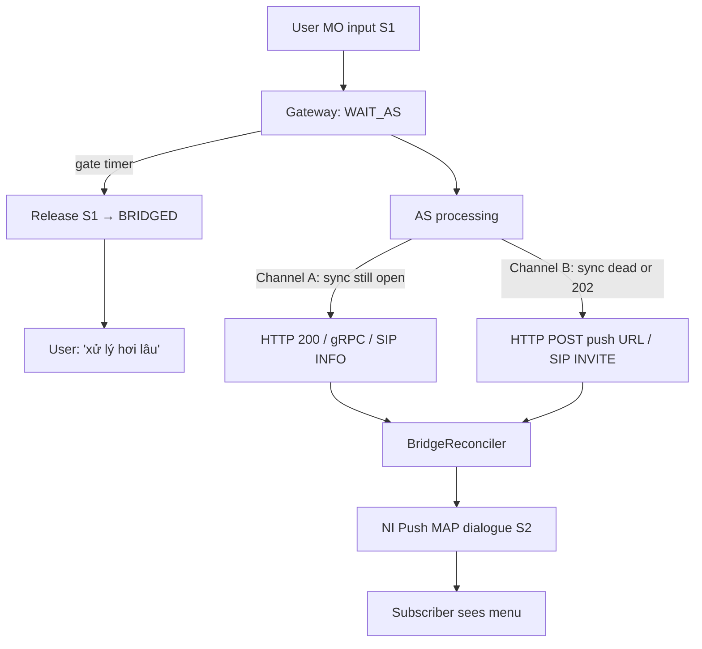
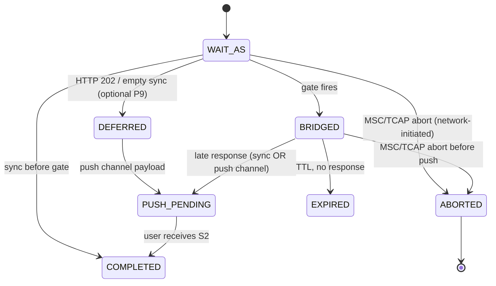
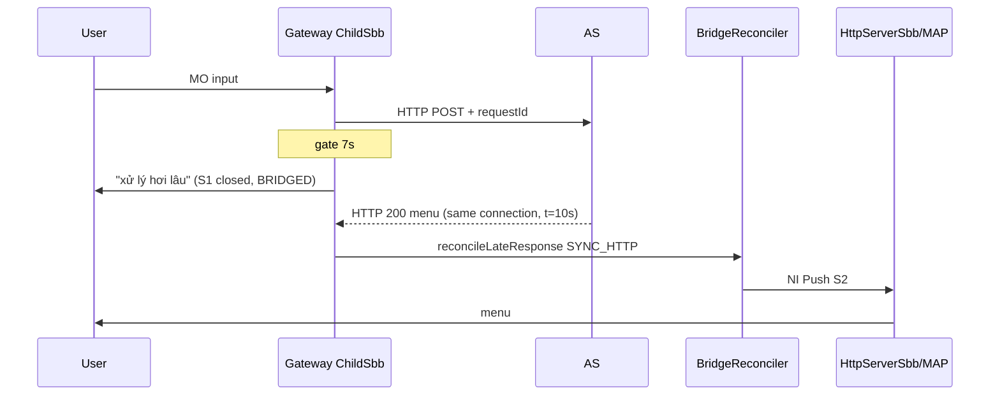
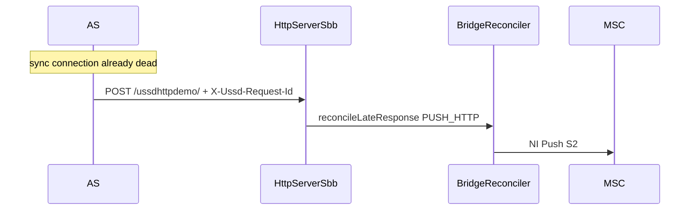
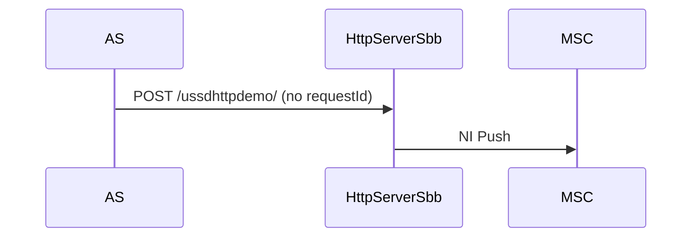

# RFC: Unified Bridge Reconciliation (single endpoint, no async-response)

Status: **Review** (not implemented)  
Author: Jenny / USSD GW team  
Supersedes: §9 “Asynchronous callback” in [`virtual-session-bridge.md`](virtual-session-bridge.md)  
Target release: 7.2.x bridge Phase 2

---

## 1. Problem statement

### 1.1 Current behaviour (gaps)

| Path | After gate (`BRIDGED`) | Actual behaviour |
|------|------------------------|------------------|
| HTTP MO sync (`HttpClientSbb`) | AS returns HTTP 200 on **same** connection | **Dropped** — MAP dialog null / EXPUNGED |
| gRPC MO sync (`GrpcClientSbb`) | AS returns unary response | **Dropped** — MAP dialog null |
| SIP MO sync (`SipClientSbb`) | AS returns INFO payload | **Dropped** — MAP dialog null; **no bridge headers wired** |
| HTTP NI push (`HttpServerSbb`) | AS POST with `X-Ussd-Request-Id` | **Works** — triggers NI Push S2 |
| SIP NI push (`SipServerSbb`) | AS INVITE with bridge id | **Not implemented** — no bridge hook |

Design doc §9 documents a separate URL `POST /ussd/async-response`. **That path was never implemented.** Code already uses the **existing USSD Push servlet** (`HttpServerSbb.onPost`) and distinguishes bridge recovery via header `X-Ussd-Request-Id`.

### 1.2 User-visible failure

AS receives HTTP 200 after gate, believes delivery succeeded, subscriber never sees menu unless AS **also** POSTs to the push servlet — behaviour AS cannot infer from the sync channel alone.

---

## 2. Design goals

1. **One semantic contract** for late AS responses — no “async callback” vs “sync response” split in AS integration docs.
2. **Prefer sync channel** when still open: same HTTP/gRPC/SIP response after gate → gateway reconciles and NI Push S2 automatically.
3. **Fallback push channel** only when sync transport is dead (timeout, reset, AS chose HTTP 202).
4. **Single inbound push endpoint per transport** (HTTP servlet URL, SIP INVITE to GW) for both cold NI push and bridge recovery.
5. **Remove** `POST /ussd/async-response` from all documentation.
6. **Parity** across HTTP, gRPC, SIP client (MO) and HTTP, SIP server (NI push).

Non-goals (this RFC):

- Cross-node Infinispan replication.
- SMS fallback implementation (SPI unchanged).

---

## 3. Unified model: “Late response reconciliation”

Replace the term **async callback** with **late response reconciliation**.

A **late response** is any AS reply tied to a `requestId` that arrives after the MO dialogue S1 was released (state `BRIDGED`) or after the AS signalled deferral (`HTTP 202` / empty sync body while still in `WAIT_AS`).

### 3.1 Two delivery channels (same payload, same idempotency)



| Channel | When AS uses it | Gateway entry point |
|---------|-----------------|---------------------|
| **A — Sync** | Response arrives on the **original** MO request connection | `HttpClientSbb`, `GrpcClientSbb`, `SipClientSbb` |
| **B — Push** | Sync timed out / connection reset / AS returned 202 or empty body | `HttpServerSbb.onPost`, `SipServerSbb.onInvite` |

**Rule for AS integrators:** always echo `X-Ussd-Request-Id` (and session id). Return menu payload on whichever channel is still alive. **Do not** call push channel if sync response already succeeded **unless** implementing deliberate retry (idempotent).

---

## 4. AS contract (single endpoint per direction)

### 4.1 Gateway → AS (MO / pull) — unchanged URL

Existing routing rule URL (`ScRoutingRule.ruleUrl`). When `sessionBridgeEnabled=true`, gateway adds:

```http
X-Ussd-Session-Id: <sessionId>     # stable across S1→S2; equals internal correlationId
X-Ussd-Request-Id: <requestId>     # one per user input / one AS round-trip
```

gRPC envelope (existing): `sessionId`, `correlationId` (same value), `requestId` **added in Phase 2** to JSON envelope.

SIP MO (new): custom SIP header on outbound INFO:

```text
X-Ussd-Session-Id: gw-m1abc-1f
X-Ussd-Request-Id: rgw-m1abc-1g
```

### 4.2 AS → Gateway (late response)

#### Channel A — Sync (preferred)

Return normal `XmlMAPDialog` body on the **same** MO transaction:

- HTTP: `200 OK` + XML/JSON body (even if S1 already closed — gateway reconciles)
- gRPC: unary `Process` response bytes
- SIP: INFO with `application/vnd.3gpp.ussd+xml` payload

Optional deferral (P9):

```http
HTTP/1.1 202 Accepted
X-Ussd-Request-Id: rgw-m1abc-1g
```

Gateway keeps `WAIT_AS`, does **not** wait for body on sync; AS must use Channel B before TTL.

#### Channel B — Push (fallback)

**Same URL / interface as campaign USSD Push** — no second path.

HTTP example (push servlet already deployed, e.g. `/ussdhttpdemo/`):

```http
POST /ussdhttpdemo/ HTTP/1.1
Content-Type: application/xml
X-Ussd-Request-Id: rgw-m1abc-1g
X-Ussd-Session-Id: gw-m1abc-1f

<dialog>... menu XmlMAPDialog ...</dialog>
```

SIP example (new bridge hook on `SipServerSbb`):

```text
INVITE sip:251911234567@ussd-gateway SIP/2.0
X-Ussd-Request-Id: rgw-m1abc-1g
X-Ussd-Session-Id: gw-m1abc-1f
Content-Type: application/vnd.3gpp.ussd+xml
...
```

**Cold NI push** (no prior MO bridge): omit `X-Ussd-Request-Id` → existing behaviour (SRI + push).

### 4.3 Idempotency

First successful reconcile wins per `requestId`:

- FSM: `BRIDGED` → `PUSH_PENDING` (atomic in store)
- Duplicate on either channel: acknowledge (HTTP 200 / SIP 200) without second NI Push or CDR S2

Race: sync and push arrive nearly together — store-level transition guards duplicate delivery (same as today’s `onAsyncCallback`).

---

## 5. New core component: `BridgeReconciler`

Location: `core/session-bridge` (new class), called via `SessionBridgeSupport`.

```java
public enum ReconcileChannel {
    SYNC_HTTP, SYNC_GRPC, SYNC_SIP,
    PUSH_HTTP, PUSH_SIP
}

public final class ReconcileResult {
    public enum Outcome { DELIVERED, QUEUED, DUPLICATE, UNKNOWN, EXPIRED, ABORTED, DISABLED }
    // ABORTED → network tore down the dialogue (§13.2); drop, no S2.
}

/**
 * Accept a late AS response and schedule NI Push S2.
 * @param requestId  from X-Ussd-Request-Id (required)
 * @param payload    serialized XmlMAPDialog bytes
 * @param channel    which entry point received it (metrics)
 */
ReconcileResult reconcileLateResponse(String requestId, byte[] payload, ReconcileChannel channel);
```

Responsibilities:

1. Load `VirtualSession` by `requestId`; require state `BRIDGED` (or `WAIT_AS` after HTTP 202 — see §6.2).
2. Idempotent transition → `PUSH_PENDING`.
3. Deserialize payload → validate MAP messages (menu / notify).
4. Run `shouldDeliverNow()` — queue via `PushRetryQueue` if active MO blocks.
5. Invoke **`NiPushDispatcher.deliver(VirtualSession, XmlMAPDialog)`** (new SLEE-facing interface).
6. Record metrics, attach CDR S2 (`bridgePhase=S2_PUSH`).

Rename for clarity:

| Old | New |
|-----|-----|
| `onAsyncCallback(requestId)` | `acceptLateResponse(requestId)` (internal step 2 only) |
| “async callback” (docs) | “late response reconciliation” |

---

## 6. FSM adjustments



### 6.1 Allowed transitions (changes)

| From | Event | To |
|------|-------|-----|
| `BRIDGED` | late response (any channel) | `PUSH_PENDING` |
| `WAIT_AS` | HTTP 202 / empty 200 with `requestId` | `DEFERRED` or stay `WAIT_AS` until gate — **config**: `bridgeDeferOn202` |
| `WAIT_AS` / `BRIDGED` | **MSC / TCAP / Provider Abort** (network ended the dialogue) | `ABORTED` — **no S2 push** (see §13.2) |

Gate timer behaviour unchanged: at gate, if still `WAIT_AS` → release S1 → `BRIDGED`.

`ABORTED` is **terminal** and distinct from `EXPIRED`: `EXPIRED` = our TTL elapsed with no AS
response; `ABORTED` = the **network** tore down the transaction, so the late AS response must be
dropped (a push would re-open a session the MSC already considers closed). Maps to a new terminal
in `FsmState` alongside `COMPLETED`/`FAILED`/`EXPIRED`.

### 6.2 Atomic transition requirement (**critical**)

Current code path `getByRequestId → check state → transitionTo → save` is a **non-atomic
read-modify-write**. `VirtualSession.transitionTo()` mutates an in-memory field and
`InfinispanVirtualSessionStore.save()` is a plain `put()` — **not** a compare-and-swap.

With the **two-channel** design (Channel A sync + Channel B push may arrive concurrently for the
same `requestId`) this is a real race: both readers observe `BRIDGED`, both transition to
`PUSH_PENDING`, both dispatch S2 → **double NI push / double charge**.

**Mandatory fix in Phase 2a** — add an atomic transition to `VirtualSessionStore`:

```java
/**
 * Atomically transition the session for this correlationId from {@code expected} to {@code next}.
 * @return the updated session if the CAS succeeded, or {@code null} if the current state was not
 *         {@code expected} (lost the race / already delivered).
 */
VirtualSession compareAndTransition(String correlationId, FsmState expected, FsmState next);
```

Implementations:

- `InMemoryVirtualSessionStore`: guard with `ConcurrentHashMap.compute(...)` on the correlationId.
- `InfinispanVirtualSessionStore`: use `cache.replace(key, oldValue, newValue)` (Infinispan
  implements the atomic `ConcurrentMap.replace`), retry-on-false loop. **No new Infinispan API
  dependency** — `replace` is part of the `ConcurrentMap` contract already used.

`BridgeReconciler.reconcileLateResponse` (§5) must perform the `BRIDGED → PUSH_PENDING` step **only**
via `compareAndTransition`; the loser of the CAS returns `DUPLICATE`. This is the single
idempotency point for both channels and the billing-safety guarantee (§13.1).

### 6.2 HTTP 202 (optional, Phase 2b)

If AS returns `202` before gate:

- Gateway stops expecting sync body.
- Does **not** complete on S1.
- At gate → `BRIDGED` as today.
- AS delivers via push channel only.

If `202` arrives **after** gate while sync socket still open — treat as idempotent ack.

---

## 7. SBB changes (implementation map)

### 7.1 `HttpClientSbb.onResponseEvent`

**Before** dropping on null / EXPUNGED MAP dialog:

```java
if (bridge.isEnabled()) {
    String requestId = bridge.requestIdFor(cdrState.getCorrelationId());
    byte[] body = extractBody(response);
    ReconcileResult r = bridge.reconcileLateResponse(requestId, body, SYNC_HTTP);
    if (r.isHandled()) { endHttpClientActivity(); return; }
}
// legacy drop path
```

Also handle: `finalMessageSent == true` but `requestId` still in `BRIDGED` (same reconcile attempt).

Record AS latency for adaptive timeout **before** reconcile (unchanged).

### 7.2 `GrpcClientSbb.processGrpcResponse`

Same check when `getMAPDialog() == null`:

```java
bridge.reconcileLateResponse(response.getRequestId(), response.getPayload(), SYNC_GRPC);
```

Requires **`requestId` in `GrpcResponse`** (propagate from request envelope).

Extend poll window: continue polling registry until **HTTP client equivalent timeout** (dialog timeout), not only until gate — gate releases S1 but sync gRPC may still complete. **Or**: gRPC channel independent; reconcile on late registry entry even after gate (preferred).

### 7.3 `SipClientSbb` (new bridge wiring)

Phase 2 adds:

1. Outbound MO: propagate `X-Ussd-*` headers on INFO (mirror `HttpClientSbb`).
2. Inbound INFO response: if MAP null → `reconcileLateResponse(..., SYNC_SIP)`.
3. `ChildSbb.beginWaitAs` already runs for MAP MO — SIP MO uses same `ChildSbb` timer / gate.

### 7.4 `HttpServerSbb.onPost` — USSD Push case (inbound)

Refactor existing block (lines ~232–257):

- Remove comments referring to “async callback”.
- Flow:

```text
if requestId header present:
    result = reconcileLateResponse(requestId, body, PUSH_HTTP)
    if DUPLICATE/UNKNOWN → ackHttp 200, return
    if QUEUED → ackHttp 200, return
    if DELIVERED → continue existing SRI + pushToDevice with bridgeCorrelationId on CDR
else:
    existing cold NI push flow (unchanged)
```

**Single endpoint** = configured push servlet only. Remove any doc reference to `/ussd/async-response`.

`ackHttpCallback()` → rename `ackLateResponse()`.

### 7.5 `SipServerSbb.onInvite` — USSD Push case (inbound)

Mirror `HttpServerSbb`:

1. Parse `X-Ussd-Request-Id` from INVITE (SIP extension header).
2. If present → `reconcileLateResponse(..., PUSH_SIP)` before SRI.
3. Cold push: no header → unchanged INVITE handling.

### 7.6 Shared `NiPushDispatcher`

Extract from `HttpServerSbb` the MAP NI push + CDR S2 logic into a class injectable via `SessionBridgeSupport.setNiPushDispatcher(...)`, implementing:

```java
boolean deliverNiPush(VirtualSession vs, XmlMAPDialog dialog);
```

Used by reconciler and push retry queue (`PushExecutor`).

---

## 8. Sequence diagrams (target)

### S2a — Late sync response (new — Channel A)



### S2b — Late push channel (existing — Channel B)



### S2c — Cold USSD Push (unchanged)



---

## 9. Configuration & observability

No new mandatory config. Optional:

| Property | Default | Meaning |
|----------|---------|---------|
| `bridgeDeferOn202` | `false` | Treat HTTP 202 as deferral (P9) |
| `bridgeSyncReconcileEnabled` | `true` | Enable Channel A reconcile (kill-switch) |

Metrics (rename / add):

| Metric | Meaning |
|--------|---------|
| `bridge_late_sync_http` | Reconciled via HttpClientSbb |
| `bridge_late_sync_grpc` | Reconciled via GrpcClientSbb |
| `bridge_late_sync_sip` | Reconciled via SipClientSbb |
| `bridge_late_push_http` | Reconciled via HttpServerSbb |
| `bridge_late_push_sip` | Reconciled via SipServerSbb |
| `bridge_late_duplicate` | Idempotent drop |
| `bridge_late_expired` | Unknown / TTL miss |

---

## 10. Documentation updates (checklist)

| File | Change |
|------|--------|
| [`virtual-session-bridge.md`](virtual-session-bridge.md) | Replace §9; update §3 diagram, §6 S2; scenario P4/P15 wording |
| [`README.md`](../README.md) | Bridge section: two channels, one push URL; remove async callback language |
| [`feature-merge-state.md`](../../feature-merge-state.md) | Point to this RFC |
| gRPC tester README | AS: respond sync OR push URL, not async-response |

**Delete concept:** `POST /ussd/async-response`

---

## 11. Test plan

| ID | Scenario | Assert |
|----|----------|--------|
| T1 | AS sync before gate | Menu on S1, no NI push |
| T2 | Gate → sync HTTP 200 same connection | NI push S2, one CDR S2, FSM COMPLETED |
| T3 | Gate → push POST same requestId | NI push S2 |
| T4 | T2 then duplicate push POST | Second ack, no duplicate push |
| T5 | T3 then late sync | Idempotent |
| T6 | Gate → no response until TTL | EXPIRED, metric |
| T7 | gRPC sync after gate | Same as T2 |
| T8 | SIP INFO after gate | Same as T2 (after Sip bridge wiring) |
| T9 | Cold push without requestId | Unchanged |
| T10 | Push with requestId, active MO queue-back | Retry queue |
| T11 | `sessionBridgeEnabled=false` | Legacy drop / no reconcile |
| T12 | **Concurrent sync + push, same requestId** | Exactly one S2; CAS loser → DUPLICATE (no double charge) |
| T13 | **MSC/TCAP abort then late AS response** | State `ABORTED`; response dropped; no S2 |
| T14 | Out-of-order: input gen N+1 then late response gen N | Stale response dropped (§13.3) |
| T15 | Late response after `bridgeStateTtlSec` | `EXPIRED` metric, optional fallback |

Unit: `BridgeReconcilerTest`, extend `VirtualSessionFsmTest` for sync reconcile from `BRIDGED`.

Integration: extend `tools/grpc-as-tester` with “slow AS, sync response after gate” mode.

---

## 12. Implementation phases

| Phase | Scope | Files |
|-------|-------|-------|
| **2a** | **`compareAndTransition` CAS (§6.2)** + `ABORTED` state + `markAborted` (§13.2) + `BridgeReconciler` + HttpClientSbb + HttpServerSbb refactor + docs | session-bridge (stores, FsmState), ChildSbb, HttpClientSbb, HttpServerSbb, SessionBridgeSupport |
| **2b** | GrpcClientSbb + extend GrpcResponse requestId + poll window | grpc-as library, GrpcClientSbb |
| **2c** | SipClientSbb + SipServerSbb headers + reconcile + abort mapping | SipClientSbb, SipServerSbb |
| **2d** | HTTP 202 deferral (optional) + `inputGeneration` ordering (§13.3) | HttpClientSbb, VirtualSession, UssdPropertiesManagement |
| **2e** | Backpressure (rate limit + circuit breaker, §13.5) + adaptive outlier guard (§13.8) | PushRetryQueue, AdaptiveTimeout |
| **3** | Clustered / persistent store (§13.7) | new `VirtualSessionStore` impl (HotRod / Redis) |

Estimated LOC: ~500 production + ~350 tests (Phase 2a–2c). **CAS + abort mapping are non-negotiable
for production** (billing safety); ordering, backpressure, clustering can ship incrementally.

---

## 13. Carrier-grade hardening (from design review, 2026-06-21)

A detailed review ([`discussion_adaptive_timeout.md`](../../discussion_adaptive_timeout.md)) raised
10 telecom edge cases. Below is the **verified** position after auditing the actual code, separating
real gaps from items already implemented.

### 13.0 Already implemented (no action)

| Reviewer concern | Reality in code |
|------------------|-----------------|
| Adaptive gate could exceed MAP timer | `AdaptiveTimeout.suggestGateMs` clamps to `[1000ms, configuredGate]`; `SessionBridgeSupport.gateTimeoutMs` forces `gate < dialogTimeout`. Ceiling is safe. |
| Session memory leak / no hard TTL | Absolute TTL exists: `VirtualSession.expireAtMillis` + `bridgeStateTtlSec=180`, lazy expiry in both stores. |
| EWMA params unknown | `ALPHA=0.2`, `HEADROOM=1.5`, `FLOOR=1000ms`, **per-networkId**. |
| “SessionBridgeSupport missing” | Exists at `core/slee/sbbs/.../slee/SessionBridgeSupport.java`. |
| “README per-MSISDN vs RFC per-requestId contradiction” | Both, different purpose — see §13.4. |

### 13.1 Billing safety / duplicate response (review #2, #7) — **critical**

Root cause = the non-atomic transition (§6.2). The fix is the `compareAndTransition` CAS: exactly
one late response per `requestId` wins `BRIDGED → PUSH_PENDING`; all others (sync retry, push
retry, AS-side retry) return `DUPLICATE` and are ack-only. The gateway **never** triggers AS
re-execution — it only re-delivers a cached menu on push retry, never re-sends the MO request to
the AS. Idempotency key on the wire = `requestId` (mandatory header in §4).

### 13.2 Network abort vs gate timeout (review #3, #10) — **critical**

The gateway must distinguish:

| Event | Source | Action |
|-------|--------|--------|
| Gate timer fires | Gateway (we choose to bridge) | `WAIT_AS → BRIDGED`, push S2 when AS replies |
| MAP/TCAP **Provider/User Abort**, Dialog released by MSC | Network | `→ ABORTED`, **drop** any late AS response, no S2 |

Implementation: in the abort/dialog-release handlers of `ChildSbb` (MO) — `onDialogProviderAbort`,
`onDialogUserAbort`, `onDialogRelease`, `onDialogTimeout` when network-initiated — call
`bridge.markAborted(correlationId)` which CAS-transitions to `ABORTED`. A later
`reconcileLateResponse` finding state `ABORTED`/terminal returns `UNKNOWN`/`DUPLICATE` and drops.

This prevents the “zombie session” reopen (#3): once the MSC considers the dialogue closed, S2 would
be a fresh NI dialogue the subscriber never asked for.

### 13.3 Response ordering across multiple inputs (review #4)

`VirtualSession` tracks `attempt` but not a per-input generation. When a user sends input #1 then
input #2 quickly and both bridge, an out-of-order late response could overwrite the newer menu.

**Add** `inputGeneration` (monotonic per virtual session): the MO path increments it on each user
input and stamps it on the `requestId`. `reconcileLateResponse` drops a payload whose generation is
**older** than the session’s current generation (stale). Low frequency in practice (USSD is
half-duplex per dialogue) but required for correctness under retry / double-tap.

### 13.4 Idempotency scope clarification (review question D)

Two independent mechanisms — **not** a contradiction:

| Mechanism | Key | Purpose |
|-----------|-----|---------|
| MO double-submit lock | `lock:{msisdn}` (TTL 5s) | Reject a second MO while one is in flight (P1) |
| Late-response idempotency | `req:{requestId}` + CAS transition | Deliver each AS late response exactly once (§13.1) |

### 13.5 Backpressure / retry storm (review #5)

`PushRetryQueue` capacity = 16384 (JCTools, bounded); overflow → `NotificationFallback`. For
100k+ concurrent bridged sessions add (Phase 2e, optional):

- Per-network NI-push rate limit (token bucket) so a recovering AS burst does not flood the MSC.
- Circuit breaker: when push failure ratio over a window exceeds a threshold, shed to fallback
  instead of retrying.

### 13.6 TTL hierarchy (review #6) — make explicit

Invariant the operator config must satisfy:

```
FLOOR (1s) ≤ adaptiveGate ≤ asyncGateTimeoutMs < dialogTimeout < MAP/TCAP network timer
                                                         ⌐ and ⌐
                            adaptiveGate ≤ asyncGateTimeoutMs ≤ bridgeStateTtlSec (absolute)
```

`reconcileLateResponse` arriving after `bridgeStateTtlSec` → cache miss → `EXPIRED` metric +
optional SMS fallback (P12). Document that `bridgeStateTtlSec` must cover the **slowest acceptable**
AS (e.g. 180s) but bounded to cap memory at high concurrency.

### 13.7 Single-node affinity / restart (review #8, #9) — scope statement

`InfinispanVirtualSessionStore` is a **local embedded** cache (JNDI `getCache`, plain put), **not**
HotRod/clustered, **no persistence** by default. Therefore, for this RFC:

- **Requirement:** an MO request and its late response (both channels) **must** land on the **same
  node**. Deploy with load-balancer **session affinity by MSISDN** (or single-node bridge).
- On node restart, in-flight bridged sessions are lost → those late responses become `EXPIRED`
  (fallback applies). Acceptable for MVP.
- **Out of scope (Phase 3):** clustered Infinispan (HotRod/dist-cache) or external store (Redis /
  RocksDB / ChronicleMap) for cross-node + restart durability. The store interface already isolates
  this — only a new `VirtualSessionStore` implementation is needed.

### 13.8 Adaptive timeout refinements (optional, Phase 2e)

Current EWMA is robust and cheap. Possible later improvements (not blocking):

- Outlier guard: ignore latency samples above `k × current EWMA` so a single p99 spike does not
  inflate the gate.
- Per-operation-type tracking (balance inquiry vs bank transfer) if AS exposes a class hint.

---

## 14. Open questions for review

1. **gRPC poll window:** extend polling until `dialogTimeout` after gate, or rely on push channel only for gRPC late responses?
2. **SIP header names:** confirm `X-Ussd-Request-Id` / `X-Ussd-Session-Id` acceptable for operator SIP peers.
3. **HTTP 202:** implement in 2a or defer to 2d?
4. **VirtualSession payload cache:** push retry today uses `serviceCode` string only; `VirtualSession` already has a `lastMenu` field — reconciler should populate it so retries re-deliver the real menu. Confirm.
5. **Abort hooks coverage:** which exact `ChildSbb` MAP callbacks signal a *network* abort vs our own timeout? Need to enumerate per jSS7 (ProviderAbort / UserAbort / DialogTimeout / DialogRelease) to wire §13.2 correctly.
6. **Affinity:** is LB session-affinity-by-MSISDN acceptable for digicom-et deployment, or is single-node bridge fine for MVP (§13.7)?

---

## 15. Approval

- [ ] Product / ông chủ — contract OK for digicom-et AS teams  
- [ ] Gateway — reconciler API + **atomic CAS transition (§6.2)** + **abort mapping (§13.2)**  
- [ ] QA — test matrix T1–T11 + race test (concurrent sync+push), abort-drop test  

**Do not merge implementation until this RFC is approved.**  
**Blocking for production:** §6.2 atomic transition and §13.2 network-abort mapping (billing safety).
