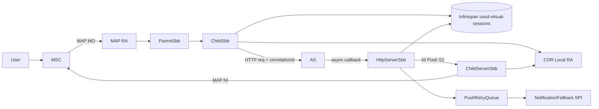
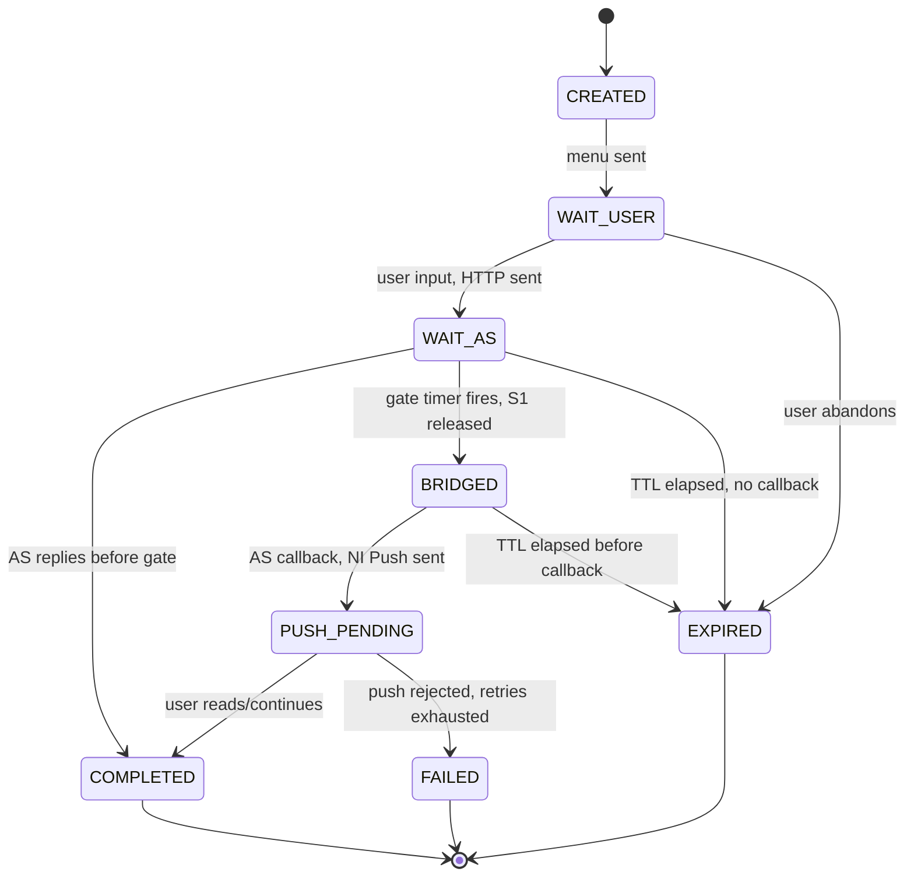
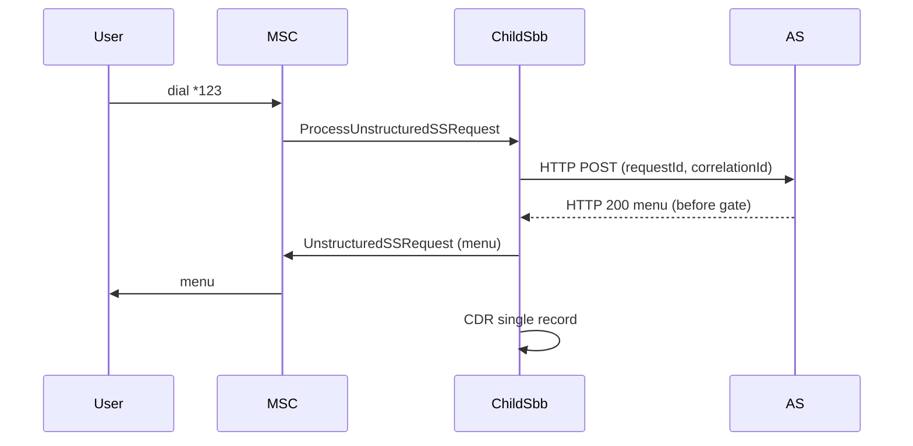
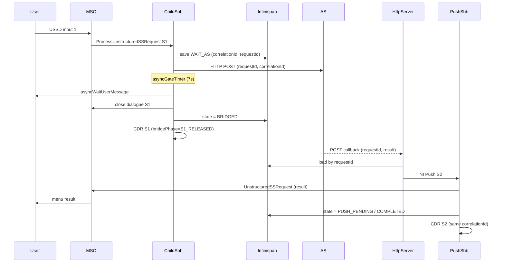
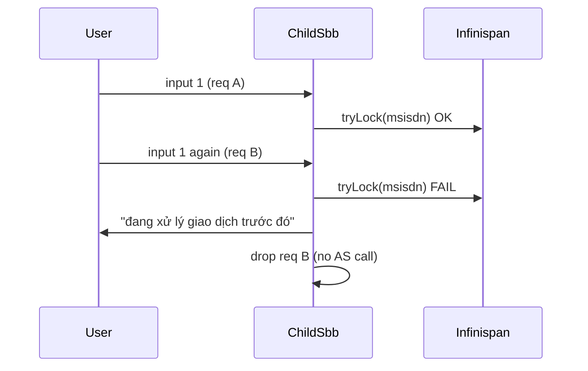
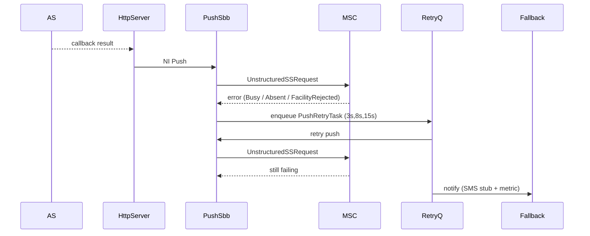
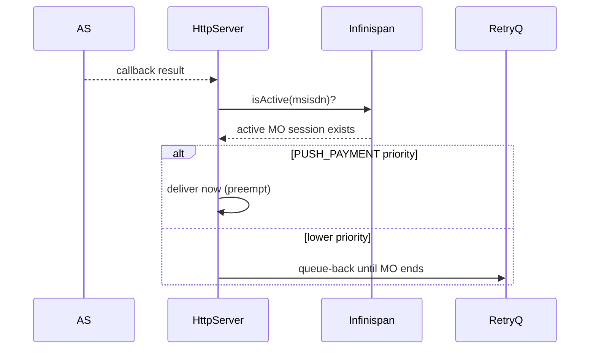
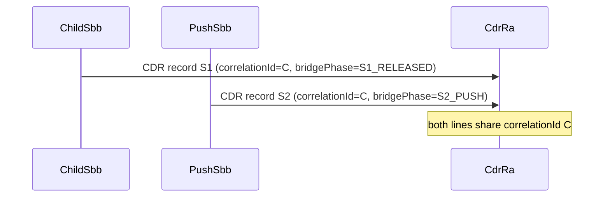
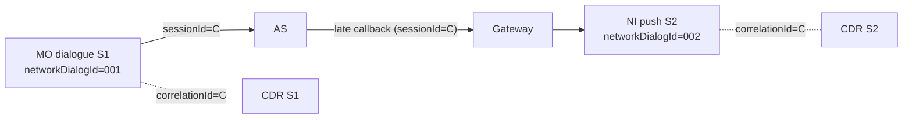
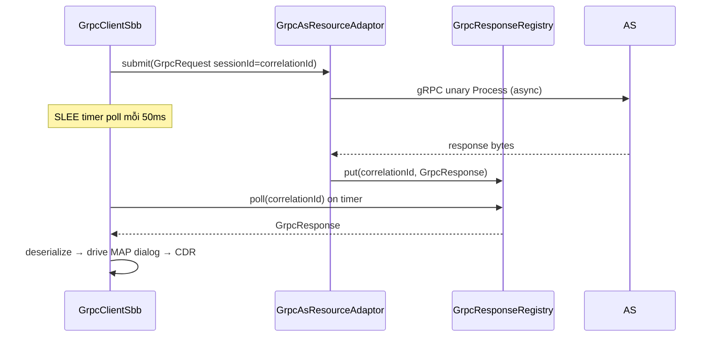

# USSD Virtual Session Bridge — Design Specification

Status: Draft (Phase 1 MVP)
Stack: Java 8, JAIN SLEE 1.1, WildFly 10, jSS7 MAP, Infinispan, JCTools
Supersedes: the brainstorming transcript in [`feature-merge-state.md`](../../feature-merge-state.md)

---

## 1. Executive Summary

USSD sessions are bound by strict network timers (typically 15–30s at MSC/VLR). When an
Application Server (AS) needs longer than the network allows, the dialogue is released by the
core network and the transaction is lost. This is the dominant cause of low success rate for
complex USSD services (banking, payment, third-party API lookups).

The Virtual Session Bridge turns the gateway from a synchronous proxy into a
session orchestration layer:

- Each user interaction is tracked by a gateway-owned `virtualSessionId` and a `correlationId`,
  independent of the network dialogue id.
- When the AS is slow, the gateway releases the MO dialogue early with a friendly message,
  persists state to Infinispan, and reconciles the late AS response by opening a new
  Network-Initiated (NI) USSD Push dialogue.
- The two network dialogues (S1 MO, S2 NI) are not merged at the MSC/VLR layer — they are
  linked at the application layer through `correlationId`, and recorded as two CDR records that
  share that id.

### Target KPIs

| KPI | Definition |
|-----|------------|
| `session_success_rate` | successful sessions / total sessions |
| `bridge_recovery_rate` | recovered timeout sessions / timeout sessions |
| `late_response_recovery` | late AS responses successfully pushed to user |
| `user_abandon_rate` | PUSH_PENDING sessions with no user reply |

### Non-goals (Phase 1)

- Distributed Infinispan cache across a cluster (local-cache first).
- Full SMSC integration (a `NotificationFallback` SPI stub is shipped; SMSC RA wiring is later).
- ML / adaptive timeout learning (a fixed adaptive gate is shipped; learning is later).

---

## 2. Terminology

| Term | Meaning |
|------|---------|
| MO / Pull | Mobile Originated. User dials `*123#` or replies to a menu. |
| NI / Push | Network Initiated. Gateway opens a dialogue to the handset. |
| Network dialogue | A single MAP dialogue (`localDialogId`/`remoteDialogId`) at SS7 layer. |
| Business session | The logical, multi-step user journey. May span several network dialogues. |
| `virtualSessionId` | Gateway-owned id for a business session. |
| `correlationId` | Id shared by all records/dialogues belonging to one bridged transaction. |
| `requestId` | Id of a single AS request; the AS echoes it on its async callback. |
| S1 | The MO dialogue that is released early when the AS is slow. |
| S2 | The NI Push dialogue that delivers the late AS result. |

---

## 3. Architecture



Code touch points:

- [`ChildSbb.java`](../../core/slee/sbbs/src/main/java/org/mobicents/ussdgateway/slee/ChildSbb.java) — MO flow, gate timer, early release.
- [`HttpServerSbb.java`](../../core/slee/sbbs/src/main/java/org/mobicents/ussdgateway/slee/http/HttpServerSbb.java) — async callback, NI Push.
- [`ChildServerSbb.java`](../../core/slee/sbbs/src/main/java/org/mobicents/ussdgateway/slee/ChildServerSbb.java) — push timer.
- [`UssdPropertiesManagement.java`](../../core/domain/src/main/java/org/mobicents/ussdgateway/UssdPropertiesManagement.java) — config + messages.
- [`USSDCDRState.java`](../../core/slee/sbbs/src/main/java/org/mobicents/ussdgateway/slee/cdr/USSDCDRState.java) + [`CdrLineFormatter.java`](../../core/slee/sbbs/src/main/java/org/mobicents/ussdgateway/slee/cdr/CdrLineFormatter.java) — CDR correlation.
- `core/session-bridge` — new module: FSM, store, retry queue, fallback, metrics.

---

## 4. Finite State Machine



Transitions are persisted to Infinispan on every change; each transition is logged with the
`correlationId`.

---

## 5. Infinispan Schema

Cache name: `ussd-virtual-sessions` (local-cache, transaction BATCH, expiration = `bridgeStateTtlSec`).

| Key | Value | TTL |
|-----|-------|-----|
| `vs:{correlationId}` | serialized `VirtualSession` | `bridgeStateTtlSec` (180s) |
| `req:{requestId}` | `correlationId` (secondary index) | `bridgeStateTtlSec` |
| `lock:{msisdn}` | `correlationId` (idempotency mutex) | 5s |
| `active:{msisdn}` | `correlationId` (active MO marker) | dialog timeout |

`VirtualSession` fields:

```text
virtualSessionId   String
correlationId      String
msisdn             String
imsi               String (nullable)
serviceCode        String
lastMenu           String
lastInput          String
pendingRequestId   String
fsmState           FsmState
priority           SessionPriority
networkDialogIds   List<Long>
attempt            int
createdAtMillis    long
expireAtMillis     long
```

---

## 6. Sequence Diagrams

### S1 — Pull MO happy path (AS fast, synchronous)



### S2 — Pull MO async bridge (AS slow)



### S3 — Pull race / double submit (idempotency lock)



### S4 — Push NI, user does not answer → retry / SMS fallback



### S5 — Push vs active Pull (priority / queue-back)



### S6 — CDR dual-record with correlationId



---

## 7. Scenario Catalog

### Pull (MO)

| ID | Scenario | Detection | Action |
|----|----------|-----------|--------|
| P1 | Double submission | `lock:{msisdn}` present | Reject 2nd, friendly message |
| P2 | Handover / VLR change in WAIT_AS | AbsentSubscriber on push | SRI-for-SM refresh VLR then push |
| P3 | User faster than AS | input during WAIT_AS | FSM blocks input or queues |
| P4 | AS timeout but txn committed | callback after gate | Reconcile via callback only, no retry of payment |
| P5 | User loses signal mid-session | dialogue closed | Cache result, resume on next dial |
| P6 | User redials after timeout | pending bridge for msisdn | Resume previous transaction |
| P7 | GW timer vs TCAP timer skew | MAP DialogTimeout before SLEE timer | gate = min(dialogTimeout, tcap - margin) |
| P8 | HTTP pool / RA queue congestion | queue depth, wait time | early async mode, overload message, circuit breaker |
| P9 | AS returns 202 / empty body | HTTP 202 | move to WAIT_AS, complete only via callback |
| P10 | Out-of-order HTTP response | responseSeq < expected | buffer or discard + log |
| P11 | Duplicate async callback | same requestId twice | idempotent apply, suppress 2nd CDR |
| P12 | Callback after Infinispan TTL | cache miss | log + SMS fallback or discard with metric |
| P13 | User redials during WAIT_AS | msisdn + pending bridge | resume message / block duplicate MO |
| P14 | SS7 link flap during WAIT_AS | SCTP/MAP unavailable | keep bridge state, retry push when link up |
| P15 | AS commit OK but HTTP fail | late callback success | reconcile via callback only |

### Push (NI)

| ID | Scenario | Detection | Action |
|----|----------|-----------|--------|
| U1 | User does not answer push | network timeout | default fallback action + SMS |
| U2 | Device rejects USSD push | FacilityRejected | mark device profile, switch to SMS |
| U3 | Subscriber busy | Busy / USSD session busy | back-off retry queue |
| U4 | Push during another USSD | priority resolver | preempt or queue-back |
| U5 | SIM detach / offline | AbsentSubscriber | pending notification TTL + SMS |
| U6 | Hybrid push+pull business flow | one correlationId, n dialogues | business session, not dialogue-bound |
| U7 | MSC rate limit | MAP error code | token bucket + deferred push |
| U8 | Stale VLR after handover | AbsentSubscriber | HLR lookup refresh then retry |
| U9 | Campaign push storm | push TPS > threshold | scheduler + per-MSC cap |
| U10 | User offline | MAP absent | pending notification TTL + SMS |

### Hybrid & Productivity

| ID | Scenario | Action |
|----|----------|--------|
| H7 | Business session spans dialogues | one correlationId, n dialogueIds in CDR |
| H8 | Per-operator profile | per-networkId adaptive timeout table |
| H9 | Success-rate KPIs | metrics: success, recovery, late-recovery, abandon |

---

## 8. Config Reference

New properties on `UssdPropertiesManagement` (persisted to `*_ussdproperties.xml`, editable via
the `ussd-management` UI):

| Property | Meaning | Default |
|----------|---------|---------|
| `sessionBridgeEnabled` | Master feature flag | `false` |
| `asyncGateTimeoutMs` | Release MO dialogue before network timeout | `7000` |
| `asyncWaitUserMessage` | Shown when bridging | `Hệ thống đang bận, sẽ update lại cho bạn ngay` |
| `asyncHardFailMessage` | Shown when AS hard-fails | `Hệ thống đang có nhiều người sử dụng, vui lòng dùng lại sau` |
| `bridgeStateTtlSec` | Infinispan TTL | `180` |
| `pushRetryDelaysMs` | Comma list of retry back-off | `3000,8000,15000` |

`asyncGateTimeoutMs` must be `< dialogTimeout`. When `sessionBridgeEnabled=false` the gateway
behaves exactly as before (no bridge, no early release).

---

## 9. AS Contract

### Request (gateway → AS)

The existing HTTP request gains two headers / fields:

```
X-Ussd-Request-Id: <requestId>
X-Ussd-Correlation-Id: <correlationId>
```

### Synchronous response (AS → gateway, before gate)

Normal body as today. Gateway delivers on S1.

### Asynchronous callback (AS → gateway, after gate)

```
POST /ussd/async-response
X-Ussd-Request-Id: <requestId>
X-Ussd-Correlation-Id: <correlationId>
Content-Type: application/xml | application/json

<ussd payload>
```

Idempotency: the AS may retry the callback; the gateway applies it once per `requestId`.

---

## 10. Implementation Phases & Traceability

| Phase | Section | Module / File | Test |
|-------|---------|---------------|------|
| A | §3–5 | `core/session-bridge` | `VirtualSessionFsmTest`, `InMemoryVirtualSessionStoreTest` |
| A | §8 | `UssdPropertiesManagement` + bootstrap XML + UI | `LegacyJavolutionConfigCompatibilityTest` |
| B | §6 S2/S3 | `ChildSbb`, `HttpServerSbb` | bridge flow test |
| C | §6 S4/S5 | `PushRetryQueue`, `NotificationFallback` | retry test |
| D | §6 S6 | `USSDCDRState`, `CdrLineFormatter` | `CdrLineFormatterTest` |
| A | §5 | `standalone-patched.xml` cache | manual deploy check |

---

## 11. Open Questions / Out of Scope

- SMSC RA integration for real SMS fallback (Phase 2).
- Distributed/replicated Infinispan for multi-node clusters (Phase 2).
- ML timeout learning per operator (Phase 3) — adaptive EWMA đã có ở Phase 2.
- Persisting bridge state to an external store (e.g. Cassandra/Redis) for cross-restart durability
  (optional; not in the repo — Infinispan local-cache is used for the MVP).

---

## 12. sessionId và correlationId — chỉ cần một id

Đây là câu hỏi nghiên cứu quan trọng: AS có cần cả `sessionId` lẫn `correlationId` không?

### Phân biệt khái niệm

| Id | Sở hữu bởi | Phạm vi | Mục đích |
|----|------------|---------|----------|
| `sessionId` (HTTP: `userObject`; gRPC: `session_id`) | Gateway ↔ AS | Một business session (có thể nhiều bước trong 1 dialogue) | AS giữ state menu theo session |
| `correlationId` (bridge) | Nội bộ gateway | Một transaction bridged (S1 MO + S2 NI) | Key Infinispan, liên kết 2 CDR |
| `networkDialogId` (MAP) | MSC/VLR | Một dialogue mạng | Định danh ở tầng SS7, không bền qua S1→S2 |

### Kết luận: **một id ở biên AS là đủ**

- Trong luồng **đồng bộ** (AS nhanh): một session = một dialogue. `sessionId` là đủ; `correlationId`
  chỉ là khái niệm nội bộ và bằng chính `sessionId`.
- Trong luồng **bridged** (AS chậm): S1 (MO) và S2 (NI push) là **hai dialogue mạng khác nhau**
  nhưng **cùng một business session**. Nếu gateway giữ `sessionId` **ổn định** xuyên S1→S2 thì AS
  chỉ cần `sessionId` để reconcile — không cần id thứ hai.

→ **Quyết định thiết kế:** khi bridge bật, gateway đặt `sessionId := correlationId` (cùng một giá
trị) gửi xuống AS. Nội bộ gateway vẫn dùng `correlationId` làm key store/CDR. Trên dây chỉ có **một
id**. CDR ghi `correlationId` để liên kết 2 record (S1/S2).

Hệ quả triển khai:
- gRPC SBB ([`GrpcClientSbb`](../../core/slee/sbbs/src/main/java/org/mobicents/ussdgateway/slee/grpc/GrpcClientSbb.java))
  đặt `GrpcRequest.sessionId = GrpcRequest.correlationId = correlationId`.
- Nếu bridge tắt: vẫn sinh một `correlationId` cục bộ làm key registry và `sessionId` cho AS — một id.



---

## 13. Adaptive timeout (Phase 2)

[`AdaptiveTimeout`](../../core/session-bridge/src/main/java/org/mobicents/ussdgateway/bridge/AdaptiveTimeout.java)
giữ EWMA độ trễ AS **theo từng `networkId`** và đề xuất gate:

```
gate = clamp(EWMA_latency × HEADROOM, floor, configuredGate)
```

- AS nhanh → gate ngắn → bridge sớm khi cần, ít giữ dialogue.
- AS chậm ổn định → gate dài hơn (nhưng **không vượt** `asyncGateTimeoutMs` cấu hình).
- `SessionBridgeSupport.gateTimeoutMs(networkId)` trả về gate đã adaptive; gRPC SBB nạp độ trễ quan
  sát được qua `recordAsLatency(networkId, ms)`.

Đáp ứng Scenario **H8** (per-operator profile) và một phần **P7** (lệch timer mạng).

---

## 14. Tích hợp gRPC AS (ussdgw ↔ Application Server)

Song song với HTTP, gateway hỗ trợ gọi AS qua **gRPC** (HTTP/2). Gateway là gRPC **client** (giống
HTTP client RA), AS là gRPC **server**.

### Module

| Module | Vai trò |
|--------|---------|
| [`core/slee/resources/grpc-as/library`](../../core/slee/resources/grpc-as/library) | `GrpcRequest`, `GrpcResponse`, `GrpcEnvelopeCodec`, `GrpcResponseRegistry`, SbbInterface |
| `grpc-as/ratype` | RA type descriptor |
| `grpc-as/ra` | `GrpcAsResourceAdaptor` (gRPC client, non-blocking) |
| `grpc-as/du` | Deployable Unit (bundle grpc + jctools) |
| [`GrpcClientSbb`](../../core/slee/sbbs/src/main/java/org/mobicents/ussdgateway/slee/grpc/GrpcClientSbb.java) | Child SBB, route khi `ScRoutingRuleType.GRPC` |

### Codec không cần protobuf codegen

Method gRPC `ussd.UssdApplicationService/Process` (unary) truyền `bytes` = JSON envelope:

```
{"sessionId","correlationId","push","networkId","payloadB64"}
```

`payloadB64` = Base64 của `XmlMAPDialog` đã serialize (giống HTTP RA gửi). Cách này giữ Java RA
không phụ thuộc protoc, vẫn interop dễ với AS Python. Đội nào muốn protobuf thuần có thể thay
marshaller mà không đụng tầng SBB.

### Luồng (non-blocking + SLEE poll timer)



Vì SLEE RA chuẩn cần custom Activity + ACIFactory (phụ thuộc container nội bộ), Phase này dùng
mẫu **non-blocking + registry + SLEE poll timer** (chỉ dùng API SLEE chuẩn: TimerFacility), an toàn
deploy như CDR Local RA. Custom-activity event-driven là tối ưu cho Phase sau.

### Test app Python

[`tools/grpc-as-tester`](../../tools/grpc-as-tester): AS gRPC đa menu (pull/push cấu hình), adaptive
delay 1–100ms, và load generator 1k–100k TPS. Xem README chính.
