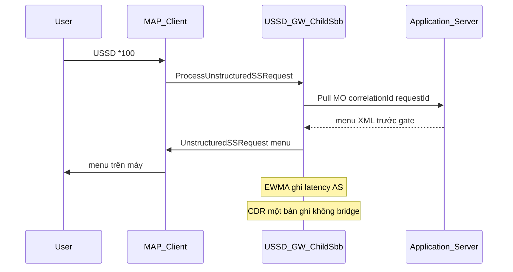
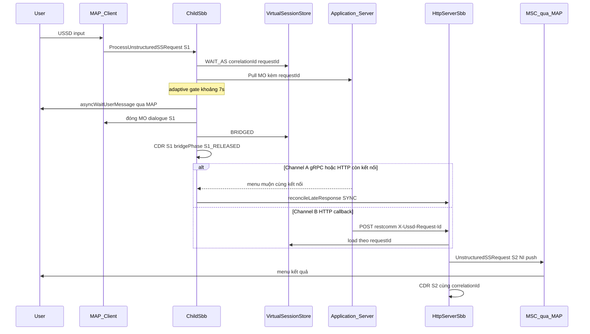
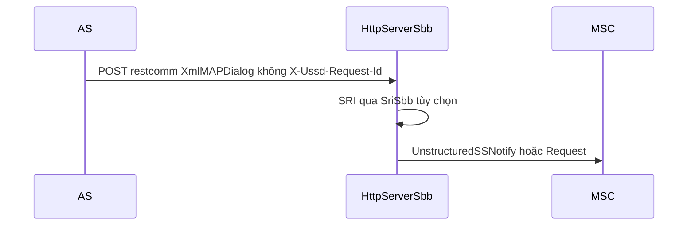
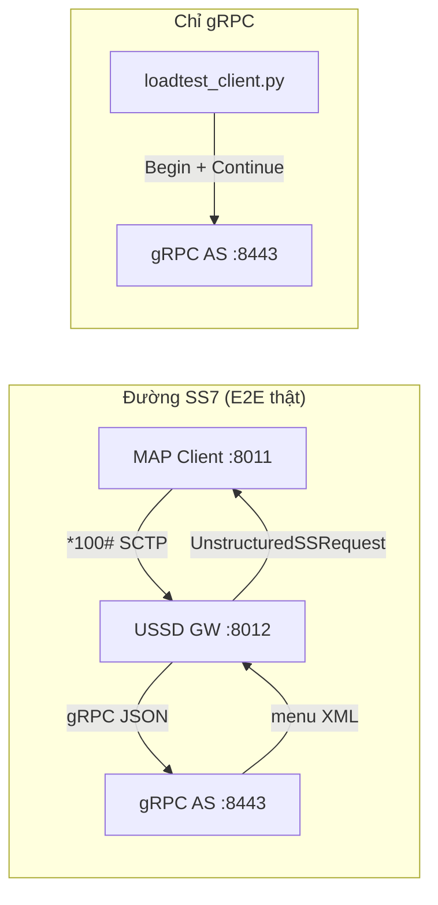

# Hướng dẫn test E2E — USSD Gateway + gRPC AS

> **Mục tiêu:** Gọi `*100#` từ mạng SS7 (giả lập) → USSD Gateway → gRPC Application Server → menu USSD nhiều cấp → kết thúc OK.

Hai bộ công cụ chính:

| Công cụ | Vị trí | Vai trò |
|---------|--------|---------|
| **jSS7 MAP Load Client** | `jSS7/map/load` | Gửi MAP `ProcessUnstructuredSSRequest` qua SCTP/M3UA — giả lập thuê bao SS7 |
| **gRPC Python tester** | `ussdgateway/tools/grpc-as-tester` | AS server + load generator gRPC trực tiếp (bypass MAP) |
| **HTTP loadtest** | `ussdgateway/tools/http-simulator/loadtest` | HTTP Pull AS + HTTP Push load (auto XML) |

Cả ba dùng chung `menu_config.json` (multi-menu: Balance / Data / Subscribe).

**Có 2 cách chạy lab:**

| Cách | Ai dùng | Độ khó |
|------|---------|--------|
| **[A] Package `ussdgw-test`** | Đem lên server production, giải nén và chạy | ⭐ Dễ — **đọc phần này trước** |
| **[B] Dev machine** | Build từ source `ussdgateway` + `jSS7` | ⭐⭐⭐ Khó hơn — cuối tài liệu |

> **Package offline:** Bundle sẵn tại `ussdgw-test/` — xem [`ussdgw-test/README.md`](../../ussdgw-test/README.md).

---

## Trước khi bắt đầu — hiểu luồng test

```
  [MAP Client]  ----SCTP *100#---->  [USSD Gateway]  ----gRPC---->  [Python AS :8443]
       |                                    |                              |
  giả lập thuê bao                    routing + bridge                  menu Balance/Data/...
```

| # | Thành phần | Chạy ở đâu | Port |
|---|------------|------------|------|
| 1 | **USSD Gateway** (Docker) | container, host network | SCTP **8012**, HTTP 8080, mgmt **9990** |
| 2 | **gRPC AS** (Python) | trên cùng máy host | **8443** |
| 3 | **MAP load client** (Java) | trên cùng máy host | bind SCTP **8011** → gọi GW **8012** |
| 4 | **HTTP Pull AS** (tuỳ chọn) | host | **8049** (`*519#`) |

**Hai đường test chính:**

1. **E2E SS7 → GW → gRPC AS** — dùng jSS7 MAP Load Client (cần SCTP tới gateway).
2. **gRPC-only** — dùng `loadtest_client.py` gọi AS trực tiếp (đo TPS/latency AS; không qua MAP).
3. **HTTP Pull/Push** — gateway ↔ HTTP AS (`*519#`) hoặc client POST tới `/restcomm`.

**Thứ tự bắt buộc:** Gateway + AS phải chạy **trước**, rồi mới chạy MAP client hoặc HTTP load.

---

# [A] Chạy bằng package `ussdgw-test` (khuyến nghị)

## Bước 0 — Chuẩn bị server

**Cần có trên server:**

- Linux x86_64
- Docker đã cài, user của ông chủ trong group `docker`
- `java` (JDK 8) — gõ `java -version` phải ra 1.8.x
- `python3` (3.9–3.12)
- RAM ≥ 6 GB
- File package đã giải nén, ví dụ: `/opt/ussdgw-test/`

```bash
# Giải nén (nếu chưa)
cd /opt
tar xzf ussdgw-test-7.2.1-SNAPSHOT.tar.gz
cd ussdgw-test
```

---

## Bước 1 — Bật SCTP kernel

```bash
lsmod | grep sctp
```

**Phải thấy** dòng `sctp` (ví dụ `sctp 557056 20`). Không có:

```bash
sudo modprobe sctp
lsmod | grep sctp
```

`00-preflight.sh` và `02-setup-host.sh` cũng kiểm tra SCTP qua `lsmod | awk '/^sctp /'`.

---

## Bước 2 — Kiểm tra package đủ file

```bash
cd /opt/ussdgw-test          # đổi path nếu ông chủ để chỗ khác
chmod +x scripts/*.sh
./scripts/00-preflight.sh
```

**Phải thấy toàn dòng `OK`**, không có `FAIL`.  
Nếu `FAIL missing docker tar` → file `docker/restcomm-ussd-7.2.1-SNAPSHOT.tar` bị thiếu khi copy.

---

## Bước 3 — Load image Docker (không dừng gateway)

```bash
cd /opt/ussdgw-test
./scripts/01-load-docker-image.sh
```

**Mặc định:** `docker load` — gateway vẫn chạy. **Backup `/opt/ussdgw`** → `backups/ussdgw-<timestamp>/ussdgw-host.tgz` (nếu thư mục tồn tại).

Ghi `gateway/.env` với tag release riêng (`docker/package.manifest`).

**Image cũ được giữ** trên máy để rollback — không tự xóa.

```bash
docker images restcomm-ussd
./scripts/01-load-docker-image.sh --list-images
ls backups/
```

| Flag | Dùng khi |
|------|----------|
| *(mặc định)* | Chuẩn bị nâng cấp + backup host |
| `--switch` | Backup + load + recreate gateway |
| `--fresh-install` | Reset lab — xóa **tất cả** image cũ |
| `--prune --keep N` | Dọn disk (giữ N bản + đang chạy + previous) |
| `--no-backup` | Bỏ qua backup `/opt/ussdgw` |
| `--list-images` | Xem tag + lịch sử switch |

## Bước 3b — Switch gateway (downtime ngắn)

```bash
./scripts/03-switch-gateway.sh
```

Backup host lần nữa, lưu image cũ vào `gateway/.env.previous`, recreate container.

## Bước 3c — Rollback nếu bản mới lỗi

**Rollback image Docker:**

```bash
./scripts/03-switch-gateway.sh --rollback
./scripts/03-switch-gateway.sh --to restcomm-ussd:7.2.1-SNAPSHOT-20260621T120000-abc
./scripts/03-switch-gateway.sh --list-images
```

**Rollback config host:**

```bash
./scripts/02-setup-host.sh --list-backups
sudo ./scripts/02-setup-host.sh --restore backups/ussdgw-20260621T154000Z/
./scripts/03-switch-gateway.sh --rollback
```

**Nâng cấp production:**

```bash
./scripts/01-load-docker-image.sh
./scripts/03-switch-gateway.sh
./scripts/08-check-gateway.sh
# nếu lỗi:
./scripts/03-switch-gateway.sh --rollback
sudo ./scripts/02-setup-host.sh --restore backups/ussdgw-<timestamp>/
```

---

## Bước 4 — Setup host (`/opt/ussdgw`)

```bash
sudo ./scripts/02-setup-host.sh
```

Tạo thư mục host, copy config-seed test (`*100#` gRPC, `*519#` HTTP). Nếu `data/` đã có → **tự backup** trước khi ghi đè.

| Flag | Mục đích |
|------|----------|
| `--list-backups` | Liệt kê backup |
| `--restore <dir>` | Khôi phục `/opt/ussdgw` |
| `--no-seed` | Chỉ init thư mục, không ghi đè XML |

---

## Bước 5 — Start USSD Gateway bằng `docker compose up` ⭐

**Đây là bước chạy container gateway.** File compose nằm tại:

```
ussdgw-test/gateway/docker-compose.yml
```

### Lệnh chạy (copy-paste)

```bash
cd /opt/ussdgw-test/gateway

# Bật gateway (service init chạy trước, rồi ussdgw)
docker compose up -d

# Xem trạng thái
docker compose ps
```

**Phải thấy** container `ussd-ng` trạng thái `running` (hoặc `healthy` sau ~3–5 phút).

### Kiểm tra gateway đã sống

```bash
# Health
curl -fs http://localhost:8080/jolokia/version && echo " OK"

# Log (Ctrl+C để thoát)
docker logs -f ussd-ng
```

Log khởi động WildFly mất **3–5 phút** lần đầu (deploy SLEE + patch JAR). Đợi đến khi health OK rồi mới test MAP.

```bash
./scripts/08-check-gateway.sh    # chẩn đoán nhanh
curl -fs http://localhost:8080/jolokia/version && echo " OK"
```

### Dừng gateway

```bash
cd /opt/ussdgw-test/gateway
docker compose down
```

### Ghi chú compose

| Service | Container | Vai trò |
|---------|-----------|---------|
| `init` | `ussd-ng-init` | Chạy 1 lần: seed `/opt/ussdgw/data` |
| `ussdgw` | `ussd-ng` | USSD Gateway WildFly |

- `network_mode: host` → SCTP listen **8012** trực tiếp trên máy host
- Image: `restcomm-ussd:7.2.1-SNAPSHOT` (load ở Bước 3)
- Config: `gateway/config-seed/` → `/opt/ussdgw/data/`

> **Shortcut:** `./scripts/03-start-gateway.sh` = `cd gateway && docker compose up -d` + đợi health.

---

## Bước 6 — Start gRPC Application Server (Python)

Gateway **phải healthy** trước khi chạy bước này.

```bash
cd /opt/ussdgw-test
./scripts/05-start-grpc-as.sh
```

**Phải thấy** trong `grpc-as.log`:

```
USSD gRPC AS listening on :8443
```

```bash
tail -3 grpc-as.log
```

> **Shortcut:** `sudo ./scripts/start-all.sh` = Bước 3 + 4 + 5 + 6 gộp một lệnh.

---

## Bước 7 — Test luồng đầy đủ SS7 → Gateway → gRPC (MAP smoke)

```bash
./scripts/06-run-map-smoke.sh
```

Lệnh này gửi **10 cuộc gọi USSD** `*100#`, tự bấm menu `BALANCE` (chọn `1` rồi `0`).

**Chờ ~30 giây – 2 phút** (có delay 20s khởi động SCTP lần đầu).

Chi tiết CLI, load test, warmup → [Mục 5](#5-e2e-test--tool-1-jss7-map-load-client).

### Làm sao biết THÀNH CÔNG?

Trong output cuối, tìm các dòng kiểu:

```
AS1 is now ACTIVE! Starting load test.
Total completed dialogs = 10
Throughput = ...
```

Và file CSV:

```bash
ls tools/jss7-map-load/map-*.csv
# Cột CompletedScenario ≈ 10, FailedScenario thấp hoặc 0
```

| Kết quả | Ý nghĩa |
|---------|---------|
| `AS1 is now ACTIVE` | SCTP Gateway ↔ client OK |
| `CompletedScenario` ≈ 10 | 10 session USSD hoàn tất |
| `FailedScenario` = 0 | Không lỗi |

**Nếu fail** → xem [Mục 9 — Lỗi thường gặp](#9-lỗi-thường-gặp).

---

## Bước 8 — Test gRPC trực tiếp (không qua SS7)

Chỉ test Python AS + load client, **không** qua Gateway:

```bash
./scripts/07-run-grpc-smoke.sh
```

**Chờ ~30 giây.** Phải thấy:

```
  mode             : multi-menu
  completed        : (số > 0)
  ok / errors      : X / 0
  achieved TPS     : ...
```

`errors = 0` → AS + multi-menu OK. Chi tiết → [Mục 6](#6-test--tool-2-grpc-python-loadtest_clientpy).

---

## Bước 9 — Dừng hết

```bash
./scripts/stop-all.sh
```

Dừng gRPC AS + Docker gateway:

```bash
./scripts/stop-all.sh
# hoặc thủ công:
#   cd gateway && docker compose down
```

---

## (Tuỳ chọn) Test thủ công bằng Simulator GUI

Khi smoke fail và cần debug từng bước:

```bash
# Terminal 1: bật lại lab nếu đã stop
sudo ./scripts/start-all.sh

# Terminal 2: mở simulator
cd tools/jss7-simulator/bin
chmod +x run.sh
./run.sh gui --name=main
# Nếu lỗi WstxOutputFactory → chạy lại build-package.sh; kiểm tra 00-preflight.sh
```

Trong cửa sổ GUI:
1. Chọn task **USSD_TEST_CLIENT**
2. Bấm **Start** / kết nối SS7
3. Gõ USSD: `*100#`
4. Khi có menu → gõ `1` (Balance) → `0` (Exit)

---

## Chạy từng bước riêng lẻ (thay vì `start-all.sh`)

| Bước | Lệnh | Tương đương thủ công |
|------|------|----------------------|
| Load image | `./scripts/01-load-docker-image.sh` | backup `/opt/ussdgw` + `docker load` (GW vẫn chạy) |
| Switch GW | `./scripts/03-switch-gateway.sh` | backup + recreate; lưu `.env.previous` |
| Rollback GW | `./scripts/03-switch-gateway.sh --rollback` | image cũ vẫn trên disk |
| Restore host | `./scripts/02-setup-host.sh --restore <dir>` | khôi phục `/opt/ussdgw` |
| Setup host | `sudo ./scripts/02-setup-host.sh` | Tạo `/opt/ussdgw/data` |
| **Start GW** | `./scripts/03-start-gateway.sh` | **`cd gateway && docker compose up -d`** |
| Stop GW | `./scripts/04-stop-gateway.sh` | **`cd gateway && docker compose down`** |
| Start gRPC AS | `./scripts/05-start-grpc-as.sh` | Python `ussd_as_server.py` |
| Stop gRPC AS | `./scripts/05-stop-grpc-as.sh` | kill gRPC AS |
| Start HTTP AS | `./scripts/09-start-http-as.sh` | HTTP Pull AS `:8049` |
| HTTP Pull smoke | `./scripts/12-run-http-pull-smoke.sh` | MAP `*519#` × 10 |
| HTTP Push smoke | `./scripts/13-run-http-push-smoke.sh` | Push 50 TPS × 30s |
| Tất cả | `sudo ./scripts/start-all.sh` | Bước 1→6 gộp |

---

# [B] Chạy từ source (máy dev — không dùng package)

Chỉ dùng khi ông chủ đang develop, **không** có file `ussdgw-test`.

## B.1 — Build (một lần)

```bash
# Gateway image (Maven SLEE + ant + docker — tránh JAR stub Eclipse)
cd ussdgateway/release-wildfly && ./build-docker.sh

# MAP load client
cd jSS7/map/load && mvn clean package -Passemble -DskipTests

# SS7 simulator (cần woodstox trong lib/)
cd jSS7 && mvn install -pl tools/simulator -am -Dmaven.test.skip=true

# Python AS + HTTP loadtest
cd ussdgateway/tools/grpc-as-tester
python3 -m venv .venv && ./.venv/bin/pip install -r requirements.txt
cd ../http-simulator/loadtest && pip install -r requirements.txt
```

## B.2 — Terminal 1: Gateway (docker compose)

```bash
sudo modprobe sctp

cd /path/to/ussdgw-test/gateway
docker compose up -d
docker compose ps
curl -fs http://localhost:8080/jolokia/version && echo " OK"
```

Hoặc từ source tree (sau `./build-docker.sh`):

```bash
cd ussdgateway/release-wildfly
sudo ./setup-server.sh
docker compose up -d
```

## B.3 — Terminal 2: gRPC AS

```bash
cd ussdgateway/tools/grpc-as-tester
./.venv/bin/python ussd_as_server.py \
  --port 8443 \
  --min-delay 1 --max-delay 100 \
  --menu-config menu_config.json
```

## B.4 — Terminal 3: MAP smoke

**Package (`ussdgw-test`):**

```bash
cd ussdgw-test/tools/jss7-map-load
java -cp "lib/*" org.restcomm.protocols.ss7.map.load.ussd.Client \
  10 5 sctp 127.0.0.1 8011 -1 127.0.0.1 8012 IPSP 101 102 1 2 3 2 8 6 8 \
  1111112 9960639999 1 16 -100 0 "*100#" BALANCE 50 200
```

**jSS7 source:**

```bash
cd jSS7/map/load
java -cp "target/load/*" org.restcomm.protocols.ss7.map.load.ussd.Client \
  10 5 sctp 127.0.0.1 8011 -1 127.0.0.1 8012 IPSP 101 102 1 2 3 2 8 6 8 \
  1111112 9960639999 1 16 -100 0 "*100#" BALANCE 50 200
```

> Port peer = **8012** khi gateway dùng `network_mode: host`. Docker map SCTP `2905:2905/sctp` → dùng `2905`.

---

# 5. E2E test — Tool 1: jSS7 MAP Load Client

Luồng: **MAP client → Gateway SCTP → gRPC AS → menu nhiều lượt → End**.

### 5.1 Smoke test (một profile, ít dialog)

**Từ package `ussdgw-test`** (classpath `lib/*`):

```bash
cd ussdgw-test/tools/jss7-map-load
java -cp "lib/*" org.restcomm.protocols.ss7.map.load.ussd.Client \
  10 5 sctp 127.0.0.1 8011 -1 127.0.0.1 8012 IPSP 101 102 1 2 3 2 8 6 8 \
  1111112 9960639999 1 16 -100 0 "*100#" BALANCE 50 200
```

Hoặc: `./scripts/06-run-map-smoke.sh`

**Từ jSS7 source** (classpath `target/load/*`):

```bash
cd jSS7/map/load
java -cp "target/load/*" org.restcomm.protocols.ss7.map.load.ussd.Client \
  10 5 sctp 127.0.0.1 8011 -1 127.0.0.1 8012 IPSP 101 102 1 2 3 2 8 6 8 \
  1111112 9960639999 1 16 -100 0 "*100#" BALANCE 50 200
```

| Tham số (vị trí) | Ví dụ | Ý nghĩa |
|------------------|-------|----------|
| 1–2 | `10` `5` | 10 dialog, 5 concurrent |
| 25 | `*100#` | Short code khớp gRPC scrule |
| 26 | `BALANCE` | Menu profile |
| 27–28 | `50` `200` | Think delay ms (adaptive gate) |

### 5.2 Multi-menu load test

**Package (`lib/*`):**

```bash
cd ussdgw-test/tools/jss7-map-load
java -cp "lib/*" org.restcomm.protocols.ss7.map.load.ussd.Client \
  100000 400 sctp 127.0.0.1 8011 -1 127.0.0.1 8012 IPSP 101 102 1 2 3 2 8 6 8 \
  1111112 9960639999 1 16 -100 5 "*100#" RANDOM 50 300
```

**jSS7 source (`target/load/*`):**

```bash
cd jSS7/map/load
java -cp "target/load/*" org.restcomm.protocols.ss7.map.load.ussd.Client \
  100000 400 sctp 127.0.0.1 8011 -1 127.0.0.1 8012 IPSP 101 102 1 2 3 2 8 6 8 \
  1111112 9960639999 1 16 -100 5 "*100#" RANDOM 50 300
```

Tham số 24 = `5` → chạy **5 phút** (duration mode).

Metrics CSV: `map-*.csv` trong thư mục làm việc (`CreatedScenario`, `CompletedScenario`, `FailedScenario`).

### 5.3 Tiêu chí thành công

- [ ] Log client: `AS1 is now ACTIVE`, có báo throughput cuối
- [ ] `CompletedScenario` ≈ số dialog hoàn tất; `FailedScenario` thấp
- [ ] Log gateway: gRPC gọi AS; không có `no routing rule` cho `*100#`
- [ ] Log AS: nhiều session với nhiều lượt menu
- [ ] CDR (nếu bật): S1/S2 khi bridge enabled

### 5.4 TPS warmup (MAP — mặc định BẬT)

Tất cả load generator **ramp TPS trong 60 giây đầu** trước khi đạt target cấu hình. Các bước: `1 → 100 → 500 → 1000 → 2000 → 3000 → 5000 → 7000 → 10000` (cắt tại `--tps` / `MAXCONCURRENTDIALOGS`). Tránh đập full rate vào USSD GW khi JVM/SLEE/TCAP chưa sẵn sàng.

| Công cụ | Tắt warmup |
|---------|------------|
| gRPC `loadtest_client.py` | `--no-warmup` |
| HTTP `http_push_loadtest.py` | `--no-warmup` |
| MAP `Client.java` | `-Dwarmup=false` |

Ví dụ output khi target 5000 TPS:

```
warmup 60s: 1 → 100 → 500 → 1000 → 2000 → 3000 → 5000 TPS
```

MAP client in summary tương tự lúc khởi động qua `WarmupRateHelper`.

**MAP load với warmup tắt:**

```bash
java -Dwarmup=false -cp "lib/*" org.restcomm.protocols.ss7.map.load.ussd.Client \
  ... # các tham số như trên
```

---

# 6. Test — Tool 2: gRPC Python (`loadtest_client.py`)

Luồng: **Load client → gRPC AS trực tiếp** (không MAP). Dùng để:

- Benchmark AS riêng (TPS/latency)
- Test multi-menu ở tầng gRPC (cùng `menu_config.json`)

### 6.1 Single-shot (chỉ Begin — throughput cao)

```bash
cd ussdgateway/tools/grpc-as-tester
./.venv/bin/python loadtest_client.py \
  --target localhost:8443 \
  --tps 1000 --duration 10
```

Mặc định có warmup 60s — với `--duration 10` sẽ chỉ ramp trong 10s rồi dừng.

### 6.2 Multi-menu full session

```bash
./.venv/bin/python loadtest_client.py \
  --target localhost:8443 \
  --tps 200 --duration 30 \
  --multi-menu --profile BALANCE \
  --think-min 50 --think-max 200 \
  --menu-config menu_config.json
```

Profiles: `BALANCE`, `DATA`, `SUBSCRIBE`, `RANDOM`.

Output mẫu:

```
  mode             : multi-menu
  completed        : 5842
  achieved TPS     : 194
  latency p95 (ms) : 12.34
  warmup 60s: 1 → 100 → 200 TPS
```

Từ `ussdgw-test`:

```bash
./scripts/07-run-grpc-smoke.sh
```

**Tắt warmup — full TPS ngay từ đầu:**

```bash
./.venv/bin/python loadtest_client.py \
  --target localhost:8443 \
  --tps 1000 --duration 30 \
  --no-warmup
```

### 6.3 So sánh công cụ

| | MAP Load Client | gRPC loadtest_client |
|--|-----------------|----------------------|
| Entry | SCTP/MAP | gRPC unary |
| Test gateway routing | ✓ | ✗ |
| Test MAP dialog / TCAP | ✓ | ✗ |
| Test gRPC AS menu | ✓ (qua GW) | ✓ (trực tiếp) |
| Multi-menu | ✓ profiles | ✓ `--multi-menu` |
| Adaptive delay | Think delay + AS delay | `--think-min/max` + AS delay |
| TPS warmup | mặc định ON (`-Dwarmup=false`) | mặc định ON (`--no-warmup`) |

---

# 7. Test — Tool 3: HTTP (`http-simulator/loadtest`)

Tự sinh XmlMAPDialog (không cần XML thủ công). Cùng `menu_config.json` và profiles như gRPC/MAP.

| Script | Kịch bản | Hướng |
|--------|----------|-------|
| `http_as_server.py` | **Pull** (MO) | Gateway POST → AS listen `:8049` |
| `http_push_loadtest.py` | **Push** (NI) | Client POST → gateway `/restcomm` |

Routing: `*519#` → `http://127.0.0.1:8049/` (HTTP pull). Push URL: `http://127.0.0.1:8080/restcomm`.

Package `ussdgw-test` đã seed sẵn rule `*519#` trong `gateway/config-seed/`.

### 7.1 HTTP Pull — start AS + MAP smoke

```bash
# Terminal: HTTP Pull AS (adaptive delay 1–100 ms)
cd ussdgateway/tools/http-simulator/loadtest
pip install -r requirements.txt
python3 http_as_server.py --port 8049 --min-delay 1 --max-delay 100

# Bridge / adaptive timeout:
python3 http_as_server.py --port 8049 --bridge-delay 8000 --bridge-every 10
```

Từ `ussdgw-test` (gateway + MAP client đã chạy):

```bash
./scripts/09-start-http-as.sh
./scripts/12-run-http-pull-smoke.sh    # 10 dialog, *519#, BALANCE
```

### 7.2 HTTP Push — load 1000 TPS

```bash
cd ussdgateway/tools/http-simulator/loadtest
python3 http_push_loadtest.py \
  --target http://127.0.0.1:8080/restcomm \
  --mode multi --profile BALANCE \
  --tps 1000 --duration 30 \
  --think-min 50 --think-max 200
```

Modes: `notify` (chỉ USSD notify), `request` / `multi` (menu NI nhiều bước, XML tự build).

Từ `ussdgw-test`:

```bash
./scripts/13-run-http-push-smoke.sh    # smoke 50 TPS × 30s
```

**Tắt warmup:**

```bash
python3 http_push_loadtest.py \
  --target http://127.0.0.1:8080/restcomm \
  --mode multi --profile BALANCE \
  --tps 1000 --duration 30 \
  --no-warmup
```

### 7.3 So sánh HTTP

| | HTTP Pull AS | HTTP Push loadtest | MAP + HTTP |
|--|--------------|-------------------|------------|
| Entry | HTTP POST từ GW | HTTP POST tới GW | SCTP `*519#` |
| XML | Auto từ menu | Auto từ menu | SS7 + HTTP AS |
| 1000 TPS | AS thread pool | `--tps 1000` | MAP load + HTTP AS |
| Adaptive / bridge | `--min/max-delay`, `--bridge-delay` | think delay giữa các bước push | think delay trong MAP client |
| TPS warmup | — (MAP client ramp) | mặc định ON (`--no-warmup`) | MAP warmup |

Simulator Swing GUI (XML thủ công): `tools/http-simulator/bin/run.sh` — vẫn có trong `ussdgw-test/tools/http-simulator/`.

---

# 8. Adaptive timeout & Virtual Session Bridge (tính năng trọng tâm)

Mục này là **tiêu chí nghiệm thu chính** của USSD Gateway: dưới tải cao, gateway phải giữ MAP dialogue ổn định, **thích ứng gate chờ AS** theo latency thực tế, và **khôi phục câu trả lời AS muộn** qua NI push thay vì fail cứng thuê bao.

Tài liệu thiết kế: [`docs/design/virtual-session-bridge.md`](design/virtual-session-bridge.md), [`docs/design/bridge-unified-reconciliation-rfc.md`](design/bridge-unified-reconciliation-rfc.md).

### 8.1 Tính năng làm gì

| Cơ chế | Mục đích |
|--------|----------|
| **Adaptive gate (EWMA)** | Trung bình trượt latency AS theo `networkId` → gate động trong `[1000 ms, asyncGateTimeoutMs]`: AS nhanh → gate ngắn; AS chậm ổn định → gate dài hơn (không vượt trần cấu hình). |
| **Virtual Session Bridge** | Gate hết trước khi AS trả lời trên **Pull MO** → release MAP S1 sớm, hiển thị `asyncWaitUserMessage`, giữ session ảo trong cache, giao kết quả sau qua **NI push S2**. |
| **Unified reconciliation** | AS muộn được ghép qua `requestId` trên **Channel A** (cùng kết nối gRPC/HTTP MO) hoặc **Channel B** (`POST /restcomm` + header `X-Ussd-Request-Id`). |

**Pull vs Push trong tính năng này:**

| Đường | Kích hoạt | SBB | Vai trò bridge |
|-------|-----------|-----|----------------|
| **Pull MO** | Thuê bao quay `*100#` / `*519#` | `ChildSbb` → HTTP/gRPC/SIP | Timer gate trên MAP ACI; S1 release + S2 NI push khi AS chậm |
| **Push NI (lạnh)** | AS POST không có `X-Ussd-Request-Id` | `HttpServerSbb` | NI push thường — không có MO bridge trước |
| **Push NI (bridge S2)** | AS POST **có** `X-Ussd-Request-Id` | `HttpServerSbb` | Giao menu sau Pull MO đã bridge |

### 8.2 Thứ bậc timeout (bắt buộc đúng thứ tự)

Package `ussdgw-test` bật bridge sẵn trong [`gateway/config-seed/UssdManagement_ussdproperties.xml`](../../ussdgw-test/gateway/config-seed/UssdManagement_ussdproperties.xml):

```xml
<sessionbridgeenabled>true</sessionbridgeenabled>
<asyncgatetimeoutms>7000</asyncgatetimeoutms>
<dialogtimeout>60000</dialogtimeout>
<!-- TCAP: TcapStack_management.xml dialogTimeout=90000 -->
<asyncwaitusermessage>He thong dang ban, se update lai cho ban ngay</asyncwaitusermessage>
<bridgestatettlsec>180</bridgestatettlsec>
```

**Ràng buộc (lab + production):**

```
1000 ms ≤ adaptiveGate ≤ asyncGateTimeoutMs (7000) < dialogTimeout (60000) < TCAP dialogTimeout (90000)
bridgeStateTtlSec (180) ≥ cửa sổ AS muộn + push retry
```

| Thuộc tính | Mặc định (package) | Ý nghĩa |
|------------|-------------------|---------|
| `sessionBridgeEnabled` | `true` | Master switch; `false` = timeout cứng kiểu cũ |
| `asyncGateTimeoutMs` | `7000` | Trần adaptive gate; MO release khi gate hết |
| `dialogTimeout` | `60000` | Timer ứng dụng khi bridge tắt hoặc sau gate |
| `asyncWaitUserMessage` | (seed) | USSD khi release S1, AS vẫn xử lý |
| `asyncHardFailMessage` | (seed) | USSD khi AS fail cứng |
| `bridgeStateTtlSec` | `180` | TTL session ảo trong cache |
| `pushRetryDelaysMs` | `3000,8000,15000` | Back-off retry NI push khi MSC busy |

**Tham số phía AS (mọi load tool):**

| Flag | Tool | Tác dụng |
|------|------|----------|
| `--min-delay` / `--max-delay` | gRPC `ussd_as_server.py`, HTTP `http_as_server.py` | Latency ngẫu nhiên → nuôi EWMA adaptive gate |
| `--bridge-delay MS` | same | Delay cố định **dài hơn gate** (dùng `8000` với gate 7000 ms) |
| `--bridge-every N` | same | Bridge delay cho 1-in-N request (`1`=luôn, `10`=10%) |

**Tham số load generator:**

| Flag | Tool | Giá trị high-load / bridge |
|------|------|----------------------------|
| `--tps` | `loadtest_client.py`, `http_push_loadtest.py` | `200`–`1000` (warmup mặc định) |
| `--duration` | same | `300` (5 phút) |
| `--multi-menu` / profile `ADAPTIVE` | gRPC load / MAP | Multi-turn + think time biến thiên |
| `--think-min` / `--think-max` | gRPC, HTTP push, MAP arg 27–28 | `50` / `300` ms |
| `--warmup` (mặc định ON) | mọi load tool | Ramp 60 s — **bắt buộc** trước khi đánh giá 1000 TPS |
| `-Dwarmup=false` | MAP Client | Tắt ramp (stress tức thì) |

### 8.3 Call flow — Pull MO (gRPC / HTTP)

#### 8.3.1 S1 nhanh (AS trả lời trước gate)



#### 8.3.2 S2 bridge (AS chậm hơn gate — kịch bản trọng tâm)



**gRPC:** AS **phải echo `requestId`** trong envelope JSON ([`ussd_envelope.py`](../tools/grpc-as-tester/ussd_envelope.py)). Channel A xử lý trong `GrpcClientSbb` khi MAP dialogue đã đóng.

**HTTP Pull:** `http_as_server.py --bridge-delay 8000` trì hoãn **cùng POST response** (Channel A). Channel B: AS POST tới `http://127.0.0.1:8080/restcomm` + header `X-Ussd-Request-Id` (RFC §5).

### 8.4 Call flow — Push NI

#### 8.4.1 NI push lạnh (không MO trước)



#### 8.4.2 Push khôi phục bridge (S2 sau Pull MO chậm)

Cùng URL **`POST /restcomm`**, AS gửi **`X-Ussd-Request-Id`** khớp MO request. `HttpServerSbb` gọi `reconcileLateResponse()` → NI push với **`correlationId` liên kết CDR S1**.

### 8.5 Smoke (chức năng, TPS thấp)

Chạy sau gateway healthy + AS up. Mục tiêu: xác nhận bridge trước high load.

#### 8.5.1 gRPC Pull — một dialogue bridge

```bash
cd ussdgateway/tools/grpc-as-tester
./.venv/bin/python ussd_as_server.py \
  --port 8443 --bridge-delay 8000 --bridge-every 1 \
  --min-delay 1 --max-delay 50 --menu-config menu_config.json

cd ussdgw-test && ./scripts/06-run-map-smoke.sh
```

**Kỳ vọng:** Máy hiện `asyncWaitUserMessage`, sau đó menu qua NI push; log `Bridging slow AS` / `bridge_late_sync_grpc`; CDR cùng `correlationId`, phase `S1_RELEASED` + `S2_PUSH`.

#### 8.5.2 HTTP Pull bridge (`*519#`)

```bash
cd ussdgateway/tools/http-simulator/loadtest
python3 http_as_server.py --port 8049 --bridge-delay 8000 --bridge-every 1

cd ussdgw-test && ./scripts/09-start-http-as.sh
./scripts/12-run-http-pull-smoke.sh
```

#### 8.5.3 Chỉ adaptive gate (không cố bridge)

```bash
./.venv/bin/python ussd_as_server.py --port 8443 --min-delay 1 --max-delay 100
cd ussdgw-test/tools/jss7-map-load
java -cp "lib/*" org.restcomm.protocols.ss7.map.load.ussd.Client \
  50 10 sctp 127.0.0.1 8011 -1 127.0.0.1 8012 IPSP 101 102 1 2 3 2 8 6 8 \
  1111112 9960639999 1 16 -100 0 "*100#" ADAPTIVE 50 500
```

**Kỳ vọng:** Mọi dialogue hoàn tất trên S1; `FailedScenario` ≈ 0.

### 8.6 Ma trận high-load (adaptive timeout + bridge @ TPS)

**Điều kiện:** Lab §4, `sessionbridgeenabled=true`, warmup **ON**, theo dõi `docker logs ussd-ng`, `map-*.csv`, CDR.

#### H1 — Bão hòa adaptive gate (không kích bridge)

**Mục tiêu:** EWMA + `dialogtimeout` 60 s giữ TPS mục tiêu, không release S1 hàng loạt.

| Lớp | Lệnh |
|-----|------|
| gRPC AS | `./.venv/bin/python ussd_as_server.py --port 8443 --workers 128 --min-delay 1 --max-delay 100` |
| MAP load | `Client 100000 400 ... "*100#" ADAPTIVE 50 300` arg 24 = `5` (5 phút) |
| Hoặc gRPC-only | `loadtest_client.py --target localhost:8443 --tps 1000 --duration 300 --multi-menu --profile ADAPTIVE --think-min 50 --think-max 300` |

**Pass:**

| Metric | Mục tiêu |
|--------|----------|
| `CompletedScenario` / created | ≥ 95% |
| `FailedScenario` | ≤ 2% |
| CDR bridge S1 | ≈ 0 (không `--bridge-delay`) |
| TPS đạt được (sau warmup 60 s) | ≥ 80% target |

#### H2 — Bridge hỗn hợp @ 1000 TPS (test production trọng tâm)

**Mục tiêu:** 10% lượt MO cố ý chậm hơn gate; gateway recover S2 không sập MAP/TCAP.

| Lớp | Cấu hình |
|-----|----------|
| gRPC AS | `--bridge-delay 8000 --bridge-every 10 --min-delay 1 --max-delay 80 --workers 128` |
| MAP E2E | `100000 400 ... "*100#" RANDOM 50 200` duration 5 phút |
| HTTP Pull | `http_as_server.py --bridge-delay 8000 --bridge-every 10` + MAP `*519#` |

**Pass:**

| Metric | Mục tiêu |
|--------|----------|
| Hoàn tất + S2 recover | ≥ 90% created |
| `FailedScenario` | ≤ 5% |
| Log | `bridge_late_sync_grpc/http`, `Bridging slow AS` |
| CDR | Cặp `S1_RELEASED` / `S2_PUSH` cùng `correlationId` |
| UX | `asyncWaitUserMessage` rồi menu trong `bridgeStateTtlSec` |

**Ví dụ MAP E2E mixed bridge (package):**

```bash
cd ussdgw-test/tools/jss7-map-load
java -cp "lib/*" org.restcomm.protocols.ss7.map.load.ussd.Client \
  100000 400 sctp 127.0.0.1 8011 -1 127.0.0.1 8012 IPSP 101 102 1 2 3 2 8 6 8 \
  1111112 9960639999 1 16 -100 5 "*100#" RANDOM 50 200
```

Warmup MAP in `warmup 60s: 1 → … → 400 TPS`. `-Dwarmup=false` chỉ dùng stress tức thì.

#### H3 — HTTP Push 1000 TPS (NI song song Pull bridge)

```bash
python3 http_push_loadtest.py \
  --target http://127.0.0.1:8080/restcomm \
  --mode multi --profile BALANCE \
  --tps 1000 --duration 300 \
  --think-min 50 --think-max 200 \
  --max-inflight 2000
```

**Pass:** Lỗi push ≤ 1%; không `RejectedExecutionException`.

#### H4 — gRPC load + bridge (không MAP — bổ trợ, không thay H2)

```bash
./.venv/bin/python ussd_as_server.py --port 8443 --bridge-delay 8000 --bridge-every 5 --workers 128
./.venv/bin/python loadtest_client.py \
  --target localhost:8443 --tps 1000 --duration 120 \
  --multi-menu --profile RANDOM --think-min 50 --think-max 200
```

#### H5 — Channel B thủ công (HTTP Pull bridge)

1. Chạy smoke Pull với `--bridge-delay 8000 --bridge-every 1`.
2. POST muộn tới gateway:

```bash
curl -sS -X POST http://127.0.0.1:8080/restcomm \
  -H "Content-Type: text/xml" \
  -H "X-Ussd-Request-Id: <requestId từ log GW>" \
  --data-binary @/path/to/XmlMAPDialog-response.xml
```

**Kỳ vọng:** Log `bridge_late_push_http`; NI push; CDR S2.

### 8.7 Giám sát & checklist xác minh

| Tín hiệu | Nơi xem | Pattern khỏe |
|----------|---------|--------------|
| Adaptive gate | Log GW | Gate ms giảm khi AS nhanh, max 7000 |
| Bridge S1 | Log `ChildSbb` | `Bridging slow AS for PULL case` |
| Reconcile muộn | Log GW | `bridge_late_sync_*` / `bridge_late_push_http` |
| MAP CSV | `map-*.csv` | `CompletedScenario` ↑, `FailedScenario` thấp |
| CDR | File CDR | Cùng `correlationId`, `S1_RELEASED` + `S2_PUSH` |
| TCAP | Log GW | Không hàng loạt `JENNY-DIALOG-TIMEOUT` trước app gate |
| Warmup | stdout load tool | 60 s đầu sub-target TPS |

### 8.8 Xử lý sự cố (bridge)

| Triệu chứng | Nguyên nhân | Cách sửa |
|-------------|-------------|----------|
| `dialogtimeouterrmssg` hàng loạt | Bridge tắt hoặc gate ≥ dialog timeout | Bật bridge; `asyncGateTimeoutMs` < `dialogtimeout` |
| Bridge S1 nhưng không S2 | AS thiếu echo `requestId` / TTL hết | Sửa envelope; tăng `bridgeStateTtlSec`; xem `bridge_late_expired` |
| `FailedScenario` cao @ 1000 TPS | Không warmup, AS pool nhỏ | Warmup ON; `--workers 128`; giảm `--bridge-every` |
| HTTP Pull không S2 | AS chưa Channel B | Dùng gRPC hoặc POST `/restcomm` + `X-Ussd-Request-Id` |
| Menu trùng | Reconcile đúp | AS không retry cùng `requestId`; xem `bridge_late_duplicate` |

---

# 9. Lỗi thường gặp

| Triệu chứng | Nguyên nhân | Cách sửa |
|-------------|-------------|----------|
| `AS1` không ACTIVE | SCTP chưa kết nối | `sudo modprobe sctp`; kiểm tra GW đang chạy; port 8011↔8012 |
| `Not valid short code` | Thiếu rule `*100#` | Package đã có sẵn; dev: sửa `UssdManagement_scroutingrule.xml` |
| gRPC connection refused | AS chưa chạy / sai host từ container | `host.docker.internal:8443` hoặc `127.0.0.1:8443` với host network |
| MAP dialog timeout | Sai SSN (147 vs 8) | Client `ussdSsn=8` |
| Menu kẹt một lượt | AS single-turn / sai menu | Dùng `ussd_as_server.py` + `menu_config.json` |
| `FailedScenario` cao | Think delay + bridge delay quá dài | Giảm `--bridge-delay` hoặc tăng `dialogtimeout` |
| HTTP pull connection refused | HTTP AS chưa chạy `:8049` | `./scripts/09-start-http-as.sh`; scrule `*519#` → `http://127.0.0.1:8049/` |
| Gateway vẫn bản cũ | Chưa switch sau load tar | `./scripts/03-switch-gateway.sh` |
| Bản mới lỗi | Cần quay lại | `./scripts/03-switch-gateway.sh --rollback` |
| Config hỏng | data bị ghi đè | `02-setup-host.sh --restore backups/ussdgw-*/` |
| SCTP / MAP fail | Module chưa load | `sudo modprobe sctp` + `lsmod \| grep sctp` |
| Outage dài khi upgrade | Dừng service trước khi load xong | Dùng mặc định `01` (load khi GW up) rồi `03-switch` |
| `docker load` lỗi | File tar hỏng/thiếu | Copy lại `docker/*.tar` |
| `Could not find main class` Client | Sai classpath package | Dùng `java -cp "lib/*"` trong `tools/jss7-map-load` |
| Simulator `WstxOutputFactory` | Thiếu woodstox trong lib | `./scripts/build-package.sh`; `00-preflight.sh` |
| SLEE `Unresolved compilation` | Image cũ có JAR stub | `./build-docker.sh` (Maven SLEE trước ant) |
| `UnknownHostException: ussd-ng` | Host network thiếu /etc/hosts | Image mới + `USSDGW_HOSTNAME=ussd-ng` |
| GUI `401` `/ussd-management/` | Chưa có user WildFly | Image + `/opt/ussdgw/configuration/mgmt-*.properties`; mặc định `admin/admin` |
| GUI `403` sau login | Thiếu role `JBossAdmin` | `mgmt-groups.properties`: `admin=JBossAdmin` |
| GW vẫn chạy image cũ sau rebuild | Docker context CLI ≠ daemon của compose | `docker context use default` trước build/load/compose |
| `NoClassDefFoundError: disruptor` | SLEE module thiếu disruptor | Rebuild `build-docker.sh` (jain-slee AS7 modules) |
| MAP RA connect fail / NPE | Bug classloader cũ | Image có fix MAP RA proxy (jain-slee.ss7) |
| `compute-jvm.sh: ... e+09` | cgroup memory dạng scientific | Image mới có `compute-jvm.sh` đã fix |
| M3UA `asp1 association not available` | Chưa có peer SCTP 8011 | Chạy SS7 simulator + MAP load client trước |
| Python pip lỗi | Không có mạng | Package có `wheels/` — script tự cài offline |

**Xem log:**

```bash
docker logs ussd-ng                    # Gateway
tail -f grpc-as.log                    # gRPC AS
tail -f http-as.log                    # HTTP Pull AS (ussdgw-test)
ls tools/jss7-map-load/map-*.csv       # Kết quả MAP
```

---

# 10. Phụ lục — Kiến trúc & config



## Config đã khớp sẵn (package `ussdgw-test`)

| Tham số | Gateway | MAP client |
|---------|---------|------------|
| SCTP | listen **8012** | bind **8011** → peer **8012** |
| M3UA RC/NA | 101 / 102 | 101 / 102 |
| OPC/DPC | 2 / 1 | 1 / 2 |
| USSD SSN | 8 | 8 |
| Short code gRPC | `*100#` → `127.0.0.1:8443` | `*100#` |
| Short code HTTP | `*519#` → `http://127.0.0.1:8049/` | `*519#` (MAP pull test) |

### Virtual Session Bridge (tuỳ chọn)

Trong `/opt/ussdgw/data/UssdManagement_ussdproperties.xml`:

```xml
<sessionbridgeenabled>true</sessionbridgeenabled>
<asyncgatetimeoutms>7000</asyncgatetimeoutms>
<dialogtimeout>25000</dialogtimeout>
```

Chi tiết: [`docs/design/virtual-session-bridge.md`](design/virtual-session-bridge.md).

## Menu profiles

| Profile | Bấm phím | Kết quả |
|---------|----------|---------|
| `BALANCE` | `1` → `0` | Xem số dư → Thoát |
| `DATA` | `2` → `1` | Chọn gói 1GB |
| `SUBSCRIBE` | `3` → `100` | Đăng ký |
| `RANDOM` | ngẫu nhiên | |
| `ADAPTIVE` | như RANDOM + think delay | Test adaptive gate |

## Tài liệu thêm

| File | Nội dung |
|------|----------|
| [`ussdgw-test/README.md`](../../ussdgw-test/README.md) | Tóm tắt package |
| [`e2e-grpc-ussd-test_en.md`](e2e-grpc-ussd-test_en.md) | English version |
| [`jSS7/map/load/USSD-LOADTEST.md`](../../jSS7/map/load/USSD-LOADTEST.md) | MAP CLI đầy đủ + warmup |
| [`tools/http-simulator/loadtest/`](../tools/http-simulator/loadtest/) | HTTP Pull AS + Push load |
| [`tools/grpc-as-tester/`](../tools/grpc-as-tester/) | gRPC AS + load client source |
| [`docs/design/virtual-session-bridge.md`](design/virtual-session-bridge.md) | Thiết kế Virtual Session Bridge + sequence S2 |
| [`docs/design/bridge-unified-reconciliation-rfc.md`](design/bridge-unified-reconciliation-rfc.md) | Late-response reconciliation |
| [`release-wildfly/DEPLOY-GUIDE.md`](../release-wildfly/DEPLOY-GUIDE.md) | Docker deploy + SCTP |

---

*Cập nhật: 2026-06-22 — §8 adaptive timeout/bridge high-load matrix, TPS warmup, HTTP Pull/Push, workflow package + GUI 401.*
