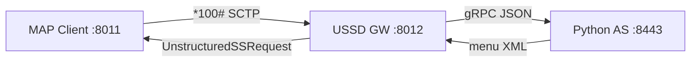

# Hướng dẫn test E2E — USSD Gateway + gRPC AS

> **Mục tiêu:** Gọi `*100#` từ mạng SS7 (giả lập) → USSD Gateway → gRPC Application Server → menu USSD nhiều cấp → kết thúc OK.

**Có 2 cách chạy:**

| Cách | Ai dùng | Độ khó |
|------|---------|--------|
| **[A] Package `ussdgw-test`** | Đem lên server production, giải nén và chạy | ⭐ Dễ — **đọc phần này trước** |
| **[B] Dev machine** | Build từ source `ussdgateway` + `jSS7` | ⭐⭐⭐ Khó hơn — cuối tài liệu |

---

## Trước khi bắt đầu — hiểu 3 thành phần

```
  [MAP Client]  ----SCTP *100#---->  [USSD Gateway]  ----gRPC---->  [Python AS :8443]
       |                                    |                              |
  giả lập thuê bao                    routing + bridge                  menu Balance/Data/...
```

| # | Thành phần | Chạy ở đâu | Port |
|---|------------|------------|------|
| 1 | **USSD Gateway** (Docker) | container, host network | SCTP **8012**, HTTP 8080, mgmt **9990** |
| 2 | **gRPC AS** (Python) | trên cùng máy host | **8443** |
| 3 | **MAP load client** (Java) | trên cùng máy host | bind SCTP **8011** → gọi GW **8012** |

**Thứ tự bắt buộc:** Gateway + AS phải chạy **trước**, rồi mới chạy MAP client.

---

# [A] Chạy bằng package `ussdgw-test` (khuyến nghị)

## Bước 0 — Chuẩn bị server

**Cần có trên server:**

- Linux x86_64
- Docker đã cài, user của ông chủ trong group `docker`
- `java` (JDK 8) — gõ `java -version` phải ra 1.8.x
- `python3` (3.9–3.12)
- RAM ≥ 6 GB
- File package đã giải nén, ví dụ: `/opt/ussdgw-test/`

```bash
# Giải nén (nếu chưa)
cd /opt
tar xzf ussdgw-test-7.2.1-SNAPSHOT.tar.gz
cd ussdgw-test
```

---

## Bước 1 — Bật SCTP kernel

```bash
lsmod | grep sctp
```

**Phải thấy** dòng `sctp` (ví dụ `sctp 557056 20`). Không có:

```bash
sudo modprobe sctp
lsmod | grep sctp
```

`00-preflight.sh` và `02-setup-host.sh` cũng kiểm tra SCTP qua `lsmod | awk '/^sctp /'`.

---

## Bước 2 — Kiểm tra package đủ file

```bash
cd /opt/ussdgw-test          # đổi path nếu ông chủ để chỗ khác
chmod +x scripts/*.sh
./scripts/00-preflight.sh
```

**Phải thấy toàn dòng `OK`**, không có `FAIL`.  
Nếu `FAIL missing docker tar` → file `docker/restcomm-ussd-7.2.1-SNAPSHOT.tar` bị thiếu khi copy.

---

## Bước 3 — Load image Docker (không dừng gateway)

```bash
cd /opt/ussdgw-test
./scripts/01-load-docker-image.sh
```

**Mặc định:** `docker load` — gateway vẫn chạy. **Backup `/opt/ussdgw`** → `backups/ussdgw-<timestamp>/ussdgw-host.tgz` (nếu thư mục tồn tại).

Ghi `gateway/.env` với tag release riêng (`docker/package.manifest`).

**Image cũ được giữ** trên máy để rollback — không tự xóa.

```bash
docker images restcomm-ussd
./scripts/01-load-docker-image.sh --list-images
ls backups/
```

| Flag | Dùng khi |
|------|----------|
| *(mặc định)* | Chuẩn bị nâng cấp + backup host |
| `--switch` | Backup + load + recreate gateway |
| `--fresh-install` | Reset lab — xóa **tất cả** image cũ |
| `--prune --keep N` | Dọn disk (giữ N bản + đang chạy + previous) |
| `--no-backup` | Bỏ qua backup `/opt/ussdgw` |
| `--list-images` | Xem tag + lịch sử switch |

## Bước 3b — Switch gateway (downtime ngắn)

```bash
./scripts/03-switch-gateway.sh
```

Backup host lần nữa, lưu image cũ vào `gateway/.env.previous`, recreate container.

## Bước 3c — Rollback nếu bản mới lỗi

**Rollback image Docker:**

```bash
./scripts/03-switch-gateway.sh --rollback
./scripts/03-switch-gateway.sh --to restcomm-ussd:7.2.1-SNAPSHOT-20260621T120000-abc
./scripts/03-switch-gateway.sh --list-images
```

**Rollback config host:**

```bash
./scripts/02-setup-host.sh --list-backups
sudo ./scripts/02-setup-host.sh --restore backups/ussdgw-20260621T154000Z/
./scripts/03-switch-gateway.sh --rollback
```

**Nâng cấp production:**

```bash
./scripts/01-load-docker-image.sh
./scripts/03-switch-gateway.sh
./scripts/08-check-gateway.sh
# nếu lỗi:
./scripts/03-switch-gateway.sh --rollback
sudo ./scripts/02-setup-host.sh --restore backups/ussdgw-<timestamp>/
```

---

## Bước 4 — Setup host (`/opt/ussdgw`)

```bash
sudo ./scripts/02-setup-host.sh
```

Tạo thư mục host, copy config-seed test. Nếu `data/` đã có → **tự backup** trước khi ghi đè.

| Flag | Mục đích |
|------|----------|
| `--list-backups` | Liệt kê backup |
| `--restore <dir>` | Khôi phục `/opt/ussdgw` |
| `--no-seed` | Chỉ init thư mục, không ghi đè XML |

---

## Bước 5 — Start USSD Gateway bằng `docker compose up` ⭐

**Đây là bước chạy container gateway.** File compose nằm tại:

```
ussdgw-test/gateway/docker-compose.yml
```

### Lệnh chạy (copy-paste)

```bash
cd /opt/ussdgw-test/gateway

# Bật gateway (service init chạy trước, rồi ussdgw)
docker compose up -d

# Xem trạng thái
docker compose ps
```

**Phải thấy** container `ussd-ng` trạng thái `running` (hoặc `healthy` sau ~3–5 phút).

### Kiểm tra gateway đã sống

```bash
# Health
curl -fs http://localhost:9990/health && echo " OK"

# Log (Ctrl+C để thoát)
docker logs -f ussd-ng
```

Log khởi động WildFly mất **3–5 phút** lần đầu (deploy SLEE + patch JAR). Đợi đến khi health OK rồi mới test MAP.

```bash
./scripts/08-check-gateway.sh    # chẩn đoán nhanh
curl -fs http://localhost:9990/health && echo " OK"
```

### Dừng gateway

```bash
cd /opt/ussdgw-test/gateway
docker compose down
```

### Ghi chú compose

| Service | Container | Vai trò |
|---------|-----------|---------|
| `init` | `ussd-ng-init` | Chạy 1 lần: seed `/opt/ussdgw/data` |
| `ussdgw` | `ussd-ng` | USSD Gateway WildFly |

- `network_mode: host` → SCTP listen **8012** trực tiếp trên máy host
- Image: `restcomm-ussd:7.2.1-SNAPSHOT` (load ở Bước 3)
- Config: `gateway/config-seed/` → `/opt/ussdgw/data/`

> **Shortcut:** `./scripts/03-start-gateway.sh` = `cd gateway && docker compose up -d` + đợi health.

---

## Bước 6 — Start gRPC Application Server (Python)

Gateway **phải healthy** trước khi chạy bước này.

```bash
cd /opt/ussdgw-test
./scripts/05-start-grpc-as.sh
```

**Phải thấy** trong `grpc-as.log`:

```
USSD gRPC AS listening on :8443
```

```bash
tail -3 grpc-as.log
```

> **Shortcut:** `sudo ./scripts/start-all.sh` = Bước 3 + 4 + 5 + 6 gộp một lệnh.

---

## Bước 7 — Test luồng đầy đủ SS7 → Gateway → gRPC (MAP smoke)

```bash
./scripts/06-run-map-smoke.sh
```

Lệnh này gửi **10 cuộc gọi USSD** `*100#`, tự bấm menu `BALANCE` (chọn `1` rồi `0`).

**Chờ ~30 giây – 2 phút** (có delay 20s khởi động SCTP lần đầu).

### Làm sao biết THÀNH CÔNG?

Trong output cuối, tìm các dòng kiểu:

```
AS1 is now ACTIVE! Starting load test.
Total completed dialogs = 10
Throughput = ...
```

Và file CSV:

```bash
ls tools/jss7-map-load/map-*.csv
# Cột CompletedScenario ≈ 10, FailedScenario thấp hoặc 0
```

| Kết quả | Ý nghĩa |
|---------|---------|
| `AS1 is now ACTIVE` | SCTP Gateway ↔ client OK |
| `CompletedScenario` ≈ 10 | 10 session USSD hoàn tất |
| `FailedScenario` = 0 | Không lỗi |

**Nếu fail** → xem [Mục 8 — Lỗi thường gặp](#8-lỗi-thường-gặp).

---

## Bước 8 — Test gRPC trực tiếp (không qua SS7)

Chỉ test Python AS + load client, **không** qua Gateway:

```bash
./scripts/07-run-grpc-smoke.sh
```

**Chờ ~30 giây.** Phải thấy:

```
  mode             : multi-menu
  completed        : (số > 0)
  ok / errors      : X / 0
  achieved TPS     : ...
```

`errors = 0` → AS + multi-menu OK.

---

## Bước 9 — Dừng hết

```bash
./scripts/stop-all.sh
```

Dừng gRPC AS + Docker gateway:

```bash
./scripts/stop-all.sh
# hoặc thủ công:
#   cd gateway && docker compose down
```

---

## (Tuỳ chọn) Bước 7 — Test thủ công bằng Simulator GUI

Khi smoke fail và cần debug từng bước:

```bash
# Terminal 1: bật lại lab nếu đã stop
sudo ./scripts/start-all.sh

# Terminal 2: mở simulator
cd tools/jss7-simulator/bin
chmod +x run.sh
./run.sh gui --name=main
# Nếu lỗi WstxOutputFactory → chạy lại build-package.sh; kiểm tra 00-preflight.sh
```

Trong cửa sổ GUI:
1. Chọn task **USSD_TEST_CLIENT**
2. Bấm **Start** / kết nối SS7
3. Gõ USSD: `*100#`
4. Khi có menu → gõ `1` (Balance) → `0` (Exit)

---

## Chạy từng bước riêng lẻ (thay vì `start-all.sh`)

| Bước | Lệnh | Tương đương thủ công |
|------|------|----------------------|
| Load image | `./scripts/01-load-docker-image.sh` | backup `/opt/ussdgw` + `docker load` (GW vẫn chạy) |
| Switch GW | `./scripts/03-switch-gateway.sh` | backup + recreate; lưu `.env.previous` |
| Rollback GW | `./scripts/03-switch-gateway.sh --rollback` | image cũ vẫn trên disk |
| Restore host | `./scripts/02-setup-host.sh --restore <dir>` | khôi phục `/opt/ussdgw` |
| Setup host | `sudo ./scripts/02-setup-host.sh` | Tạo `/opt/ussdgw/data` |
| **Start GW** | `./scripts/03-start-gateway.sh` | **`cd gateway && docker compose up -d`** |
| Stop GW | `./scripts/04-stop-gateway.sh` | **`cd gateway && docker compose down`** |
| Start AS | `./scripts/05-start-grpc-as.sh` | Python `ussd_as_server.py` |
| Stop AS | `./scripts/05-stop-grpc-as.sh` | kill gRPC AS |
| Tất cả | `sudo ./scripts/start-all.sh` | Bước 1→6 gộp |

---

# [B] Chạy từ source (máy dev — không dùng package)

Chỉ dùng khi ông chủ đang develop, **không** có file `ussdgw-test`.

## B.1 — Build (một lần)

```bash
# Gateway image (Maven SLEE + ant + docker — tránh JAR stub Eclipse)
cd ussdgateway/release-wildfly && ./build-docker.sh

# MAP load client
cd jSS7/map/load && mvn clean package -Passemble -DskipTests

# SS7 simulator (cần woodstox trong lib/)
cd jSS7 && mvn install -pl tools/simulator -am -Dmaven.test.skip=true

# Python AS
cd ussdgateway/tools/grpc-as-tester
python3 -m venv .venv && ./.venv/bin/pip install -r requirements.txt
```

## B.2 — Terminal 1: Gateway (docker compose)

```bash
sudo modprobe sctp

# Stop gateway + remove old image, then load new tar
cd /path/to/ussdgw-test/gateway
docker compose down --remove-orphans
docker rm -f ussd-ng ussd-ng-init 2>/dev/null || true
docker images restcomm-ussd --format '{{.Repository}}:{{.Tag}}' | xargs -r docker rmi -f
docker load -i ../docker/restcomm-ussd-7.2.1-SNAPSHOT.tar

# Setup host + config
cd /path/to/ussdgw-test
sudo ./scripts/02-setup-host.sh

# Start gateway
cd gateway
docker compose up -d
docker compose ps
curl -fs http://localhost:9990/health && echo " OK"
```

Hoặc từ source tree (sau `./build-docker.sh`):

```bash
cd ussdgateway/release-wildfly
sudo ./setup-server.sh
docker compose up -d
```

## B.3 — Terminal 2: gRPC AS

```bash
cd ussdgateway/tools/grpc-as-tester
./.venv/bin/python ussd_as_server.py --port 8443 --menu-config menu_config.json
```

## B.4 — Terminal 3: MAP smoke

**Package (`ussdgw-test`):**

```bash
cd ussdgw-test/tools/jss7-map-load
java -cp "lib/*" org.restcomm.protocols.ss7.map.load.ussd.Client \
  10 5 sctp 127.0.0.1 8011 -1 127.0.0.1 8012 IPSP 101 102 1 2 3 2 8 6 8 \
  1111112 9960639999 1 4 -100 0 "*100#" BALANCE 50 200
```

Hoặc: `./scripts/06-run-map-smoke.sh`

**jSS7 source:**

```bash
cd jSS7/map/load
java -cp "target/load/*" org.restcomm.protocols.ss7.map.load.ussd.Client \
  10 5 sctp 127.0.0.1 8011 -1 127.0.0.1 8012 IPSP 101 102 1 2 3 2 8 6 8 \
  1111112 9960639999 1 4 -100 0 "*100#" BALANCE 50 200
```

> Port peer = **8012** khi gateway dùng `network_mode: host`.

---

# 7. Test nâng cao (sau khi smoke OK)

## Adaptive timeout

Gateway đã bật bridge trong package (`asyncGateTimeoutMs=7000`). Chạy MAP với think delay:

```bash
cd tools/jss7-map-load
java -cp "lib/*" org.restcomm.protocols.ss7.map.load.ussd.Client \
  50 10 sctp 127.0.0.1 8011 -1 127.0.0.1 8012 IPSP 101 102 1 2 3 2 8 6 8 \
  1111112 9960639999 1 4 -100 0 "*100#" RANDOM 50 500
```

## Bridge late-response (AS chậm hơn gate 7s)

```bash
./scripts/05-stop-grpc-as.sh
cd tools/grpc-as-tester && ../.venv/bin/python ussd_as_server.py \
  --port 8443 --bridge-delay 8000 --bridge-every 1 &
# Rồi chạy lại 06-run-map-smoke.sh
```

Chi tiết thiết kế: [`docs/design/bridge-unified-reconciliation-rfc.md`](design/bridge-unified-reconciliation-rfc.md)

---

# 8. Lỗi thường gặp

| Triệu chứng | Nguyên nhân | Cách sửa |
|-------------|-------------|----------|
| `AS1` không ACTIVE | SCTP chưa kết nối | `sudo modprobe sctp`; kiểm tra GW đang chạy; port 8011↔8012 |
| `Not valid short code` | Thiếu rule `*100#` | Package đã có sẵn; nếu dev: sửa `UssdManagement_scroutingrule.xml` |
| gRPC connection refused | AS chưa chạy | `./scripts/05-start-grpc-as.sh` hoặc xem `grpc-as.log` |
| `FailedScenario` cao | AS chậm / GW chưa ready | Đợi GW healthy; chạy lại sau `start-all.sh` |
| `docker load` lỗi | File tar hỏng/thiếu | Copy lại `docker/*.tar` |
| Gateway vẫn bản cũ | Chưa switch | `./scripts/03-switch-gateway.sh` |
| Bản mới lỗi | Cần quay lại | `./scripts/03-switch-gateway.sh --rollback` |
| Config hỏng | data bị ghi đè | `02-setup-host.sh --restore backups/ussdgw-*/` |
| SCTP / MAP fail | Module chưa load | `sudo modprobe sctp` + `lsmod \| grep sctp` |
| `Could not find main class` Client | Sai classpath package | Dùng `java -cp "lib/*"` trong `tools/jss7-map-load` |
| Simulator `WstxOutputFactory` | Thiếu woodstox trong lib | `./scripts/build-package.sh`; `00-preflight.sh` |
| SLEE `Unresolved compilation` | Image cũ có JAR stub | `./build-docker.sh` (Maven SLEE trước ant) |
| `UnknownHostException: ussd-ng` | Host network thiếu /etc/hosts | Image mới + `USSDGW_HOSTNAME=ussd-ng` |
| GUI `401` `/ussd-management/` | Chưa có user WildFly | Image + `/opt/ussdgw/configuration/mgmt-*.properties`; mặc định `admin/admin` |
| GUI `403` sau login | Thiếu role `JBossAdmin` | `mgmt-groups.properties`: `admin=JBossAdmin` |
| GW vẫn chạy image cũ sau rebuild | Docker context CLI ≠ daemon của compose | `docker context use default` trước build/load/compose |
| `NoClassDefFoundError: disruptor` | SLEE module thiếu disruptor | Rebuild `build-docker.sh` (jain-slee AS7 modules) |
| MAP RA connect fail / NPE | Bug classloader cũ | Image có fix MAP RA proxy (jain-slee.ss7) |
| `compute-jvm.sh: ... e+09` | cgroup memory dạng scientific | Image mới có `compute-jvm.sh` đã fix |
| M3UA `asp1 association not available` | Chưa có peer SCTP 8011 | Chạy SS7 simulator + MAP load client trước |
| Python pip lỗi | Không có mạng | Package có `wheels/` — script tự cài offline |

**Xem log:**

```bash
docker logs ussd-ng          # Gateway
tail -f grpc-as.log              # gRPC AS
ls tools/jss7-map-load/map-*.csv # Kết quả MAP
```

---

# Phụ lục — Kiến trúc chi tiết



## Config đã khớp sẵn (package `ussdgw-test`)

| Tham số | Gateway | MAP client |
|---------|---------|------------|
| SCTP | listen **8012** | bind **8011** → peer **8012** |
| M3UA RC/NA | 101 / 102 | 101 / 102 |
| OPC/DPC | 2 / 1 | 1 / 2 |
| USSD SSN | 8 | 8 |
| Short code | `*100#` → `127.0.0.1:8443` | `*100#` |

## Menu profiles

| Profile | Bấm phím | Kết quả |
|---------|----------|---------|
| `BALANCE` | `1` → `0` | Xem số dư → Thoát |
| `DATA` | `2` → `1` | Chọn gói 1GB |
| `SUBSCRIBE` | `3` → `100` | Đăng ký |
| `RANDOM` | ngẫu nhiên | |

## Tài liệu thêm

| File | Nội dung |
|------|----------|
| [`ussdgw-test/README.md`](../../ussdgw-test/README.md) | Tóm tắt package |
| [`e2e-grpc-ussd-test_en.md`](e2e-grpc-ussd-test_en.md) | English version |
| [`jSS7/map/load/USSD-LOADTEST.md`](../../jSS7/map/load/USSD-LOADTEST.md) | MAP CLI đầy đủ |
| [`docs/design/virtual-session-bridge.md`](design/virtual-session-bridge.md) | Bridge design |

---

*Cập nhật: 2026-06-21 — docker context, SLEE/disruptor/MAP RA, hostname, package `ussdgw-test`.*
