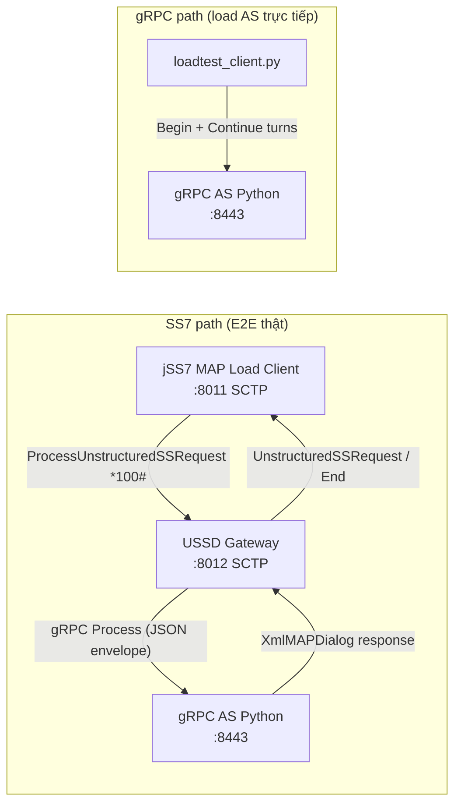

# End-to-End Test: USSD Gateway + gRPC Application Server

Hướng dẫn test đầy đủ luồng USSD qua **USSD Gateway** với **gRPC AS**, dùng hai bộ công cụ:

| Tool | Vị trí | Vai trò |
|------|--------|---------|
| **jSS7 MAP Load Client** | `jSS7/map/load` | Phát MAP `ProcessUnstructuredSSRequest` qua SCTP/M3UA — mô phỏng thuê bao SS7 |
| **gRPC Python tester** | `ussdgateway/tools/grpc-as-tester` | AS server + load generator gRPC trực tiếp (bypass MAP) |

Menu USSD dùng chung file `menu_config.json` (multi-menu: Balance / Data / Subscribe).

---

## 1. Kiến trúc lab



**Hai đường test:**

1. **E2E SS7 → GW → gRPC AS** — dùng `jSS7/map/load` Client (cần SCTP tới gateway).
2. **gRPC-only** — dùng `loadtest_client.py` gọi thẳng AS (test throughput/latency AS, không qua MAP).

---

## 2. Yêu cầu

| Thành phần | Phiên bản / ghi chú |
|------------|---------------------|
| JDK | 8 |
| Maven | 3.9.x |
| Docker | Gateway image `restcomm-ussd:7.2.1-SNAPSHOT` |
| Python | 3.8+ với `grpcio` |
| SCTP (Linux) | Kernel SCTP cho MAP client ↔ gateway |
| jSS7 | Build simulator + map/load (`9.2.12`) |

**Build gateway Docker** (nếu chưa có image):

```bash
cd ussdgateway/release-wildfly
./build-docker.sh
```

**Build jSS7 MAP load:**

```bash
cd jSS7/map/load
mvn clean test package -Passemble
# Output: target/load/map-load.jar + lib/
```

**Build jSS7 MAP Simulator** (test thủ công):

```bash
cd jSS7
mvn clean install -pl tools/simulator -am -Dmaven.test.skip=true
# Binary: tools/simulator/bootstrap/target/simulator-ss7/bin/run.sh
```

**Python AS:**

```bash
cd ussdgateway/tools/grpc-as-tester
python3 -m venv .venv && ./.venv/bin/pip install -r requirements.txt
```

---

## 3. Cấu hình demo (phải khớp nhau)

### 3.1 SS7 / SCTP

| Tham số | Gateway | jSS7 MAP client / Simulator |
|---------|---------|----------------------------|
| Gateway SCTP listen | `8012` (trong container: map host `2905:2905/sctp`) | Peer `:8012` |
| Client SCTP bind | — | Local `:8011` |
| M3UA RC / NA | `101` / `102` | `101` / `102` |
| OPC / DPC | GW `2`, peer `1` | Client `1`, peer `2` |
| USSD SSN | `8` | Remote SSN **`8`** |
| MSC / HLR SSN | `8` / `6` | `8` / `6` |
| Short code gRPC | `*100#` | USSD string `*100#` |

File tham chiếu:

- Gateway seed: `release-wildfly/config-seed/SCTPManagement_sctp.xml`
- Simulator: `core/bootstrap/src/main/config/ss7-simulator/main_simulator2.xml`

### 3.2 Routing rule gRPC

Seed mặc định **chưa có** rule gRPC. Thêm vào
`/opt/ussdgw/data/UssdManagement_scroutingrule.xml` (hoặc sửa trước khi deploy):

```xml
<item>
  <ruleType>GRPC</ruleType>
  <shortcode>*100#</shortcode>
  <networkid>0</networkid>
  <ruleurl>host.docker.internal:8443</ruleurl>
  <exactmatch>true</exactmatch>
</item>
```

- Gateway **trong Docker**, AS **trên host**: dùng `host.docker.internal:8443` (Linux: thêm `extra_hosts` hoặc IP host).
- Cả hai trên host: `127.0.0.1:8443`.

`ruleurl` chỉ cần `host:port` — gateway là gRPC **client**, AS là server.

### 3.3 Virtual Session Bridge (tuỳ chọn — test adaptive timeout)

Sửa `/opt/ussdgw/data/UssdManagement_ussdproperties.xml`:

```xml
<sessionbridgeenabled>true</sessionbridgeenabled>
<asyncgatetimeoutms>7000</asyncgatetimeoutms>
<dialogtimeout>25000</dialogtimeout>
```

| Property | Ý nghĩa |
|----------|---------|
| `asyncGateTimeoutMs` | Trần gate (ms); EWMA adaptive ≤ giá trị này |
| `asyncWaitUserMessage` | S1 release khi gate hết |
| `bridgeStateTtlSec` | TTL virtual session (180s) |
| `GRPC_DEADLINE_MS` | 30000 ms (RA deploy-config) |

Chi tiết thiết kế: [`docs/design/virtual-session-bridge.md`](design/virtual-session-bridge.md).

### 3.4 Menu tree (shared)

File: `tools/grpc-as-tester/menu_config.json` (copy tương đương trong `jSS7/map/load/src/main/resources/`).

| Profile | Lượt chọn (digits) | Kết quả |
|---------|-------------------|---------|
| `BALANCE` | `1` → `0` | Xem balance → Exit |
| `DATA` | `2` → `1` | Chọn bundle 1GB → Final |
| `SUBSCRIBE` | `3` → `100` | Nhập amount → Final |
| `RANDOM` | Random hợp lệ mỗi node | — |

---

## 4. Khởi động lab

### Bước 1 — Gateway

```bash
cd ussdgateway/release-wildfly

# Khuyến nghị: map SCTP ra host
docker run -d --name ussdgw-e2e \
  --memory=5g --cpus=2 \
  -p 8080:8080 -p 9990:9990 \
  -p 2905:2905/sctp \
  -v ussdgw-data:/opt/ussdgw/data \
  -v ussdgw-log:/opt/ussdgw/log \
  --add-host=host.docker.internal:host-gateway \
  restcomm-ussd:7.2.1-SNAPSHOT

# Đợi healthy
docker exec ussdgw-e2e curl -fs http://localhost:9990/health
```

Sau khi container chạy lần đầu, chỉnh `data/UssdManagement_scroutingrule.xml` và `data/UssdManagement_ussdproperties.xml` như mục 3, rồi restart container.

### Bước 2 — gRPC Application Server

```bash
cd ussdgateway/tools/grpc-as-tester
./.venv/bin/python ussd_as_server.py \
  --port 8443 \
  --min-delay 1 --max-delay 100 \
  --menu-config menu_config.json
```

Log mong đợi: `USSD gRPC AS listening on :8443`.

### Bước 3 — (Tuỳ chọn) MAP Simulator GUI

Dùng khi debug từng bước thay vì load generator:

```bash
cd jSS7/tools/simulator/bootstrap/target/simulator-ss7/bin
cp ../../../../../../ussdgateway/core/bootstrap/src/main/config/ss7-simulator/main_simulator2.xml \
   ../data/main_simulator2.xml
./run.sh gui --name=main
```

Trong GUI: `USSD_TEST_CLIENT`, dial `*100#`, trả lời menu thủ công.

---

## 5. Test E2E — Tool 1: jSS7 MAP Load Client

Luồng: **MAP client → Gateway SCTP → gRPC AS → menu multi-turn → End**.

### 5.1 Smoke test (1 profile, ít dialog)

```bash
cd jSS7/map/load

java -cp "target/load/*" org.restcomm.protocols.ss7.map.load.ussd.Client \
  10 5 sctp 127.0.0.1 8011 -1 127.0.0.1 2905 IPSP 101 102 1 2 3 2 8 6 8 \
  1111112 9960639999 1 16 -100 0 "*100#" BALANCE 50 200
```

> **Port:** Nếu gateway map `2905:2905/sctp`, client peer port = `2905`. Nếu chạy WildFly trực tiếp trên host, dùng `8012`.

| Arg (vị trí) | Giá trị ví dụ | Ý nghĩa |
|--------------|---------------|---------|
| 1–2 | `10` `5` | 10 dialog, 5 concurrent |
| 25 | `*100#` | Short code khớp scrule gRPC |
| 26 | `BALANCE` | Menu profile |
| 27–28 | `50` `200` | Think delay ms (adaptive gate) |

Hoặc qua Ant (defaults trong `ussd_build.xml`):

```bash
ant -f ussd_build.xml assemble
ant -f ussd_build.xml client
```

### 5.2 Load test multi-menu

```bash
java -cp "target/load/*" org.restcomm.protocols.ss7.map.load.ussd.Client \
  100000 400 sctp 127.0.0.1 8011 -1 127.0.0.1 2905 IPSP 101 102 1 2 3 2 8 6 8 \
  1111112 9960639999 1 16 -100 5 "*100#" RANDOM 50 300
```

Arg 24 = `5` → chạy **5 phút** (duration mode).

Metrics CSV: `map-*.csv` trong thư mục làm việc (`CreatedScenario`, `CompletedScenario`, `FailedScenario`).

### 5.3 Verify thành công

- [ ] Client log: `AS1 is now ACTIVE`, throughput cuối test
- [ ] `CompletedScenario` ≈ số dialog hoàn thành; `FailedScenario` thấp
- [ ] Gateway log: gRPC call tới AS, không `no routing rule` cho `*100#`
- [ ] AS log: nhiều session với menu turns
- [ ] CDR (nếu bật): S1/S2 khi bridge enabled

---

## 6. Test — Tool 2: gRPC Python (`loadtest_client.py`)

Luồng: **Load client → gRPC AS trực tiếp** (không qua MAP). Dùng để:

- Benchmark AS thuần (TPS/latency)
- Test multi-menu ở tầng gRPC (cùng `menu_config.json`)

### 6.1 Single-shot (Begin only — throughput cao)

```bash
cd ussdgateway/tools/grpc-as-tester
./.venv/bin/python loadtest_client.py \
  --target localhost:8443 \
  --tps 1000 --duration 10
```

### 6.2 Multi-menu full session

```bash
./.venv/bin/python loadtest_client.py \
  --target localhost:8443 \
  --tps 200 --duration 30 \
  --multi-menu --profile BALANCE \
  --think-min 50 --think-max 200 \
  --menu-config menu_config.json
```

Profiles: `BALANCE`, `DATA`, `SUBSCRIBE`, `RANDOM`.

Output mẫu:

```
  mode             : multi-menu
  completed        : 5842
  achieved TPS     : 194
  latency p95 (ms) : 12.34
```

### 6.3 So sánh hai tool

| | MAP Load Client | gRPC loadtest_client |
|--|-----------------|----------------------|
| Entry | SCTP/MAP | gRPC unary |
| Test gateway routing | ✓ | ✗ |
| Test MAP dialog / TCAP | ✓ | ✗ |
| Test gRPC AS menu | ✓ (qua GW) | ✓ (trực tiếp) |
| Multi-menu | ✓ profiles | ✓ `--multi-menu` |
| Adaptive delay | Think delay + AS delay | `--think-min/max` + AS delay |

---

## 7. Scenarios nâng cao

### 7.1 Adaptive timeout (EWMA gate)

**Gateway:** `sessionbridgeenabled=true`, `asyncgatetimeoutms=7000`

**AS:**

```bash
./.venv/bin/python ussd_as_server.py --port 8443 --min-delay 1 --max-delay 100
```

**MAP client:** profile `ADAPTIVE` hoặc `RANDOM`, think `50–500` ms.

**Kỳ vọng:** Gate co/giãn theo latency AS; multi-turn vẫn complete trước `dialogtimeout` (25s).

### 7.2 Bridge late-response (Channel A reconcile)

**AS** cố ý chậm hơn gate:

```bash
./.venv/bin/python ussd_as_server.py \
  --port 8443 --bridge-delay 8000 --bridge-every 1
```

**Kỳ vọng:**

1. Gate (7s) fires → MO release S1 (`asyncWaitUserMessage`)
2. AS trả lễ → gateway reconcile qua `requestId` → NI push S2

Verify: gateway metrics/log `bridge_late_*`, CDR S1 + S2. Spec: [`docs/design/bridge-unified-reconciliation-rfc.md`](design/bridge-unified-reconciliation-rfc.md).

### 7.3 Direct gRPC bridge test (không MAP)

Dùng `loadtest_client.py --multi-menu` với AS `--bridge-delay 8000` — test AS + envelope `requestId` echo; **không** cover MAP/SCTP path.

---

## 8. Checklist troubleshooting

| Triệu chứng | Nguyên nhân thường gặp | Fix |
|-------------|------------------------|-----|
| `AS1` không ACTIVE | SCTP chưa kết nối | Kiểm tra port 8011↔8012/2905, firewall |
| `Not valid short code` | Thiếu scrule `*100#` GRPC | Thêm rule mục 3.2 |
| AS connection refused | AS chưa chạy / sai host từ container | `host.docker.internal:8443` |
| Dialog timeout MAP | SSN sai (147 vs 8) | Client `ussdSsn=8` |
| Menu stuck 1 turn | AS single-turn / sai menu | Dùng `ussd_as_server.py` + `menu_config.json` |
| `FailedScenario` cao | Think delay + bridge quá dài | Giảm `--bridge-delay` hoặc tăng `dialogtimeout` |
| gRPC load 0 ok | Sai target / AS down | `curl` không áp dụng; check `--target host:8443` |

**Log locations:**

- MAP client: `client/maplog.txt` (Ant) hoặc stdout
- Gateway: `docker logs ussdgw-e2e`
- gRPC AS: stdout (bật `--verbose`)

---

## 9. Tài liệu liên quan

| Tài liệu | Nội dung |
|----------|----------|
| [`tools/grpc-as-tester/`](../tools/grpc-as-tester/) | AS server + load client source |
| [`jSS7/map/load/USSD-LOADTEST.md`](../../jSS7/map/load/USSD-LOADTEST.md) | MAP load CLI chi tiết |
| [`docs/design/virtual-session-bridge.md`](design/virtual-session-bridge.md) | Bridge FSM + adaptive timeout |
| [`docs/design/bridge-unified-reconciliation-rfc.md`](design/bridge-unified-reconciliation-rfc.md) | Late response reconcile |
| [`release-wildfly/DEPLOY-GUIDE.md`](../release-wildfly/DEPLOY-GUIDE.md) | Docker deploy + SCTP |

---

*Cập nhật: 2026-06-21 — multi-menu MAP load + gRPC `--multi-menu`.*
