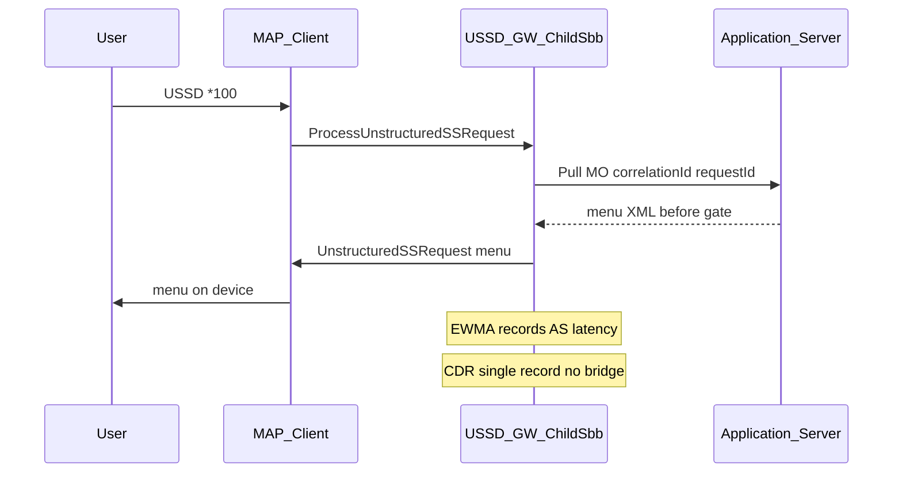
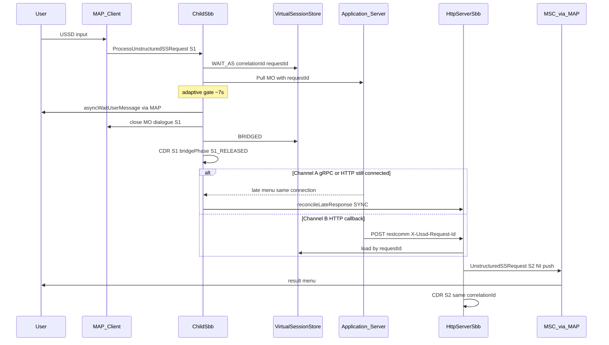
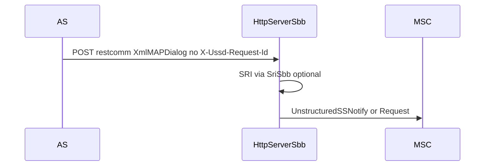
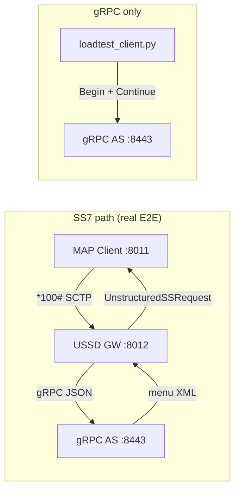

# End-to-End Test Guide — USSD Gateway + gRPC AS

> **Goal:** Dial `*100#` from the SS7 network (simulated) → USSD Gateway → gRPC Application Server → multi-level USSD menu → end OK.

Two main tool sets:

| Tool | Location | Role |
|------|----------|------|
| **jSS7 MAP Load Client** | `jSS7/map/load` | Send MAP `ProcessUnstructuredSSRequest` over SCTP/M3UA — simulates SS7 subscriber |
| **gRPC Python tester** | `ussdgateway/tools/grpc-as-tester` | AS server + gRPC load generator; `grpc_push_client.py` (NI Push → GW `:8453`) |
| **HTTP loadtest** | `ussdgateway/tools/http-simulator/loadtest` | HTTP Pull AS + HTTP Push load (auto XML) |

All three share `menu_config.json` (multi-menu: Balance / Data / Subscribe).

**There are 2 ways to run the lab:**

| Method | Who uses it | Difficulty |
|--------|-------------|------------|
| **[A] Package `ussdgw-test`** | Deploy to production server, extract and run | ⭐ Easy — **read this section first** |
| **[B] Dev machine** | Build from source `ussdgateway` + `jSS7` | ⭐⭐⭐ Harder — end of document |

> **Offline package:** Pre-bundled at `ussdgw-test/` — see [`ussdgw-test/README.md`](../../ussdgw-test/README.md).

---

## Before you start — understand the test flow

```
  [MAP Client]  ----SCTP *100#---->  [USSD Gateway]  ----gRPC---->  [Python AS :8443]
       |                                    |                              |
  simulates subscriber                    routing + bridge                  menu Balance/Data/...
```

| # | Component | Runs where | Port |
|---|-----------|------------|------|
| 1 | **USSD Gateway** (Docker) | container, host network | SCTP **8012**, HTTP 8080, mgmt **9990** |
| 2 | **gRPC AS** (Python) | same host machine | **8443** (Pull MO) |
| 2b | **gRPC Push** (gateway server) | inside gateway | **8453** (NI Push) |
| 3 | **MAP load client** (Java) | same host machine | bind SCTP **8011** → call GW **8012** |
| 4 | **HTTP Pull AS** (optional) | host | **8049** (`*519#`) |

**Two main test paths:**

1. **E2E SS7 → GW → gRPC AS** — use jSS7 MAP Load Client (requires SCTP to gateway).
2. **gRPC-only** — use `loadtest_client.py` to call AS directly (measure AS TPS/latency; no MAP).
3. **HTTP Pull/Push** — gateway ↔ HTTP AS (`*519#`) or client POST to `/restcomm`.

**Mandatory order:** Gateway + AS must be running **first**, then run MAP client or HTTP load.

### Convention: Script shortcut ↔ manual commands

Each step in this document has **two ways** to run:

| Method | When to use |
|--------|-------------|
| **Script** (`./scripts/NN-...sh`) | Fast regression — combines many commands, auto-creates venv/PID/log |
| **Manual alternative** | Debug each tool — tester sees clearly **which tool is being called** and **what that command does** |

- Common environment variables: `source ./scripts/env.sh` (or `PKG_ROOT=/opt/ussdgw-test`).
- Full command table per script → [Appendix A — Run each tool manually (manual alternative to scripts)](#appendix-a--run-each-tool-manually-manual-alternative-to-scripts).
- In **Steps 2–9** below, the **「Manual alternative」** block appears right after the corresponding script line.

---

# [A] Run with package `ussdgw-test` (recommended)

## Step 0 — Prepare server

**Required on server:**

- Linux x86_64
- Docker installed, owner user in `docker` group
- `java` (JDK 8) — `java -version` must show 1.8.x
- `python3` (3.9–3.12)
- RAM ≥ 6 GB
- Package file extracted, e.g.: `/opt/ussdgw-test/`

```bash
# Extract (if not yet done)
cd /opt
tar xzf ussdgw-test-7.2.1-SNAPSHOT.tar.gz
cd ussdgw-test
```

---

## Step 1 — Enable SCTP kernel

```bash
lsmod | grep sctp
```

**Must see** a line with `sctp` (e.g. `sctp 557056 20`). If not:

```bash
sudo modprobe sctp
lsmod | grep sctp
```

`00-preflight.sh` and `02-setup-host.sh` also check SCTP via `lsmod | awk '/^sctp /'`.

---

## Step 2 — Verify package has all files

```bash
cd /opt/ussdgw-test          # change path if you installed elsewhere
chmod +x scripts/*.sh
./scripts/00-preflight.sh
```

**Must see all `OK` lines**, no `FAIL`.  
If `FAIL missing docker tar` → file `docker/restcomm-ussd-7.2.1-SNAPSHOT.tar` was missing when copied.

#### Manual alternative (Step 2)

| # | Command | Purpose |
|---|---------|---------|
| 1 | `chmod +x scripts/*.sh` | Allow script execution |
| 2 | `command -v docker && docker info` | Docker CLI + daemon ready |
| 3 | `java -version` | JDK 8 (MAP client) |
| 4 | `python3 --version` | Python for gRPC/HTTP AS |
| 5 | `lsmod \| awk '/^sctp /'` | SCTP kernel (MAP/SS7) |
| 6 | `test -f docker/restcomm-ussd-*.tar` | Gateway image tar in package |
| 7 | `test -f tools/jss7-map-load/lib/map-load.jar` | MAP load client bundled |

---

## Step 3 — Load Docker image (without stopping gateway)

```bash
cd /opt/ussdgw-test
./scripts/01-load-docker-image.sh
```

**Default:** `docker load` — gateway keeps running. **Backup `/opt/ussdgw`** → `backups/ussdgw-<timestamp>/ussdgw-host.tgz` (if directory exists).

Writes `gateway/.env` with release tag (`docker/package.manifest`).

**Old images are kept** on the machine for rollback — not auto-deleted.

```bash
docker images restcomm-ussd
./scripts/01-load-docker-image.sh --list-images
ls backups/
```

| Flag | Use when |
|------|----------|
| *(default)* | Prepare upgrade + backup host |
| `--switch` | Backup + load + recreate gateway |
| `--fresh-install` | Reset lab — delete **all** old images |
| `--prune --keep N` | Clean disk (keep N versions + running + previous) |
| `--no-backup` | Skip backup of `/opt/ussdgw` |
| `--list-images` | View tag + switch history |

#### Manual alternative (Step 3 — load image)

Assume `cd /opt/ussdgw-test` and `source ./scripts/env.sh`.

| # | Command | Purpose |
|---|---------|---------|
| 1 | `tar -tzf "${DOCKER_TAR}" \| head` | Verify tar before load |
| 2 | `docker load -i "${DOCKER_TAR}"` | Import `restcomm-ussd` image into local Docker |
| 3 | `docker images restcomm-ussd` | Confirm tag just loaded |
| 4 | `cat gateway/.env` | Release tag used for `docker compose` (script writes after load) |

Details on host backup, `--switch`, rollback → [Appendix A §A.1–A.3](#a1--load--switch--rollback-docker).

## Step 3b — Switch gateway (short downtime)

```bash
./scripts/03-switch-gateway.sh
```

Backup host again, save old image to `gateway/.env.previous`, recreate container.

## Step 3c — Rollback if new version fails

**Rollback Docker image:**

```bash
./scripts/03-switch-gateway.sh --rollback
./scripts/03-switch-gateway.sh --to restcomm-ussd:7.2.1-SNAPSHOT-20260621T120000-abc
./scripts/03-switch-gateway.sh --list-images
```

**Rollback host config:**

```bash
./scripts/02-setup-host.sh --list-backups
sudo ./scripts/02-setup-host.sh --restore backups/ussdgw-20260621T154000Z/
./scripts/03-switch-gateway.sh --rollback
```

**Production upgrade:**

```bash
./scripts/01-load-docker-image.sh
./scripts/03-switch-gateway.sh
./scripts/08-check-gateway.sh
# if error:
./scripts/03-switch-gateway.sh --rollback
sudo ./scripts/02-setup-host.sh --restore backups/ussdgw-<timestamp>/
```

---

## Step 4 — Setup host (`/opt/ussdgw`)

```bash
sudo ./scripts/02-setup-host.sh
```

Creates host directories, copies test config-seed (`*100#` gRPC, `*519#` HTTP). If `data/` already exists → **auto backup** before overwrite.

| Flag | Purpose |
|------|---------|
| `--list-backups` | List backups |
| `--restore <dir>` | Restore `/opt/ussdgw` |
| `--no-seed` | Init directories only, do not overwrite XML |

#### Manual alternative (Step 4)

| # | Command | Purpose |
|---|---------|---------|
| 1 | `sudo mkdir -p /opt/ussdgw/{data,logs}` | Gateway runtime directories on host |
| 2 | `sudo cp -a gateway/config-seed/* /opt/ussdgw/data/` | Seed rule `*100#` gRPC, `*519#` HTTP, bridge XML |
| 3 | `ls /opt/ussdgw/data/UssdManagement_scroutingrule.xml` | Confirm routing copied |

Script also auto-backs up if `data/` exists — when running manually, backup first: `sudo tar czf ussdgw-backup.tgz -C / opt/ussdgw`.

---

## Step 5 — Start USSD Gateway with `docker compose up` ⭐

**This is the step that runs the gateway container.** Compose file location:

```
ussdgw-test/gateway/docker-compose.yml
```

### Run command (copy-paste)

```bash
cd /opt/ussdgw-test/gateway

# Start gateway (init service runs first, then ussdgw)
docker compose up -d

# View status
docker compose ps
```

**Must see** container `ussd-ng` status `running` (or `healthy` after ~3–5 minutes).

### Verify gateway is alive

```bash
# Health
curl -fs http://localhost:8080/jolokia/version && echo " OK"

# Log (Ctrl+C to exit)
docker logs -f ussd-ng
```

WildFly startup log takes **3–5 minutes** the first time (deploy SLEE + patch JAR). Wait until health OK before MAP test.

```bash
./scripts/08-check-gateway.sh    # quick diagnosis
curl -fs http://localhost:8080/jolokia/version && echo " OK"
```

### Stop gateway

```bash
cd /opt/ussdgw-test/gateway
docker compose down
```

### Compose notes

| Service | Container | Role |
|---------|-----------|------|
| `init` | `ussd-ng-init` | Runs once: seed `/opt/ussdgw/data` |
| `ussdgw` | `ussd-ng` | USSD Gateway WildFly |

- `network_mode: host` → SCTP listen **8012** directly on host machine
- Image: `restcomm-ussd:7.2.1-SNAPSHOT` (loaded in Step 3)
- Config: `gateway/config-seed/` → `/opt/ussdgw/data/`

> **Shortcut:** `./scripts/03-start-gateway.sh` = `cd gateway && docker compose up -d` + wait for health.

#### Manual alternative (Step 5)

| # | Command | Purpose |
|---|---------|---------|
| 1 | `cd /opt/ussdgw-test/gateway` | Enter compose directory |
| 2 | `docker compose up -d` | Start `init` (seed data) + `ussdgw` (WildFly) |
| 3 | `docker compose ps` | Container `ussd-ng` = running/healthy |
| 4 | `curl -fs http://localhost:8080/jolokia/version` | HTTP health — wait 3–5 minutes first time |
| 5 | `docker logs -f ussd-ng` | Monitor SLEE deploy (optional) |

Stop: `cd gateway && docker compose down` (equivalent to `./scripts/04-stop-gateway.sh`).

---

## Step 6 — Start gRPC Application Server (Python)

Gateway **must be healthy** before running this step.

```bash
cd /opt/ussdgw-test
./scripts/05-start-grpc-as.sh
```

**Must see** in `grpc-as.log`:

```
USSD gRPC AS listening on :8443
```

```bash
tail -3 grpc-as.log
```

> **Shortcut:** `sudo ./scripts/start-all.sh` = Steps 3 + 4 + 5 + 6 combined in one command.

#### Manual alternative (Step 6 — gRPC Pull AS)

| # | Command | Purpose |
|---|---------|---------|
| 1 | `cd /opt/ussdgw-test/tools/grpc-as-tester` | Python AS directory + `menu_config.json` |
| 2 | `python3 -m venv .venv && .venv/bin/pip install -r requirements.txt` | Venv (first time only; offline: `--find-links wheels`) |
| 3 | `nohup .venv/bin/python ussd_as_server.py --port 8443 --min-delay 1 --max-delay 100 --menu-config menu_config.json > ../../grpc-as.log 2>&1 &` | AS listens gRPC — gateway is **client** to `:8443` |
| 4 | `tail -3 ../../grpc-as.log` | Must see `USSD gRPC AS listening on :8443` |

Stop AS: `kill $(cat /opt/ussdgw-test/.grpc-as.pid)` or `./scripts/05-stop-grpc-as.sh`.

---

## Step 7 — Test full flow SS7 → Gateway → gRPC (MAP smoke)

```bash
./scripts/06-run-map-smoke.sh
```

This command sends **10 USSD calls** `*100#`, auto-presses menu `BALANCE` (select `1` then `0`).

**Wait ~30 seconds – 2 minutes** (includes 20s SCTP startup delay first time).

CLI details, load test, warmup → [Section 5](#5-e2e-test--tool-1-jss7-map-load-client).

#### Manual alternative (Step 7 — MAP smoke `*100#`)

**Prerequisites:** Step 5 (gateway healthy) + Step 6 (gRPC AS `:8443`).

| # | Command | Purpose |
|---|---------|---------|
| 1 | `cd /opt/ussdgw-test/tools/jss7-map-load` | MAP load client (JAR in `lib/`) |
| 2 | `java -cp "lib/*" org.restcomm.protocols.ss7.map.load.ussd.Client 10 5 sctp 127.0.0.1 8011 -1 127.0.0.1 8012 IPSP 101 102 1 2 3 2 8 6 8 1111112 9960639999 1 4 -100 0 "*100#" BALANCE 50 200` | **10** SCTP dialogues, profile **BALANCE** (`1`→`0`), think 50–200 ms; gateway routes `*100#` → gRPC AS |
| 3 | `ls map-*.csv && tail maplog.txt` | Results: `CompletedScenario`, throughput |

Disable 60 s warmup: add `-Dwarmup=false` before `-cp`. Change short code/port: `source ../../scripts/env.sh` then use `"${USSD_SHORT_CODE}"` and `"${SCTP_GW_PORT}"`.

### How to know SUCCESS?

In final output, look for lines like:

```
AS1 is now ACTIVE! Starting load test.
Total completed dialogs = 10
Throughput = ...
```

And CSV file:

```bash
ls tools/jss7-map-load/map-*.csv
# Column CompletedScenario ≈ 10, FailedScenario low or 0
```

| Result | Meaning |
|--------|---------|
| `AS1 is now ACTIVE` | SCTP Gateway ↔ client OK |
| `CompletedScenario` ≈ 10 | 10 USSD sessions completed |
| `FailedScenario` = 0 | No errors |

**If fail** → see [Section 9 — Common errors](#9-common-errors).

---

## Step 8 — Test gRPC directly (without SS7)

Test Python AS + load client only, **not** via Gateway:

```bash
./scripts/07-run-grpc-smoke.sh
```

**Wait ~30 seconds.** Must see:

```
  mode             : multi-menu
  completed        : (number > 0)
  ok / errors      : X / 0
  achieved TPS     : ...
```

`errors = 0` → AS + multi-menu OK. Details → [Section 6](#6-test--tool-2-grpc-python-loadtest_clientpy).

#### Manual alternative (Step 8 — gRPC-only load)

**Prerequisites:** Step 6 (gRPC AS running). **No** gateway needed for this test.

| # | Command | Purpose |
|---|---------|---------|
| 1 | `cd /opt/ussdgw-test/tools/grpc-as-tester` | Same venv as `ussd_as_server.py` |
| 2 | `.venv/bin/python loadtest_client.py --target localhost:8443 --tps 50 --duration 30 --multi-menu --profile BALANCE --think-min 50 --think-max 200 --menu-config menu_config.json` | gRPC client calls AS **directly** — measure TPS/latency multi-menu, bypass MAP |

Disable warmup: add `--no-warmup`.

---

## Step 8b — (Optional) gRPC NI Push smoke

Gateway receives **Push NI** via gRPC server (port **8453**). Enable on web mgmt → tab **gRPC Push** → `GrpcPushServerEnabled=true`, port `8453`, service `mobicents-ussdgateway-server-grpc` deployed.

```bash
./scripts/14-run-grpc-push-smoke.sh
```

#### Manual alternative (Step 8b)

| # | Command | Purpose |
|---|---------|---------|
| 1 | Open `http://localhost:9990` → Server Settings → gRPC Push | Enable gateway push server |
| 2 | `curl -fs http://localhost:8080/jolokia/version` | Gateway healthy |
| 3 | `cd /opt/ussdgw-test/tools/grpc-as-tester` | Tool `grpc_push_client.py` |
| 4 | `.venv/bin/python grpc_push_client.py --target localhost:8453 --mode multi --profile BALANCE --tps 50 --duration 30 --think-min 50 --think-max 200 --menu-config menu_config.json` | Client sends NI push to **gateway** `:8453` (no MAP) |

---

## Step 9 — Stop everything

```bash
./scripts/stop-all.sh
```

Stop gRPC AS + Docker gateway:

```bash
./scripts/stop-all.sh
# or manually:
#   cd gateway && docker compose down
```

#### Manual alternative (Step 9)

| # | Command | Purpose |
|---|---------|---------|
| 1 | `kill $(cat /opt/ussdgw-test/.grpc-as.pid 2>/dev/null) 2>/dev/null; rm -f .grpc-as.pid` | Stop gRPC AS |
| 2 | `kill $(cat /opt/ussdgw-test/.http-as.pid 2>/dev/null) 2>/dev/null; rm -f .http-as.pid` | Stop HTTP Pull AS (if any) |
| 3 | `cd /opt/ussdgw-test/gateway && docker compose down` | Stop gateway + init |

---

## (Optional) Manual test with Simulator GUI

When smoke fails and you need step-by-step debug:

```bash
# Terminal 1: restart lab if already stopped
sudo ./scripts/start-all.sh

# Terminal 2: open simulator
cd tools/jss7-simulator/bin
chmod +x run.sh
./run.sh gui --name=main
# If WstxOutputFactory error → rerun build-package.sh; check 00-preflight.sh
```

In GUI window:
1. Select task **USSD_TEST_CLIENT**
2. Click **Start** / connect SS7
3. Enter USSD: `*100#`
4. When menu appears → enter `1` (Balance) → `0` (Exit)

---

## Appendix A — Run each tool manually (manual alternative to scripts)

Table below maps **1:1** each script → manual command. `PKG=/opt/ussdgw-test` (change if extracted elsewhere).

### A.0 — Common environment variables

```bash
cd /opt/ussdgw-test
source ./scripts/env.sh
# Then: $GRPC_AS_DIR, $MAP_LOAD_DIR, $HTTP_LOADTEST_DIR, $SCTP_GW_PORT, ...
```

### A.1 — Load / switch / rollback Docker

| Script | Purpose (summary) | Manual alternative |
|--------|-------------------|-------------------|
| `00-preflight.sh` | Check docker, java, python, SCTP, tar, JAR | Run each line in [Step 2 — Manual alternative](#manual-alternative-step-2) |
| `01-load-docker-image.sh` | Backup `/opt/ussdgw` + `docker load` | `docker load -i "${DOCKER_TAR}"` → `docker images restcomm-ussd` |
| `03-switch-gateway.sh` | Recreate container with new image | `cd gateway && docker compose down && docker compose up -d` (after `gateway/.env` points to new tag) |
| `03-switch-gateway.sh --rollback` | Revert image in `.env.previous` | Read `gateway/.env.previous`, write `USSDGW_IMAGE=...` back to `.env`, `compose up -d` |
| `04-stop-gateway.sh` | Stop gateway | `cd gateway && docker compose down` |

### A.2 — Host + gateway

| Script | Manual alternative |
|--------|-------------------|
| `02-setup-host.sh` | `sudo mkdir -p /opt/ussdgw/{data,logs}` + `sudo cp -a gateway/config-seed/* /opt/ussdgw/data/` |
| `03-start-gateway.sh` | `cd gateway && docker compose up -d` + `curl -fs http://localhost:8080/jolokia/version` |
| `08-check-gateway.sh` | `docker compose ps` + Jolokia + `docker logs --tail 50 ussd-ng` |

### A.3 — gRPC Pull AS + smoke

| Script | # | Manual command | Purpose |
|--------|---|----------------|---------|
| `05-start-grpc-as.sh` | 1 | `cd "${GRPC_AS_DIR}"` | Enter gRPC tool |
| | 2 | `python3 -m venv .venv && .venv/bin/pip install -r requirements.txt` | Install dependencies (first time) |
| | 3 | `nohup .venv/bin/python ussd_as_server.py --port 8443 --min-delay 1 --max-delay 100 --menu-config menu_config.json > "${PKG_ROOT}/grpc-as.log" 2>&1 &` | AS server for **Pull MO** `*100#` |
| `05-stop-grpc-as.sh` | 1 | `kill $(cat "${PKG_ROOT}/.grpc-as.pid")` | Stop AS process |
| `06-run-map-smoke.sh` | 1 | `cd "${MAP_LOAD_DIR}"` | MAP client |
| | 2 | `java -cp "lib/*" org.restcomm.protocols.ss7.map.load.ussd.Client 10 5 sctp 127.0.0.1 8011 -1 127.0.0.1 8012 IPSP 101 102 1 2 3 2 8 6 8 1111112 9960639999 1 4 -100 0 "*100#" BALANCE 50 200` | E2E SS7→GW→gRPC, 10 dialog |
| `07-run-grpc-smoke.sh` | 1 | `cd "${GRPC_AS_DIR}"` | |
| | 2 | `.venv/bin/python loadtest_client.py --target localhost:8443 --tps 50 --duration 30 --multi-menu --profile BALANCE --think-min 50 --think-max 200 --menu-config menu_config.json` | Load AS directly, no MAP |

### A.4 — HTTP Pull / Push

| Script | # | Manual command | Purpose |
|--------|---|----------------|---------|
| `09-start-http-as.sh` | 1 | `cd "${HTTP_LOADTEST_DIR}"` | HTTP simulator |
| | 2 | `python3 -m venv .venv && .venv/bin/pip install -r requirements.txt` | Venv (first time) |
| | 3 | `nohup .venv/bin/python http_as_server.py --port 8049 --min-delay 1 --max-delay 100 --menu-config menu_config.json > "${PKG_ROOT}/http-as.log" 2>&1 &` | **Pull** AS — gateway POST to `:8049` |
| `12-run-http-pull-smoke.sh` | 1 | `curl -fs http://127.0.0.1:8049/ -o /dev/null -X POST -d ''` | Check HTTP AS alive |
| | 2 | `cd "${MAP_LOAD_DIR}"` + `java -cp "lib/*" ... "*519#" BALANCE 50 200` | E2E MAP `*519#` → HTTP AS (same SCTP args as Step 7, change short code) |
| `13-run-http-push-smoke.sh` | 1 | `cd "${HTTP_LOADTEST_DIR}"` | |
| | 2 | `.venv/bin/python http_push_loadtest.py --target http://127.0.0.1:8080/restcomm --mode multi --profile BALANCE --tps 50 --duration 30 --think-min 50 --think-max 200 --menu-config menu_config.json` | **Push NI** — client POST XmlMAP to gateway |

Full MAP command for `*519#`:

```bash
cd "${MAP_LOAD_DIR}"
java -cp "lib/*" org.restcomm.protocols.ss7.map.load.ussd.Client \
  10 5 sctp 127.0.0.1 8011 -1 127.0.0.1 8012 IPSP 101 102 1 2 3 2 8 6 8 \
  1111112 9960639999 1 4 -100 0 "*519#" BALANCE 50 200
```

### A.5 — gRPC NI Push

| Script | # | Manual command | Purpose |
|--------|---|----------------|---------|
| `14-run-grpc-push-smoke.sh` | 1 | Enable gRPC Push on web mgmt `:9990` | Gateway listen **8453** |
| | 2 | `cd "${GRPC_AS_DIR}"` | |
| | 3 | `.venv/bin/python grpc_push_client.py --target localhost:8453 --mode multi --profile BALANCE --tps 50 --duration 30 --think-min 50 --think-max 200 --menu-config menu_config.json` | Push NI via gRPC to gateway |

### A.6 — Start / stop lab

| Script | Manual alternative (in order) |
|--------|-------------------------------|
| `start-all.sh` | `00-preflight` → `01-load` → `sudo 02-setup` → `03-start-gateway` → `05-start-grpc-as` |
| `stop-all.sh` | `05-stop-grpc-as` → `09-stop-http-as` → `04-stop-gateway` |

---

## Run each step individually (quick script reference)

| Step | Script | Summary | Manual command details |
|------|--------|---------|------------------------|
| Preflight | `00-preflight.sh` | Check environment | [A.1](#a1--load--switch--rollback-docker) |
| Load image | `01-load-docker-image.sh` | `docker load` + backup | [A.1](#a1--load--switch--rollback-docker) |
| Switch GW | `03-switch-gateway.sh` | Recreate container | [A.1](#a1--load--switch--rollback-docker) |
| Setup host | `02-setup-host.sh` | Seed `/opt/ussdgw` | [A.2](#a2--host--gateway) |
| **Start GW** | `03-start-gateway.sh` | `docker compose up -d` | [A.2](#a2--host--gateway) |
| Start gRPC AS | `05-start-grpc-as.sh` | `ussd_as_server.py :8443` | [A.3](#a3--grpc-pull-as--smoke) |
| MAP smoke | `06-run-map-smoke.sh` | `*100#` × 10 | [A.3](#a3--grpc-pull-as--smoke) |
| gRPC smoke | `07-run-grpc-smoke.sh` | `loadtest_client.py` | [A.3](#a3--grpc-pull-as--smoke) |
| Start HTTP AS | `09-start-http-as.sh` | `http_as_server.py :8049` | [A.4](#a4--http-pull--push) |
| HTTP Pull smoke | `12-run-http-pull-smoke.sh` | MAP `*519#` × 10 | [A.4](#a4--http-pull--push) |
| HTTP Push smoke | `13-run-http-push-smoke.sh` | Push 50 TPS × 30s | [A.4](#a4--http-pull--push) |
| gRPC Push smoke | `14-run-grpc-push-smoke.sh` | Push gRPC 50 TPS × 30s | [A.5](#a5--grpc-ni-push) |
| All | `start-all.sh` | Steps 1→6 combined | [A.6](#a6--start-stop-lab) |

---

# [B] Run from source (dev machine — no package)

Use only when developing, **no** `ussdgw-test` file.

## B.1 — Build (one time)

```bash
# Gateway image (Maven SLEE + ant + docker — avoid Eclipse stub JAR)
cd ussdgateway/release-wildfly && ./build-docker.sh

# MAP load client
cd jSS7/map/load && mvn clean package -Passemble -DskipTests

# SS7 simulator (needs woodstox in lib/)
cd jSS7 && mvn install -pl tools/simulator -am -Dmaven.test.skip=true

# Python AS + HTTP loadtest
cd ussdgateway/tools/grpc-as-tester
python3 -m venv .venv && ./.venv/bin/pip install -r requirements.txt
cd ../http-simulator/loadtest && pip install -r requirements.txt
```

## B.2 — Terminal 1: Gateway (docker compose)

```bash
sudo modprobe sctp

cd /path/to/ussdgw-test/gateway
docker compose up -d
docker compose ps
curl -fs http://localhost:8080/jolokia/version && echo " OK"
```

Or from source tree (after `./build-docker.sh`):

```bash
cd ussdgateway/release-wildfly
sudo ./setup-server.sh
docker compose up -d
```

## B.3 — Terminal 2: gRPC AS

```bash
cd ussdgateway/tools/grpc-as-tester
./.venv/bin/python ussd_as_server.py \
  --port 8443 \
  --min-delay 1 --max-delay 100 \
  --menu-config menu_config.json
```

## B.4 — Terminal 3: MAP smoke

**Package (`ussdgw-test`):**

```bash
cd ussdgw-test/tools/jss7-map-load
java -cp "lib/*" org.restcomm.protocols.ss7.map.load.ussd.Client \
  10 5 sctp 127.0.0.1 8011 -1 127.0.0.1 8012 IPSP 101 102 1 2 3 2 8 6 8 \
  1111112 9960639999 1 16 -100 0 "*100#" BALANCE 50 200
```

**jSS7 source:**

```bash
cd jSS7/map/load
java -cp "target/load/*" org.restcomm.protocols.ss7.map.load.ussd.Client \
  10 5 sctp 127.0.0.1 8011 -1 127.0.0.1 8012 IPSP 101 102 1 2 3 2 8 6 8 \
  1111112 9960639999 1 16 -100 0 "*100#" BALANCE 50 200
```

> Peer port = **8012** when gateway uses `network_mode: host`. Docker maps SCTP `2905:2905/sctp` → use `2905`.

---

# 5. E2E test — Tool 1: jSS7 MAP Load Client

Flow: **MAP client → Gateway SCTP → gRPC AS → multi-turn menu → End**.

### 5.1 Smoke test (one profile, few dialogues)

**From package `ussdgw-test`** (classpath `lib/*`):

```bash
cd ussdgw-test/tools/jss7-map-load
java -cp "lib/*" org.restcomm.protocols.ss7.map.load.ussd.Client \
  10 5 sctp 127.0.0.1 8011 -1 127.0.0.1 8012 IPSP 101 102 1 2 3 2 8 6 8 \
  1111112 9960639999 1 16 -100 0 "*100#" BALANCE 50 200
```

Or: `./scripts/06-run-map-smoke.sh`

**From jSS7 source** (classpath `target/load/*`):

```bash
cd jSS7/map/load
java -cp "target/load/*" org.restcomm.protocols.ss7.map.load.ussd.Client \
  10 5 sctp 127.0.0.1 8011 -1 127.0.0.1 8012 IPSP 101 102 1 2 3 2 8 6 8 \
  1111112 9960639999 1 16 -100 0 "*100#" BALANCE 50 200
```

| Parameter (position) | Example | Meaning |
|----------------------|---------|---------|
| 1–2 | `10` `5` | 10 dialogues, 5 concurrent |
| 25 | `*100#` | Short code matching gRPC scrule |
| 26 | `BALANCE` | Menu profile |
| 27–28 | `50` `200` | Think delay ms (adaptive gate) |

### 5.2 Multi-menu load test

**Package (`lib/*`):**

```bash
cd ussdgw-test/tools/jss7-map-load
java -cp "lib/*" org.restcomm.protocols.ss7.map.load.ussd.Client \
  100000 400 sctp 127.0.0.1 8011 -1 127.0.0.1 8012 IPSP 101 102 1 2 3 2 8 6 8 \
  1111112 9960639999 1 16 -100 5 "*100#" RANDOM 50 300
```

**jSS7 source (`target/load/*`):**

```bash
cd jSS7/map/load
java -cp "target/load/*" org.restcomm.protocols.ss7.map.load.ussd.Client \
  100000 400 sctp 127.0.0.1 8011 -1 127.0.0.1 8012 IPSP 101 102 1 2 3 2 8 6 8 \
  1111112 9960639999 1 16 -100 5 "*100#" RANDOM 50 300
```

Parameter 24 = `5` → run **5 minutes** (duration mode).

Metrics CSV: `map-*.csv` in working directory (`CreatedScenario`, `CompletedScenario`, `FailedScenario`).

### 5.3 Success criteria

- [ ] Client log: `AS1 is now ACTIVE`, throughput report at end
- [ ] `CompletedScenario` ≈ number of completed dialogues; `FailedScenario` low
- [ ] Gateway log: gRPC calls AS; no `no routing rule` for `*100#`
- [ ] AS log: many sessions with multiple menu turns
- [ ] CDR (if enabled): S1/S2 when bridge enabled

### 5.4 TPS warmup (MAP — ON by default)

All load generators **ramp TPS during first 60 seconds** before reaching configured target. Steps: `1 → 100 → 500 → 1000 → 2000 → 3000 → 5000 → 7000 → 10000` (capped at `--tps` / `MAXCONCURRENTDIALOGS`). Avoids hitting full rate on USSD GW before JVM/SLEE/TCAP is ready.

| Tool | Disable warmup |
|------|----------------|
| gRPC `loadtest_client.py` | `--no-warmup` |
| HTTP `http_push_loadtest.py` | `--no-warmup` |
| MAP `Client.java` | `-Dwarmup=false` |

Example output when target 5000 TPS:

```
warmup 60s: 1 → 100 → 500 → 1000 → 2000 → 3000 → 5000 TPS
```

MAP client prints similar summary at startup via `WarmupRateHelper`.

**MAP load with warmup disabled:**

```bash
java -Dwarmup=false -cp "lib/*" org.restcomm.protocols.ss7.map.load.ussd.Client \
  ... # same parameters as above
```

---

# 6. Test — Tool 2: gRPC Python (`loadtest_client.py`)

Flow: **Load client → gRPC AS directly** (no MAP). Used to:

- Benchmark AS alone (TPS/latency)
- Test multi-menu at gRPC layer (same `menu_config.json`)

### 6.1 Single-shot (Begin only — high throughput)

```bash
cd ussdgateway/tools/grpc-as-tester
./.venv/bin/python loadtest_client.py \
  --target localhost:8443 \
  --tps 1000 --duration 10
```

Warmup 60s ON by default — with `--duration 10` only ramps within 10s then stops.

### 6.2 Multi-menu full session

```bash
./.venv/bin/python loadtest_client.py \
  --target localhost:8443 \
  --tps 200 --duration 30 \
  --multi-menu --profile BALANCE \
  --think-min 50 --think-max 200 \
  --menu-config menu_config.json
```

Profiles: `BALANCE`, `DATA`, `SUBSCRIBE`, `RANDOM`.

Sample output:

```
  mode             : multi-menu
  completed        : 5842
  achieved TPS     : 194
  latency p95 (ms) : 12.34
  warmup 60s: 1 → 100 → 200 TPS
```

From `ussdgw-test`:

```bash
./scripts/07-run-grpc-smoke.sh
```

**Disable warmup — full TPS from start:**

```bash
./.venv/bin/python loadtest_client.py \
  --target localhost:8443 \
  --tps 1000 --duration 30 \
  --no-warmup
```

### 6.3 Tool comparison

| | MAP Load Client | gRPC loadtest_client |
|--|-----------------|----------------------|
| Entry | SCTP/MAP | gRPC unary |
| Test gateway routing | ✓ | ✗ |
| Test MAP dialogue / TCAP | ✓ | ✗ |
| Test gRPC AS menu | ✓ (via GW) | ✓ (direct) |
| Multi-menu | ✓ profiles | ✓ `--multi-menu` |
| Adaptive delay | Think delay + AS delay | `--think-min/max` + AS delay |
| TPS warmup | ON by default (`-Dwarmup=false`) | ON by default (`--no-warmup`) |

---

# 7. Test — Tool 3: HTTP (`http-simulator/loadtest`)

Auto-generates XmlMAPDialog (no manual XML). Same `menu_config.json` and profiles as gRPC/MAP.

| Script | Scenario | Direction |
|--------|----------|-----------|
| `http_as_server.py` | **Pull** (MO) | Gateway POST → AS listen `:8049` |
| `http_push_loadtest.py` | **Push** (NI) | Client POST → gateway `/restcomm` |

Routing: `*519#` → `http://127.0.0.1:8049/` (HTTP pull). Push URL: `http://127.0.0.1:8080/restcomm`.

Package `ussdgw-test` pre-seeds rule `*519#` in `gateway/config-seed/`.

### 7.1 HTTP Pull — start AS + MAP smoke

```bash
# Terminal: HTTP Pull AS (adaptive delay 1–100 ms)
cd ussdgateway/tools/http-simulator/loadtest
pip install -r requirements.txt
python3 http_as_server.py --port 8049 --min-delay 1 --max-delay 100

# Bridge / adaptive timeout:
python3 http_as_server.py --port 8049 --bridge-delay 8000 --bridge-every 10
```

From `ussdgw-test` (gateway + MAP client already running):

```bash
./scripts/09-start-http-as.sh
./scripts/12-run-http-pull-smoke.sh    # 10 dialog, *519#, BALANCE
```

#### Manual alternative (7.1)

| # | Command | Purpose |
|---|---------|---------|
| 1 | `cd /opt/ussdgw-test && source scripts/env.sh` | Variables `$HTTP_LOADTEST_DIR`, `$MAP_LOAD_DIR` |
| 2 | `cd "${HTTP_LOADTEST_DIR}" && python3 -m venv .venv && .venv/bin/pip install -r requirements.txt` | HTTP AS venv (first time) |
| 3 | `nohup .venv/bin/python http_as_server.py --port 8049 --min-delay 1 --max-delay 100 --menu-config menu_config.json > ../../http-as.log 2>&1 &` | HTTP Pull AS — gateway POST MO here |
| 4 | `cd "${MAP_LOAD_DIR}"` | MAP client |
| 5 | `java -cp "lib/*" org.restcomm.protocols.ss7.map.load.ussd.Client 10 5 sctp 127.0.0.1 8011 -1 127.0.0.1 8012 IPSP 101 102 1 2 3 2 8 6 8 1111112 9960639999 1 4 -100 0 "*519#" BALANCE 50 200` | 10 dialogues `*519#` via SCTP → gateway → HTTP AS |

Bridge test: replace step 3 with `http_as_server.py --port 8049 --bridge-delay 8000 --bridge-every 10`.

### 7.2 HTTP Push — load 1000 TPS

```bash
cd ussdgateway/tools/http-simulator/loadtest
python3 http_push_loadtest.py \
  --target http://127.0.0.1:8080/restcomm \
  --mode multi --profile BALANCE \
  --tps 1000 --duration 30 \
  --think-min 50 --think-max 200
```

Modes: `notify` (USSD notify only), `request` / `multi` (multi-step NI menu, XML auto-built).

From `ussdgw-test`:

```bash
./scripts/13-run-http-push-smoke.sh    # smoke 50 TPS × 30s
```

#### Manual alternative (7.2 — smoke 50 TPS)

| # | Command | Purpose |
|---|---------|---------|
| 1 | `cd /opt/ussdgw-test/tools/http-simulator/loadtest` | Push tool (can share venv with `09-start-http-as`) |
| 2 | `.venv/bin/python http_push_loadtest.py --target http://127.0.0.1:8080/restcomm --mode multi --profile BALANCE --tps 50 --duration 30 --think-min 50 --think-max 200 --menu-config menu_config.json` | Client auto-builds XmlMAPDialog, POST **NI** to gateway `/restcomm` |

High load 1000 TPS: change `--tps 1000` (keep gateway healthy). Disable warmup: `--no-warmup`.

**Disable warmup:**

```bash
python3 http_push_loadtest.py \
  --target http://127.0.0.1:8080/restcomm \
  --mode multi --profile BALANCE \
  --tps 1000 --duration 30 \
  --no-warmup
```

### 7.3 HTTP comparison

| | HTTP Pull AS | HTTP Push loadtest | MAP + HTTP |
|--|--------------|-------------------|------------|
| Entry | HTTP POST from GW | HTTP POST to GW | SCTP `*519#` |
| XML | Auto from menu | Auto from menu | SS7 + HTTP AS |
| 1000 TPS | AS thread pool | `--tps 1000` | MAP load + HTTP AS |
| Adaptive / bridge | `--min/max-delay`, `--bridge-delay` | think delay between push steps | think delay in MAP client |
| TPS warmup | — (MAP client ramp) | ON by default (`--no-warmup`) | MAP warmup |

Simulator Swing GUI (manual XML): `tools/http-simulator/bin/run.sh` — also in `ussdgw-test/tools/http-simulator/`.

---

# 8. Adaptive timeout & Virtual Session Bridge (key feature)

This section is the **main acceptance criteria** for USSD Gateway: under high load, gateway must keep MAP dialogues stable, **adapt AS wait gate** to actual latency, and **recover late AS responses** via NI push instead of hard-failing the subscriber.

Design docs: [`docs/design/virtual-session-bridge.md`](design/virtual-session-bridge.md), [`docs/design/bridge-unified-reconciliation-rfc.md`](design/bridge-unified-reconciliation-rfc.md).

### 8.1 What the feature does

| Mechanism | Purpose |
|-----------|---------|
| **Adaptive gate (EWMA)** | Moving average AS latency per `networkId` → dynamic gate in `[1000 ms, asyncGateTimeoutMs]`: fast AS → short gate; consistently slow AS → longer gate (not exceeding config ceiling). |
| **Virtual Session Bridge** | Gate expires before AS responds on **Pull MO** → release MAP S1 early, show `asyncWaitUserMessage`, keep virtual session in cache, deliver result later via **NI push S2**. |
| **Unified reconciliation** | Late AS matched via `requestId` on **Channel A** (same gRPC/HTTP MO connection) or **Channel B** (`POST /restcomm` + header `X-Ussd-Request-Id`). |

**Pull vs Push in this feature:**

| Path | Trigger | SBB | Bridge role |
|------|---------|-----|-------------|
| **Pull MO** | Subscriber dials `*100#` / `*519#` | `ChildSbb` → HTTP/gRPC/SIP | Gate timer on MAP ACI; S1 release + S2 NI push when AS slow |
| **Push NI (cold)** | AS POST without `X-Ussd-Request-Id` | `HttpServerSbb` | Normal NI push — no prior MO bridge |
| **Push NI (bridge S2)** | AS POST **with** `X-Ussd-Request-Id` | `HttpServerSbb` | Deliver menu after bridged Pull MO |

### 8.2 Timeout hierarchy (must be in correct order)

Package `ussdgw-test` enables bridge in [`gateway/config-seed/UssdManagement_ussdproperties.xml`](../../ussdgw-test/gateway/config-seed/UssdManagement_ussdproperties.xml):

```xml
<sessionbridgeenabled>true</sessionbridgeenabled>
<asyncgatetimeoutms>7000</asyncgatetimeoutms>
<dialogtimeout>60000</dialogtimeout>
<!-- TCAP: TcapStack_management.xml dialogTimeout=90000 -->
<asyncwaitusermessage>He thong dang ban, se update lai cho ban ngay</asyncwaitusermessage>
<bridgestatettlsec>180</bridgestatettlsec>
```

**Constraints (lab + production):**

```
1000 ms ≤ adaptiveGate ≤ asyncGateTimeoutMs (7000) < dialogTimeout (60000) < TCAP dialogTimeout (90000)
bridgeStateTtlSec (180) ≥ late AS window + push retry
```

| Property | Default (package) | Meaning |
|----------|-------------------|---------|
| `sessionBridgeEnabled` | `true` | Master switch; `false` = legacy hard timeout |
| `asyncGateTimeoutMs` | `7000` | Adaptive gate ceiling; MO release when gate expires |
| `dialogTimeout` | `60000` | Application timer when bridge off or after gate |
| `asyncWaitUserMessage` | (seed) | USSD shown when releasing S1, AS still processing |
| `asyncHardFailMessage` | (seed) | USSD when AS hard-fails |
| `bridgeStateTtlSec` | `180` | Virtual session TTL in cache |
| `pushRetryDelaysMs` | `3000,8000,15000` | Back-off retry NI push when MSC busy |

**AS-side parameters (all load tools):**

| Flag | Tool | Effect |
|------|------|--------|
| `--min-delay` / `--max-delay` | gRPC `ussd_as_server.py`, HTTP `http_as_server.py` | Random latency → feeds EWMA adaptive gate |
| `--bridge-delay MS` | same | Fixed delay **longer than gate** (use `8000` with gate 7000 ms) |
| `--bridge-every N` | same | Bridge delay for 1-in-N requests (`1`=always, `10`=10%) |

**Load generator parameters:**

| Flag | Tool | High-load / bridge values |
|------|------|---------------------------|
| `--tps` | `loadtest_client.py`, `http_push_loadtest.py` | `200`–`1000` (warmup ON by default) |
| `--duration` | same | `300` (5 minutes) |
| `--multi-menu` / profile `ADAPTIVE` | gRPC load / MAP | Multi-turn + variable think time |
| `--think-min` / `--think-max` | gRPC, HTTP push, MAP arg 27–28 | `50` / `300` ms |
| `--warmup` (ON by default) | all load tools | 60 s ramp — **required** before evaluating 1000 TPS |
| `-Dwarmup=false` | MAP Client | Disable ramp (instant stress) |

### 8.3 Call flow — Pull MO (gRPC / HTTP)

#### 8.3.1 Fast S1 (AS responds before gate)



#### 8.3.2 S2 bridge (AS slower than gate — key scenario)



**gRPC:** AS **must echo `requestId`** in JSON envelope ([`ussd_envelope.py`](../tools/grpc-as-tester/ussd_envelope.py)). Channel A handled in `GrpcClientSbb` when MAP dialogue already closed.

**HTTP Pull:** `http_as_server.py --bridge-delay 8000` delays **same POST response** (Channel A). Channel B: AS POST to `http://127.0.0.1:8080/restcomm` + header `X-Ussd-Request-Id` (RFC §5).

### 8.4 Call flow — Push NI

#### 8.4.1 Cold NI push (no prior MO)



#### 8.4.2 Bridge recovery push (S2 after slow Pull MO)

Same URL **`POST /restcomm`**, AS sends **`X-Ussd-Request-Id`** matching MO request. `HttpServerSbb` calls `reconcileLateResponse()` → NI push with **`correlationId` linking S1 CDR**.

### 8.5 Smoke (functional, low TPS)

Run after gateway healthy + AS up. Goal: confirm bridge before high load.

#### 8.5.1 gRPC Pull — one bridge dialogue

**Script:**

```bash
cd ussdgw-test && ./scripts/05-start-grpc-as.sh   # or AS with bridge-delay below
```

**Manual alternative:**

| # | Command | Purpose |
|---|---------|---------|
| 1 | `cd /opt/ussdgw-test/tools/grpc-as-tester` | |
| 2 | `.venv/bin/python ussd_as_server.py --port 8443 --bridge-delay 8000 --bridge-every 1 --min-delay 1 --max-delay 50 --menu-config menu_config.json` | AS intentionally responds **after** adaptive gate → trigger bridge S1+S2 |
| 3 | `cd /opt/ussdgw-test/tools/jss7-map-load` | |
| 4 | `java -cp "lib/*" org.restcomm.protocols.ss7.map.load.ussd.Client 10 5 sctp 127.0.0.1 8011 -1 127.0.0.1 8012 IPSP 101 102 1 2 3 2 8 6 8 1111112 9960639999 1 4 -100 0 "*100#" BALANCE 50 200` | MAP smoke (or `./scripts/06-run-map-smoke.sh` if AS already running with bridge flags) |

Or combine AS + MAP:

```bash
cd ussdgateway/tools/grpc-as-tester
./.venv/bin/python ussd_as_server.py \
  --port 8443 --bridge-delay 8000 --bridge-every 1 \
  --min-delay 1 --max-delay 50 --menu-config menu_config.json

cd ussdgw-test && ./scripts/06-run-map-smoke.sh
```

**Expected:** Device shows `asyncWaitUserMessage`, then menu via NI push; log `Bridging slow AS` / `bridge_late_sync_grpc`; CDR same `correlationId`, phase `S1_RELEASED` + `S2_PUSH`.

#### 8.5.2 HTTP Pull bridge (`*519#`)

**Script:**

```bash
cd ussdgw-test && ./scripts/09-start-http-as.sh
./scripts/12-run-http-pull-smoke.sh
```

**Manual alternative:**

| # | Command | Purpose |
|---|---------|---------|
| 1 | `cd /opt/ussdgw-test/tools/http-simulator/loadtest` | |
| 2 | `python3 http_as_server.py --port 8049 --bridge-delay 8000 --bridge-every 1` | HTTP AS bridge — delay response on **same** POST MO |
| 3 | `cd /opt/ussdgw-test/tools/jss7-map-load` | |
| 4 | `java -cp "lib/*" org.restcomm.protocols.ss7.map.load.ussd.Client 10 5 sctp 127.0.0.1 8011 -1 127.0.0.1 8012 IPSP 101 102 1 2 3 2 8 6 8 1111112 9960639999 1 4 -100 0 "*519#" BALANCE 50 200` | MAP `*519#` triggers HTTP bridge |

Or from source tree:

```bash
cd ussdgateway/tools/http-simulator/loadtest
python3 http_as_server.py --port 8049 --bridge-delay 8000 --bridge-every 1
```

#### 8.5.3 Adaptive gate only (no forced bridge)

| # | Command | Purpose |
|---|---------|---------|
| 1 | `cd /opt/ussdgw-test/tools/grpc-as-tester && .venv/bin/python ussd_as_server.py --port 8443 --min-delay 1 --max-delay 100` | Random AS latency — feeds EWMA gate |
| 2 | `cd /opt/ussdgw-test/tools/jss7-map-load` | |
| 3 | `java -cp "lib/*" org.restcomm.protocols.ss7.map.load.ussd.Client 50 10 sctp 127.0.0.1 8011 -1 127.0.0.1 8012 IPSP 101 102 1 2 3 2 8 6 8 1111112 9960639999 1 16 -100 0 "*100#" ADAPTIVE 50 500` | 50 dialogues, profile **ADAPTIVE**, no `--bridge-delay` |

```bash
./.venv/bin/python ussd_as_server.py --port 8443 --min-delay 1 --max-delay 100
cd ussdgw-test/tools/jss7-map-load
java -cp "lib/*" org.restcomm.protocols.ss7.map.load.ussd.Client \
  50 10 sctp 127.0.0.1 8011 -1 127.0.0.1 8012 IPSP 101 102 1 2 3 2 8 6 8 \
  1111112 9960639999 1 16 -100 0 "*100#" ADAPTIVE 50 500
```

**Expected:** All dialogues complete on S1; `FailedScenario` ≈ 0.

### 8.6 High-load matrix (adaptive timeout + bridge @ TPS)

**Prerequisites:** Lab §4, `sessionbridgeenabled=true`, warmup **ON**, monitor `docker logs ussd-ng`, `map-*.csv`, CDR.

#### H1 — Adaptive gate saturation (no bridge trigger)

**Goal:** EWMA + `dialogtimeout` 60 s maintains target TPS, no mass S1 release.

| Layer | Command |
|-------|---------|
| gRPC AS | `./.venv/bin/python ussd_as_server.py --port 8443 --workers 128 --min-delay 1 --max-delay 100` |
| MAP load | `Client 100000 400 ... "*100#" ADAPTIVE 50 300` arg 24 = `5` (5 minutes) |
| Or gRPC-only | `loadtest_client.py --target localhost:8443 --tps 1000 --duration 300 --multi-menu --profile ADAPTIVE --think-min 50 --think-max 300` |

**Pass:**

| Metric | Target |
|--------|--------|
| `CompletedScenario` / created | ≥ 95% |
| `FailedScenario` | ≤ 2% |
| CDR bridge S1 | ≈ 0 (no `--bridge-delay`) |
| Achieved TPS (after 60 s warmup) | ≥ 80% target |

#### H2 — Mixed bridge @ 1000 TPS (key production test)

**Goal:** 10% MO intentionally slower than gate; gateway recovers S2 without MAP/TCAP collapse.

| Layer | Configuration |
|-------|---------------|
| gRPC AS | `--bridge-delay 8000 --bridge-every 10 --min-delay 1 --max-delay 80 --workers 128` |
| MAP E2E | `100000 400 ... "*100#" RANDOM 50 200` duration 5 minutes |
| HTTP Pull | `http_as_server.py --bridge-delay 8000 --bridge-every 10` + MAP `*519#` |

**Pass:**

| Metric | Target |
|--------|--------|
| Completed + S2 recover | ≥ 90% created |
| `FailedScenario` | ≤ 5% |
| Log | `bridge_late_sync_grpc/http`, `Bridging slow AS` |
| CDR | Pair `S1_RELEASED` / `S2_PUSH` same `correlationId` |
| UX | `asyncWaitUserMessage` then menu within `bridgeStateTtlSec` |

**Example MAP E2E mixed bridge (package):**

```bash
cd ussdgw-test/tools/jss7-map-load
java -cp "lib/*" org.restcomm.protocols.ss7.map.load.ussd.Client \
  100000 400 sctp 127.0.0.1 8011 -1 127.0.0.1 8012 IPSP 101 102 1 2 3 2 8 6 8 \
  1111112 9960639999 1 16 -100 5 "*100#" RANDOM 50 200
```

MAP warmup prints `warmup 60s: 1 → … → 400 TPS`. `-Dwarmup=false` only for instant stress.

#### H3 — HTTP Push 1000 TPS (NI parallel to Pull bridge)

```bash
python3 http_push_loadtest.py \
  --target http://127.0.0.1:8080/restcomm \
  --mode multi --profile BALANCE \
  --tps 1000 --duration 300 \
  --think-min 50 --think-max 200 \
  --max-inflight 2000
```

**Pass:** Push errors ≤ 1%; no `RejectedExecutionException`.

#### H4 — gRPC load + bridge (no MAP — supplementary, not replacing H2)

```bash
./.venv/bin/python ussd_as_server.py --port 8443 --bridge-delay 8000 --bridge-every 5 --workers 128
./.venv/bin/python loadtest_client.py \
  --target localhost:8443 --tps 1000 --duration 120 \
  --multi-menu --profile RANDOM --think-min 50 --think-max 200
```

#### H5 — Channel B manual (HTTP Pull bridge)

1. Run Pull smoke with `--bridge-delay 8000 --bridge-every 1`.
2. Late POST to gateway:

```bash
curl -sS -X POST http://127.0.0.1:8080/restcomm \
  -H "Content-Type: text/xml" \
  -H "X-Ussd-Request-Id: <requestId from GW log>" \
  --data-binary @/path/to/XmlMAPDialog-response.xml
```

**Expected:** Log `bridge_late_push_http`; NI push; CDR S2.

### 8.7 Monitoring & verification checklist

| Signal | Where to look | Healthy pattern |
|--------|---------------|-----------------|
| Adaptive gate | GW log | Gate ms decreases when AS fast, max 7000 |
| Bridge S1 | Log `ChildSbb` | `Bridging slow AS for PULL case` |
| Late reconcile | GW log | `bridge_late_sync_*` / `bridge_late_push_http` |
| MAP CSV | `map-*.csv` | `CompletedScenario` ↑, `FailedScenario` low |
| CDR | CDR file | Same `correlationId`, `S1_RELEASED` + `S2_PUSH` |
| TCAP | GW log | No mass `JENNY-DIALOG-TIMEOUT` before app gate |
| Warmup | load tool stdout | First 60 s sub-target TPS |

### 8.8 Troubleshooting (bridge)

| Symptom | Cause | Fix |
|---------|-------|-----|
| Mass `dialogtimeouterrmssg` | Bridge off or gate ≥ dialog timeout | Enable bridge; `asyncGateTimeoutMs` < `dialogtimeout` |
| Bridge S1 but no S2 | AS missing echo `requestId` / TTL expired | Fix envelope; increase `bridgeStateTtlSec`; check `bridge_late_expired` |
| High `FailedScenario` @ 1000 TPS | No warmup, small AS pool | Warmup ON; `--workers 128`; reduce `--bridge-every` |
| HTTP Pull no S2 | AS not Channel B | Use gRPC or POST `/restcomm` + `X-Ussd-Request-Id` |
| Duplicate menu | Double reconcile | AS must not retry same `requestId`; check `bridge_late_duplicate` |

---

# 9. Common errors

| Symptom | Cause | Fix |
|---------|-------|-----|
| `AS1` not ACTIVE | SCTP not connected | `sudo modprobe sctp`; check GW running; port 8011↔8012 |
| `Not valid short code` | Missing rule `*100#` | Package has it; dev: edit `UssdManagement_scroutingrule.xml` |
| gRPC connection refused | AS not running / wrong host from container | `host.docker.internal:8443` or `127.0.0.1:8443` with host network |
| MAP dialogue timeout | Wrong SSN (147 vs 8) | Client `ussdSsn=8` |
| Menu stuck one turn | AS single-turn / wrong menu | Use `ussd_as_server.py` + `menu_config.json` |
| High `FailedScenario` | Think delay + bridge delay too long | Reduce `--bridge-delay` or increase `dialogtimeout` |
| HTTP pull connection refused | HTTP AS not running `:8049` | `./scripts/09-start-http-as.sh`; scrule `*519#` → `http://127.0.0.1:8049/` |
| Gateway still old version | Not switched after load tar | `./scripts/03-switch-gateway.sh` |
| New version broken | Need rollback | `./scripts/03-switch-gateway.sh --rollback` |
| Config corrupted | data overwritten | `02-setup-host.sh --restore backups/ussdgw-*/` |
| SCTP / MAP fail | Module not loaded | `sudo modprobe sctp` + `lsmod \| grep sctp` |
| Long outage on upgrade | Stopped service before load done | Use default `01` (load while GW up) then `03-switch` |
| `docker load` error | Tar corrupt/missing | Recopy `docker/*.tar` |
| `Could not find main class` Client | Wrong package classpath | Use `java -cp "lib/*"` in `tools/jss7-map-load` |
| Simulator `WstxOutputFactory` | Missing woodstox in lib | `./scripts/build-package.sh`; `00-preflight.sh` |
| SLEE `Unresolved compilation` | Old image with stub JAR | `./build-docker.sh` (Maven SLEE before ant) |
| `UnknownHostException: ussd-ng` | Host network missing /etc/hosts | New image + `USSDGW_HOSTNAME=ussd-ng` |
| GUI `401` `/ussd-management/` | No WildFly user yet | Image + `/opt/ussdgw/configuration/mgmt-*.properties`; default `admin/admin` |
| GUI `403` after login | Missing role `JBossAdmin` | `mgmt-groups.properties`: `admin=JBossAdmin` |
| GW still running old image after rebuild | Docker context CLI ≠ compose daemon | `docker context use default` before build/load/compose |
| `NoClassDefFoundError: disruptor` | SLEE module missing disruptor | Rebuild `build-docker.sh` (jain-slee AS7 modules) |
| MAP RA connect fail / NPE | Old classloader bug | Image has MAP RA proxy fix (jain-slee.ss7) |
| `compute-jvm.sh: ... e+09` | cgroup memory in scientific notation | New image has fixed `compute-jvm.sh` |
| M3UA `asp1 association not available` | No SCTP peer 8011 yet | Run SS7 simulator + MAP load client first |
| Python pip error | No network | Package has `wheels/` — script installs offline |

**View logs:**

```bash
docker logs ussd-ng                    # Gateway
tail -f grpc-as.log                    # gRPC AS
tail -f http-as.log                    # HTTP Pull AS (ussdgw-test)
ls tools/jss7-map-load/map-*.csv       # MAP results
```

---

# 10. Appendix — Architecture & config



## Pre-matched config (package `ussdgw-test`)

| Parameter | Gateway | MAP client |
|-----------|---------|------------|
| SCTP | listen **8012** | bind **8011** → peer **8012** |
| M3UA RC/NA | 101 / 102 | 101 / 102 |
| OPC/DPC | 2 / 1 | 1 / 2 |
| USSD SSN | 8 | 8 |
| Short code gRPC | `*100#` → `127.0.0.1:8443` | `*100#` |
| Short code HTTP | `*519#` → `http://127.0.0.1:8049/` | `*519#` (MAP pull test) |

### Virtual Session Bridge (optional)

In `/opt/ussdgw/data/UssdManagement_ussdproperties.xml`:

```xml
<sessionbridgeenabled>true</sessionbridgeenabled>
<asyncgatetimeoutms>7000</asyncgatetimeoutms>
<dialogtimeout>25000</dialogtimeout>
```

Details: [`docs/design/virtual-session-bridge.md`](design/virtual-session-bridge.md).

## Menu profiles

| Profile | Key presses | Result |
|---------|-------------|--------|
| `BALANCE` | `1` → `0` | View balance → Exit |
| `DATA` | `2` → `1` | Select 1GB package |
| `SUBSCRIBE` | `3` → `100` | Subscribe |
| `RANDOM` | random | |
| `ADAPTIVE` | like RANDOM + think delay | Test adaptive gate |

## Further reading

| File | Content |
|------|---------|
| [`ussdgw-test/README.md`](../../ussdgw-test/README.md) | Package summary |
| [`e2e-grpc-ussd-test.md`](e2e-grpc-ussd-test.md) | Vietnamese version |
| [`jSS7/map/load/USSD-LOADTEST.md`](../../jSS7/map/load/USSD-LOADTEST.md) | Full MAP CLI + warmup |
| [`tools/http-simulator/loadtest/`](../tools/http-simulator/loadtest/) | HTTP Pull AS + Push load |
| [`tools/grpc-as-tester/`](../tools/grpc-as-tester/) | gRPC AS + load client source |
| [`docs/design/virtual-session-bridge.md`](design/virtual-session-bridge.md) | Virtual Session Bridge design + S2 sequence |
| [`docs/design/bridge-unified-reconciliation-rfc.md`](design/bridge-unified-reconciliation-rfc.md) | Late-response reconciliation |
| [`release-wildfly/DEPLOY-GUIDE.md`](../release-wildfly/DEPLOY-GUIDE.md) | Docker deploy + SCTP |

---

*Last updated: 2026-06-25 — Appendix A manual commands per tool; gRPC Push smoke (script 14); §8 adaptive timeout/bridge high-load matrix.*
