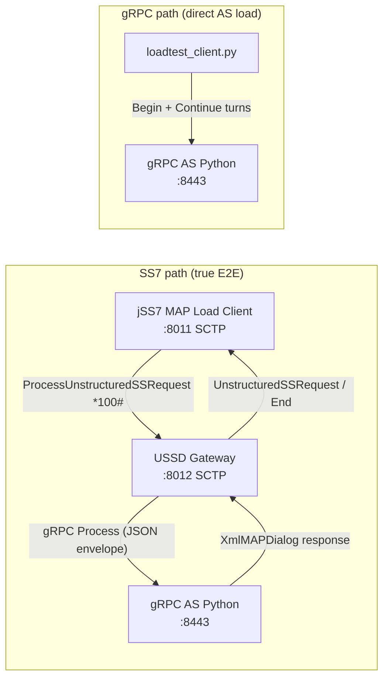

# End-to-End Test: USSD Gateway + gRPC Application Server

Full guide for testing the USSD flow through **USSD Gateway** with a **gRPC Application Server (AS)**, using two toolsets:

| Tool | Location | Role |
|------|----------|------|
| **jSS7 MAP Load Client** | `jSS7/map/load` | Sends MAP `ProcessUnstructuredSSRequest` over SCTP/M3UA — simulates an SS7 subscriber |
| **gRPC Python tester** | `ussdgateway/tools/grpc-as-tester` | AS server + direct gRPC load generator (bypasses MAP) |

Both tools share `menu_config.json` (multi-menu: Balance / Data / Subscribe).

> **Offline test package:** A ready-to-deploy bundle is available at `ussdgw-test/` (see `ussdgw-test/README.md`).

---

## 1. Lab architecture



**Two test paths:**

1. **E2E SS7 → GW → gRPC AS** — use `jSS7/map/load` Client (requires SCTP to the gateway).
2. **gRPC-only** — use `loadtest_client.py` to call the AS directly (AS throughput/latency; no MAP).

---

## 2. Prerequisites

| Component | Version / notes |
|-----------|-----------------|
| JDK | 8 |
| Maven | 3.9.x |
| Docker | Gateway image `restcomm-ussd:7.2.1-SNAPSHOT` |
| Python | 3.9+ with `grpcio` |
| SCTP (Linux) | Kernel SCTP — verify: `lsmod \| grep sctp` |
| jSS7 | Build simulator + map/load (`9.2.12`) |

**SCTP kernel module** (required for SS7/MAP):

```bash
lsmod | grep sctp
# OK: sctp  557056  20  (refs > 0)
sudo modprobe sctp    # if empty
./scripts/00-preflight.sh
```

**Build gateway Docker image** (if not already available):

```bash
cd ussdgateway/release-wildfly
./build-docker.sh   # Maven SLEE modules + ant release + docker build
```

> `build-docker.sh` runs `mvn clean package` on `jain-slee/.../container/build/as7` first so the release zip does not contain Eclipse stub JARs (`Unresolved compilation problems` in SLEE). Ant target `verify-slee-jars` fails the build if stub bytecode is detected.

**Build jSS7 MAP load client:**

```bash
cd jSS7/map/load
mvn clean test package -Passemble
# Output: target/load/map-load.jar + lib/
```

**Build jSS7 MAP Simulator** (manual step-by-step testing):

```bash
cd jSS7
mvn clean install -pl tools/simulator -am -Dmaven.test.skip=true
# Binary: tools/simulator/bootstrap/target/simulator-ss7/bin/run.sh
```

**Python AS setup:**

```bash
cd ussdgateway/tools/grpc-as-tester
python3 -m venv .venv && ./.venv/bin/pip install -r requirements.txt
```

---

## 3. Demo configuration (must align)

### 3.1 SS7 / SCTP

| Parameter | Gateway | jSS7 MAP client / Simulator |
|-----------|---------|----------------------------|
| Gateway SCTP listen | `8012` (host network) or container map `2905:2905/sctp` | Peer `:8012` or `:2905` |
| Client SCTP bind | — | Local `:8011` |
| M3UA RC / NA | `101` / `102` | `101` / `102` |
| OPC / DPC | GW `2`, peer `1` | Client `1`, peer `2` |
| USSD SSN | `8` | Remote SSN **`8`** |
| MSC / HLR SSN | `8` / `6` | `8` / `6` |
| gRPC short code | `*100#` | USSD string `*100#` |

Reference files:

- Gateway seed: `release-wildfly/config-seed/SCTPManagement_sctp.xml`
- Simulator: `core/bootstrap/src/main/config/ss7-simulator/main_simulator2.xml`

### 3.2 gRPC routing rule

The default seed **does not** include a gRPC rule. Add to
`/opt/ussdgw/data/UssdManagement_scroutingrule.xml` (or patch before first deploy):

```xml
<item>
  <ruleType>GRPC</ruleType>
  <shortcode>*100#</shortcode>
  <networkid>0</networkid>
  <ruleurl>127.0.0.1:8443</ruleurl>
  <exactmatch>true</exactmatch>
</item>
```

- Gateway **in Docker**, AS **on host** (bridge network): use `host.docker.internal:8443` (Linux: add `extra_hosts: host.docker.internal:host-gateway`).
- Both on host (or gateway with `network_mode: host`): `127.0.0.1:8443`.

`ruleurl` is `host:port` only — the gateway is the gRPC **client**; the AS is the server.

The `ussdgw-test` package ships with this rule and bridge settings pre-configured in `gateway/config-seed/`.

### 3.3 Virtual Session Bridge (optional — adaptive timeout testing)

Edit `/opt/ussdgw/data/UssdManagement_ussdproperties.xml`:

```xml
<sessionbridgeenabled>true</sessionbridgeenabled>
<asyncgatetimeoutms>7000</asyncgatetimeoutms>
<dialogtimeout>25000</dialogtimeout>
```

| Property | Meaning |
|----------|---------|
| `asyncGateTimeoutMs` | Gate ceiling (ms); EWMA adaptive value ≤ this |
| `asyncWaitUserMessage` | S1 release text when the gate expires |
| `bridgeStateTtlSec` | Virtual session TTL (180 s) |
| `GRPC_DEADLINE_MS` | 30000 ms (RA deploy-config) |

Design details: [`docs/design/virtual-session-bridge.md`](design/virtual-session-bridge.md).

### 3.4 Menu tree (shared)

File: `tools/grpc-as-tester/menu_config.json` (same content in `jSS7/map/load/src/main/resources/`).

| Profile | Digit sequence | Result |
|---------|----------------|--------|
| `BALANCE` | `1` → `0` | View balance → Exit |
| `DATA` | `2` → `1` | Select 1 GB bundle → Final |
| `SUBSCRIBE` | `3` → `100` | Enter amount → Final |
| `RANDOM` | Random valid choice per node | — |

---

## 4. Start the lab

### Step 1 — Load Docker image (no downtime)

```bash
cd /opt/ussdgw-test
./scripts/01-load-docker-image.sh
```

**Default:** `docker load` while gateway **keeps running**. If `/opt/ussdgw` exists, creates a host backup under `backups/ussdgw-<timestamp>/ussdgw-host.tgz` before loading.

Writes `gateway/.env` with unique release tag from `docker/package.manifest` (e.g. `restcomm-ussd:7.2.1-SNAPSHOT-20260621T154000-abc1234`).

**Old Docker images are kept** on the host for rollback — nothing is deleted unless you run `--prune` explicitly.

Verify:

```bash
docker images restcomm-ussd
./scripts/01-load-docker-image.sh --list-images
cat gateway/.env
ls -la backups/
```

| Flag | When to use |
|------|-------------|
| *(default)* | Prep upgrade — backup host + load tar, zero downtime |
| `--switch` | Backup + load + recreate gateway |
| `--fresh-install` | Lab reset only — removes **all** old images |
| `--prune --keep N` | Optional disk cleanup (default keep=5 + running + previous) |
| `--no-backup` | Skip `/opt/ussdgw` tar backup |
| `--force` | Reload tar even if release already loaded |
| `--list-images` | Show installed tags + switch history |

### Step 1b — Switch gateway to new release (brief downtime)

```bash
./scripts/03-switch-gateway.sh
```

Backs up `/opt/ussdgw` again, saves previous image to `gateway/.env.previous`, then `compose recreate`.

Downtime ≈ WildFly boot (3–5 min). Image already on disk from Step 1.

### Step 1c — Rollback if new release fails

**Rollback Docker image** (previous release still on disk):

```bash
./scripts/03-switch-gateway.sh --rollback
# or pick a specific kept tag:
./scripts/03-switch-gateway.sh --to restcomm-ussd:7.2.1-SNAPSHOT-20260621T120000-abc1234
./scripts/03-switch-gateway.sh --list-images
```

**Rollback host config** (`/opt/ussdgw/data`, logs, standalone.conf):

```bash
./scripts/02-setup-host.sh --list-backups
sudo ./scripts/02-setup-host.sh --restore backups/ussdgw-20260621T154000Z/
./scripts/03-switch-gateway.sh --rollback
```

**Production upgrade workflow:**

```bash
# 1) Prep — service stays up (docker load may take minutes)
./scripts/01-load-docker-image.sh

# 2) Short maintenance window
./scripts/03-switch-gateway.sh
./scripts/08-check-gateway.sh

# 3) If problems — rollback without re-loading tar
./scripts/03-switch-gateway.sh --rollback
# and/or restore host:
sudo ./scripts/02-setup-host.sh --restore backups/ussdgw-<timestamp>/
```

Each package build has unique `BUILD_ID` in `docker/package.manifest` — old and new images coexist.

### Step 2 — Host setup (`/opt/ussdgw`)

```bash
sudo ./scripts/02-setup-host.sh
```

Creates host dirs, applies package config-seed (`*100#` gRPC, `*519#` HTTP). If `/opt/ussdgw/data` already exists, **auto backup** before overwriting seed files.

| Flag | Purpose |
|------|---------|
| `--list-backups` | List `backups/ussdgw-*` archives |
| `--restore <dir>` | Restore `/opt/ussdgw` from backup (creates pre-restore safety backup) |
| `--no-seed` | Init dirs only — do not overwrite XML in `data/` |

**SCTP check** (required for MAP/SS7):

```bash
lsmod | grep sctp
# expect: sctp  ... refs>0
sudo modprobe sctp   # if missing
```

`02-setup-host.sh` and `00-preflight.sh` report SCTP status using `lsmod | awk '/^sctp /'`.

### Step 3 — Start USSD Gateway with `docker compose up` ⭐

Compose file: `ussdgw-test/gateway/docker-compose.yml`

```bash
cd /opt/ussdgw-test/gateway
docker compose up -d
docker compose ps
curl -fs http://localhost:9990/health && echo " OK"
```

Wait **3–5 minutes** for WildFly (first boot: SLEE deploy + JAR patch). Logs: `docker logs -f ussd-ng`

```bash
./scripts/08-check-gateway.sh
curl -fs http://localhost:9990/health && echo " OK"
```

Stop:

```bash
cd /opt/ussdgw-test/gateway
docker compose down
```

Shortcut: `./scripts/03-start-gateway.sh` (same as `cd gateway && docker compose up -d` + health wait).

**Shortcut for Steps 1–4:** `sudo ./scripts/start-all.sh` (load + setup + compose + gRPC AS).

### Step 4 — gRPC Application Server

```bash
cd /opt/ussdgw-test
./scripts/05-start-grpc-as.sh
tail -3 grpc-as.log   # expect: USSD gRPC AS listening on :8443
```

**From source tree** (dev machine):

```bash
cd ussdgateway/tools/grpc-as-tester
./.venv/bin/python ussd_as_server.py \
  --port 8443 \
  --min-delay 1 --max-delay 100 \
  --menu-config menu_config.json
```

### Step 5 — (Optional) MAP Simulator GUI

Use for step-by-step debugging instead of the load generator.

**From `ussdgw-test` package:**

```bash
cd ussdgw-test/tools/jss7-simulator/bin
chmod +x run.sh
./run.sh gui --name=main
```

Config: `tools/jss7-simulator/data/main_simulator2.xml`. Requires `lib/woodstox-core-*.jar` (verified by `./scripts/00-preflight.sh`).

**From jSS7 source:**

```bash
cd jSS7/tools/simulator/bootstrap/target/simulator-ss7/bin
cp ../../../../../../ussdgateway/core/bootstrap/src/main/config/ss7-simulator/main_simulator2.xml \
   ../data/main_simulator2.xml
./run.sh gui --name=main
```

In the GUI: select `USSD_TEST_CLIENT`, dial `*100#`, respond to menus manually.

---

## 5. E2E test — Tool 1: jSS7 MAP Load Client

Flow: **MAP client → Gateway SCTP → gRPC AS → multi-turn menu → End**.

### 5.1 Smoke test (one profile, few dialogs)

**From `ussdgw-test` package** (classpath `lib/*`):

```bash
cd ussdgw-test/tools/jss7-map-load
java -cp "lib/*" org.restcomm.protocols.ss7.map.load.ussd.Client \
  10 5 sctp 127.0.0.1 8011 -1 127.0.0.1 8012 IPSP 101 102 1 2 3 2 8 6 8 \
  1111112 9960639999 1 16 -100 0 "*100#" BALANCE 50 200
```

Or: `./scripts/06-run-map-smoke.sh`

**From jSS7 source** (classpath `target/load/*`):

```bash
cd jSS7/map/load
java -cp "target/load/*" org.restcomm.protocols.ss7.map.load.ussd.Client \
  10 5 sctp 127.0.0.1 8011 -1 127.0.0.1 8012 IPSP 101 102 1 2 3 2 8 6 8 \
  1111112 9960639999 1 16 -100 0 "*100#" BALANCE 50 200
```

> **Port:** With `network_mode: host`, peer port is `8012`. With Docker SCTP map `2905:2905/sctp`, use `2905`.

| Arg (position) | Example | Meaning |
|----------------|---------|---------|
| 1–2 | `10` `5` | 10 dialogs, 5 concurrent |
| 25 | `*100#` | Short code matching gRPC scrule |
| 26 | `BALANCE` | Menu profile |
| 27–28 | `50` `200` | Think delay ms (adaptive gate) |

From `ussdgw-test`:

```bash
./scripts/06-run-map-smoke.sh
```

### 5.2 Multi-menu load test

**Package (`lib/*`):**

```bash
cd ussdgw-test/tools/jss7-map-load
java -cp "lib/*" org.restcomm.protocols.ss7.map.load.ussd.Client \
  100000 400 sctp 127.0.0.1 8011 -1 127.0.0.1 8012 IPSP 101 102 1 2 3 2 8 6 8 \
  1111112 9960639999 1 16 -100 5 "*100#" RANDOM 50 300
```

**jSS7 source (`target/load/*`):**

```bash
cd jSS7/map/load
java -cp "target/load/*" org.restcomm.protocols.ss7.map.load.ussd.Client \
  100000 400 sctp 127.0.0.1 8011 -1 127.0.0.1 8012 IPSP 101 102 1 2 3 2 8 6 8 \
  1111112 9960639999 1 16 -100 5 "*100#" RANDOM 50 300
```

Arg 24 = `5` → run for **5 minutes** (duration mode).

Metrics CSV: `map-*.csv` in the working directory (`CreatedScenario`, `CompletedScenario`, `FailedScenario`).

### 5.3 Success criteria

- [ ] Client log: `AS1 is now ACTIVE`, final throughput reported
- [ ] `CompletedScenario` ≈ completed dialogs; `FailedScenario` low
- [ ] Gateway log: gRPC calls to AS; no `no routing rule` for `*100#`
- [ ] AS log: multiple sessions with menu turns
- [ ] CDR (if enabled): S1/S2 when bridge is enabled

---

## 6. Test — Tool 2: gRPC Python (`loadtest_client.py`)

Flow: **Load client → gRPC AS directly** (no MAP). Use to:

- Benchmark the AS alone (TPS/latency)
- Exercise multi-menu at the gRPC layer (same `menu_config.json`)

### 6.1 Single-shot (Begin only — high throughput)

```bash
cd ussdgateway/tools/grpc-as-tester
./.venv/bin/python loadtest_client.py \
  --target localhost:8443 \
  --tps 1000 --duration 10
```

### 6.2 Multi-menu full session

```bash
./.venv/bin/python loadtest_client.py \
  --target localhost:8443 \
  --tps 200 --duration 30 \
  --multi-menu --profile BALANCE \
  --think-min 50 --think-max 200 \
  --menu-config menu_config.json
```

Profiles: `BALANCE`, `DATA`, `SUBSCRIBE`, `RANDOM`.

Sample output:

```
  mode             : multi-menu
  completed        : 5842
  achieved TPS     : 194
  latency p95 (ms) : 12.34
```

From `ussdgw-test`:

```bash
./scripts/07-run-grpc-smoke.sh
```

### 6.3 Tool comparison

| | MAP Load Client | gRPC loadtest_client |
|--|-----------------|----------------------|
| Entry | SCTP/MAP | gRPC unary |
| Tests gateway routing | ✓ | ✗ |
| Tests MAP dialog / TCAP | ✓ | ✗ |
| Tests gRPC AS menu | ✓ (via GW) | ✓ (direct) |
| Multi-menu | ✓ profiles | ✓ `--multi-menu` |
| Adaptive delay | Think delay + AS delay | `--think-min/max` + AS delay |

---

## 7. Test — Tool 3: HTTP (`http-simulator/loadtest`)

Auto-generated XmlMAPDialog (no manual XML). Same `menu_config.json` and profiles as gRPC/MAP.

| Script | Scenario | Direction |
|--------|----------|-----------|
| `http_as_server.py` | **Pull** (MO) | Gateway POSTs → AS listens on `:8049` |
| `http_push_loadtest.py` | **Push** (NI) | Client POSTs → gateway `/restcomm` |

Routing: `*519#` → `http://127.0.0.1:8049/` (HTTP pull). Push URL: `http://127.0.0.1:8080/restcomm`.

### 7.1 HTTP Pull — start AS + MAP smoke

```bash
# Terminal: HTTP Pull AS (adaptive delay 1–100 ms)
cd ussdgateway/tools/http-simulator/loadtest
pip install -r requirements.txt
python3 http_as_server.py --port 8049 --min-delay 1 --max-delay 100

# Bridge / adaptive timeout exercise:
python3 http_as_server.py --port 8049 --bridge-delay 8000 --bridge-every 10
```

From `ussdgw-test` (gateway + MAP client already running):

```bash
./scripts/09-start-http-as.sh
./scripts/12-run-http-pull-smoke.sh    # 10 dialogs, *519#, BALANCE
```

### 7.2 HTTP Push — load 1000 TPS

```bash
cd ussdgateway/tools/http-simulator/loadtest
python3 http_push_loadtest.py \
  --target http://127.0.0.1:8080/restcomm \
  --mode multi --profile BALANCE \
  --tps 1000 --duration 30 \
  --think-min 50 --think-max 200
```

Modes: `notify` (USSD notify only), `request` / `multi` (multi-step NI menu, XML built automatically).

From `ussdgw-test`:

```bash
./scripts/13-run-http-push-smoke.sh    # 50 TPS × 30s smoke
```

### 7.3 HTTP tool comparison

| | HTTP Pull AS | HTTP Push loadtest | MAP + HTTP |
|--|--------------|-------------------|------------|
| Entry | HTTP POST from GW | HTTP POST to GW | SCTP `*519#` |
| XML | Auto from menu | Auto from menu | SS7 + HTTP AS |
| 1000 TPS | AS thread pool | `--tps 1000` | MAP load + HTTP AS |
| Adaptive / bridge | `--min/max-delay`, `--bridge-delay` | think delay between push steps | think delay in MAP client |

Legacy Swing GUI simulator (manual XML): `tools/http-simulator/bin/run.sh` — still bundled in `ussdgw-test/tools/http-simulator/`.

---

## 8. Advanced scenarios

### 8.1 Adaptive timeout

**Gateway:** `sessionbridgeenabled=true`, `asyncgatetimeoutms=7000`

**AS:**

```bash
./.venv/bin/python ussd_as_server.py --port 8443 --min-delay 1 --max-delay 100
```

**MAP client:** profile `ADAPTIVE` or `RANDOM`, think delay `50–500` ms.

**Expected:** Gate adapts to AS latency; multi-turn dialogs still complete before `dialogtimeout` (25 s).

### 8.2 Bridge late-response

**AS** deliberately slower than the gate:

```bash
./.venv/bin/python ussd_as_server.py \
  --port 8443 --bridge-delay 8000 --bridge-every 1
```

**Expected:**

1. Gate (7 s) fires → MO release S1 (`asyncWaitUserMessage`)
2. Late AS response → gateway reconciles via `requestId` → NI push S2

Verify: gateway metrics/logs `bridge_late_*`, CDR S1 + S2. Spec: [`docs/design/bridge-unified-reconciliation-rfc.md`](design/bridge-unified-reconciliation-rfc.md).

### 8.3 Direct gRPC bridge test

Use `loadtest_client.py --multi-menu` with AS `--bridge-delay 8000` — tests AS + `requestId` echo in the envelope; **does not** cover the MAP/SCTP path.

---

## 9. Troubleshooting checklist

| Symptom | Common cause | Fix |
|---------|--------------|-----|
| `AS1` not ACTIVE | SCTP not connected | Check ports 8011↔8012, firewall, `modprobe sctp` |
| `Not valid short code` | Missing `*100#` GRPC scrule | Add rule per section 3.2 |
| AS connection refused | AS not running / wrong host from container | `host.docker.internal:8443` or `127.0.0.1:8443` with host network |
| MAP dialog timeout | Wrong SSN (147 vs 8) | Client `ussdSsn=8` |
| Menu stuck at one turn | Single-turn AS / wrong menu | Use `ussd_as_server.py` + `menu_config.json` |
| High `FailedScenario` | Think delay + bridge delay too long | Reduce `--bridge-delay` or increase `dialogtimeout` |
| HTTP pull connection refused | HTTP AS not on 8049 | `./scripts/09-start-http-as.sh`; scrule `*519#` → `http://127.0.0.1:8049/` |
| Gateway unchanged after new tar | Container not recreated | `./scripts/03-switch-gateway.sh` after load |
| New release unstable | Need previous build | `./scripts/03-switch-gateway.sh --rollback` |
| Config broken after upgrade | Host data overwritten | `sudo ./scripts/02-setup-host.sh --restore backups/ussdgw-<ts>/` |
| SCTP / MAP fails | Module not loaded | `sudo modprobe sctp` then `lsmod \| grep sctp` |
| Long outage during upgrade | Stopped service before load finished | Use default `01` (load while up) then `03-switch` |
| `docker load` fails | Corrupt/missing tar | Re-copy `docker/*.tar`; ensure old image removed first |
| `Could not find main class` MAP Client | Wrong classpath in package | Use `java -cp "lib/*"` from `ussdgw-test/tools/jss7-map-load`, not `target/load/*` |
| Simulator `WstxOutputFactory` NCE | Missing Woodstox in `lib/` | Re-run `build-package.sh`; check `00-preflight.sh` |
| SLEE `Unresolved compilation` | Bad extension JAR in old image | Rebuild with `./build-docker.sh` (Maven SLEE + verify-slee-jars) |
| `UnknownHostException: ussd-ng` | Hostname not in `/etc/hosts` with host network | Use image with entrypoint fix; `USSDGW_HOSTNAME=ussd-ng` in compose |
| GUI `401` on `/ussd-management/` | No mgmt user in WildFly | Image + `/opt/ussdgw/configuration/mgmt-*.properties`; default `admin/admin` |
| GUI `403` after login | Missing `JBossAdmin` role | `mgmt-groups.properties`: `admin=JBossAdmin` |
| Gateway still runs old image after rebuild | Docker CLI context ≠ daemon used by compose | `docker context use default` before `build-docker.sh`, `01-load`, and `docker compose up` |
| `NoClassDefFoundError: disruptor` | SLEE module missing LMAX disruptor | Rebuild image with latest `build-docker.sh` (jain-slee AS7 modules) |
| MAP RA failed connect / NPE | Cross-classloader `MAPProvider` bug in old image | Image built with jain-slee.ss7 MAP RA proxy fix |
| `compute-jvm.sh: ... e+09` syntax error | cgroup memory in scientific notation | Image with fixed `compute-jvm.sh` (included in current release) |
| M3UA `asp1 association not available` | No SCTP peer on 8011 | Start SS7 simulator + MAP load client before expecting MAP ACTIVE |

**Log locations:**

- MAP client: `client/maplog.txt` (Ant) or stdout / `tools/jss7-map-load/map-*.csv`
- Gateway: `docker logs ussd-ng` or `docker logs ussdgw-e2e`
- gRPC AS: stdout or `ussdgw-test/grpc-as.log` (use `--verbose` for detail)
- HTTP AS: `ussdgw-test/http-as.log`

---

## 10. Related documentation

| Document | Content |
|----------|---------|
| [`tools/http-simulator/loadtest/`](../tools/http-simulator/loadtest/) | HTTP Pull AS + Push load (auto XML) |
| [`tools/grpc-as-tester/`](../tools/grpc-as-tester/) | gRPC AS server + load client source |
| [`jSS7/map/load/USSD-LOADTEST.md`](../../jSS7/map/load/USSD-LOADTEST.md) | MAP load CLI reference |
| [`docs/design/bridge-unified-reconciliation-rfc.md`](design/bridge-unified-reconciliation-rfc.md) | Late-response reconciliation |
| [`release-wildfly/DEPLOY-GUIDE.md`](../release-wildfly/DEPLOY-GUIDE.md) | Docker deploy + SCTP |
| [`ussdgw-test/README.md`](../../ussdgw-test/README.md) | Offline production test package |

---

*Last updated: 2026-06-21 — Docker context, SLEE/disruptor/MAP RA fixes, hostname, MAP lib/* classpath, Woodstox.*
